## 🧞‍♂️ 環境構築しよう

ではプロジェクトを作成するにあたって環境構築をしていきましょう！

まず、`node` / `yarn`を取得する必要があります。お持ちでない場合は、[こちら](https://hardhat.org/tutorial/setting-up-the-environment.html)にアクセスしてください。

`node v16`をインストールすることを推奨しています。

### 🌚 バックエンドの環境構築

まずはスマートコントラクトを作成するための環境を整えていきましょう！

では下のコマンドをターミナルで実行してrustを使用できるようにしていきます。(Windows OSの場合は`https://rust.sh/`からインストール用のinit.exeをダウンロードし実行しましょう。)

```bash
curl --proto '=https' --tlsv1.2 -sSf `https://sh.rustup.rs` | sh
```

下のようなメッセージが帰ってくるはずです。

```
1) Proceed with installation (default)
2) Customize installation
3) Cancel installation
>
```

処理が終わったら下のコマンドを実行して環境変数を設定します。

```bash
source "$HOME/.cargo/env"
```

次にrustの特定のバージョンを下のコマンドをターミナルで実行することでインストールします。

```
rustup install 1.68.0
```

その後指定したバージョンがインストールされているか、下のコマンドをターミナルで実行することで確認します。
```
rustup toolchain list
```

すると下のような結果が出てきます。

赤字で囲っているところがインストールしたrustのコンパイラーのバージョンを示すものです。こちらをコピーしましょう。


では下のコマンドをターミナルで実行することでrustのコンパイラーとして1.68.0のものを使用できるようにしましょう。

`rustup component add rust-src --toolchain`に続く部分は先ほどコピーしたものと入れ替えてください。筆者はmacを使用しているので`1.68.0-aarch64-apple-darwin`となっています。


```
rustup override set 1.68.0
rustup component add rust-src --toolchain 1.68.0-aarch64-apple-darwin
```

ここで注意点です。Astar-SocialFiで使用しているパッケージの中には、開発環境によってはエラーで動かなくなるものが含まれています。なのでもしどこかでどうしてもエラーが発生して進まないということがあればここから説明するコマンドを使用してrustのコンパイラーのバージョンをnightlyに変更してみてください。

nightlyとは、rustのコンパイラーのバージョンの種類の1つです。毎日rustのコンパイラーは更新されており、それが毎日反映されているのが`nightly`です。

stableバージョンには安定的に動作すると認められたものしか入れられていません。

ではAstar-SocialFiが動く（教材更新日:2023/6/14時点）nightlyのバージョンに切り替えるコマンドを以下に示します。

```
rustup toolchain install nightly-2023-01-01
rustup target add wasm32-unknown-unknown --toolchain nightly-2023-01-01
rustup component add rust-src --toolchain nightly-2023-01-01
```

これでコンパイラーのバージョンは変更できました。このバージョンのコンパイラーを用いるには`cargo`コマンドの次に`+nightly-2023-01-01`という文字列を入れる必要があります。注意してください。

次に`cargo-contracts CLI`を使用できるようにするための準備をします。下のコマンドを順番にターミナルで実行してください。

その前にmacで開発をされる方は[こちら](https://qiita.com/zaburo/items/29fe23c1ceb6056109fd)を参考に`Homebrew`をインストールしてください。こちらはパッケージをインストールするのに使用します。

```
rustup component add rust-src
(Macの場合のみ)brew install openssl
cargo install cargo-dylint dylint-link
cargo install --force --locked cargo-contract
```

これでコントラクトをデプロイする準備が完了しました！

それでは本プロジェクトで使用するフォルダーを作成してきましょう。作業を始めるディレクトリに移動したら、次のコマンドを実行します。

```
mkdir ASTAR-SocialFi
cd ASTAR-SocialFi
yarn init --private -y
```

ASTAR-SocialFiディレクトリ内に、package.jsonファイルが生成されます。

```
ASTAR-SocialFi
 └── package.json
```

それでは、`package.json`ファイルを以下のように更新してください。

```json
{
  "name": "ASTAR-SocialFi",
  "version": "1.0.0",
  "description": "ASTAR SNS dApp",
  "private": true,
  "workspaces": {
    "packages": [
      "packages/*"
    ]
  },
  "scripts": {
    "contract": "yarn workspace contract",
    "client": "yarn workspace client",
    "test": "yarn workspace contract test"
  }
}
```

`package.json`ファイルの内容を確認してみましょう。

モノレポを作成するにあたり、パッケージマネージャーの機能である[Workspaces](https://classic.yarnpkg.com/lang/en/docs/workspaces/)を利用しています。

この機能により、yarn installを一度だけ実行すれば、すべてのパッケージ（今回はコントラクトのパッケージとクライアントのパッケージ）を一度にインストールできるようになります。

**workspaces**の定義をしている部分は以下になります。

```json
"workspaces": {
  "packages": [
    "packages/*"
  ]
},
```

また、ワークスペース内の各パッケージにアクセスするためのコマンドを以下の部分で定義しています。

```json
"scripts": {
  "contract": "yarn workspace contract",
  "client": "yarn workspace client",
  "test": "yarn workspace contract test"
}
```

これにより、各パッケージのディレクトリへ階層を移動しなくてもプロジェクトのルート直下から以下のようにコマンドを実行することが可能となります（ただし、各パッケージ内に`package.json`ファイルが存在し、その中にコマンドが定義されていないと実行できません。そのため、現在は実行してもエラーとなります。ファイルは後ほど作成します）。

```
yarn <パッケージ名> <実行したいコマンド>
```

次に、ASTAR-SocialFiディレクトリ下に`.gitignore`ファイルを作成して以下の内容を書き込みます。

```
**/yarn-error.log*

# dependencies
**/node_modules

# misc
**/.DS_Store
```

最後にpackagesフォルダーを作成しましょう。

最終的に以下のようなフォルダー構成となっていることを確認してください。

```
ASTAR-SocialFi
 ├── .gitignore
 ├── package.json
 └── packages/
```

これでモノレポの雛形が完成しました！

### 🗂 プロジェクトを作成しよう

**コントラクト用のディレクトリ作成**

`packages`のディレクトリに移動して下のコマンドをターミナルで実行させましょう。

```
cargo contract new aster_sns_contract
```

作成が完了したら、packagesディレクトリ直下にある`astar_sns_contract`というディレクトリ名を`contract`という名前に変更しましょう。

次に下のコマンドを順番に実行してコントラクトディレクトリを編集していきましょう。

```
cd packages/contract
yarn init --private -y
```

その後`contract`ディレクトリ内で作成されたpackage.jsonを以下のように編集しましょう。

```json
{
  "name": "contract",
  "version": "1.0.0",
  "description": "contract directory",
  "private": true,
  "scripts": {
    "start": "./astar-collator --dev",
    "build": "cargo contract build",
    "test": "cargo test"
  }
}
```

では作成されたコントラクトをローカルのチェーンにデプロイしてみましょう。

最初に、作成したプロジェクトのabiファイルとwasm形式で記述されたファイルを作成していきます。

`packages/contract`にいることを確認して、下のコマンドを実行してみましょう。

```
cargo contract build
```

このようなメッセージが返ってきていればOKです！

```
  - aster_sns_contract.contract (code + metadata)
  - aster_sns_contract.wasm (the contract's code)
  - metadata.json (the contract's metadata)
```

これで`astar-sns-contract/target/ink`の直下に`metadata.json`と`contract.wasm`が作成されていれば成功です。

次にローカルのノードを立ててローカルでコントラクトのデプロイができる環境を作っていくのですが、そのために必要なツールを下のコマンドをターミナルで実行してインストールしていきましょう。

```
brew install wget
```

次に行うコマンドを行う時に、最新のバージョンのものをインストールするために[こちら](https://github.com/AstarNetwork/Astar/releases)を確認して最新のものを最後の部分（`v4.24.0/astar-collator-4.24.0-macOS-x86_64.tar.gz`）と入れ替えて下さい

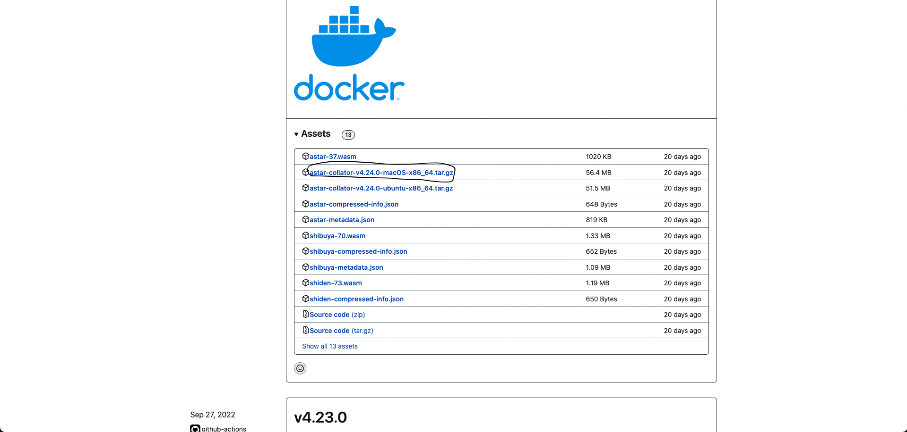

```
wget https://github.com/AstarNetwork/Astar/releases/download/v4.24.0/astar-collator-v4.24.0-macOS-x86_64.tar.gz
```

```
tar xvf astar-collator-v4.24.0-macOS-x86_64.tar.gz
```

次に下のコマンドをターミナルで実行してローカルのノードを立てましょう。

```
./astar-collator --dev
```

ターミナルで下のようなメッセージが返ってくればきちんとノードが立てられているということです！

```
2022-11-03 11:52:42 🎁 Prepared block for proposing at 3 (2 ms) [hash: 0x52f9668c6355a0f4576b9f6c9f97fee7d76053400b235633521e8d521f326af9; parent_hash: 0x5776…b064; extrinsics (1): [0x4d38…cff5]]
2022-11-03 11:52:42 🔖 Pre-sealed block for proposal at 3. Hash now 0xf5f639ff7eb5a57fdcc7fd08c3024e6b595cf37784ebc6a403cc9b225682f8e3, previously 0x52f9668c6355a0f4576b9f6c9f97fee7d76053400b235633521e8d521f326af9.
2022-11-03 11:52:42 ✨ Imported #3 (0xf5f6…f8e3)
2022-11-03 11:52:42 Accepting new connection 2/100
2022-11-03 11:52:44 🙌 Starting consensus session on top of parent 0xf5f639ff7eb5a57fdcc7fd08c3024e6b595cf37784ebc6a403cc9b225682f8e3
```

次に[こちら](https://polkadot.js.org/apps/?rpc=wss%3A%2F%2Frpc.polkadot.io#/explorer)のurlへ飛びます。

これはpolkadot.jsというサイトで、etherscanのpolkadot版です。

このサイトでまずはローカルのノードに切り替えます。手順は以下の通りです。

（1）左上の`polkadot`をクリック

（2）下にスクロールして`DEVELPMENT`をクリック

（3）`DEVELPMENT`直下の`Local Node`をクリック

（4）左上の`Switch`をクリック

下の画像を参考に行なってください。


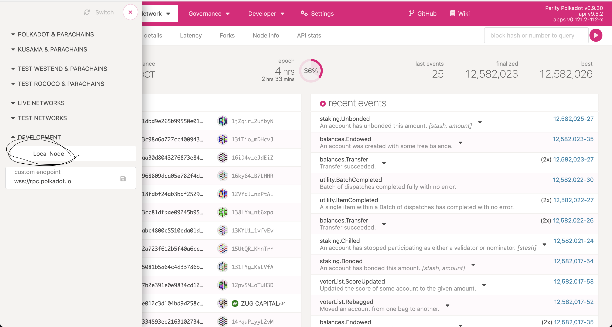
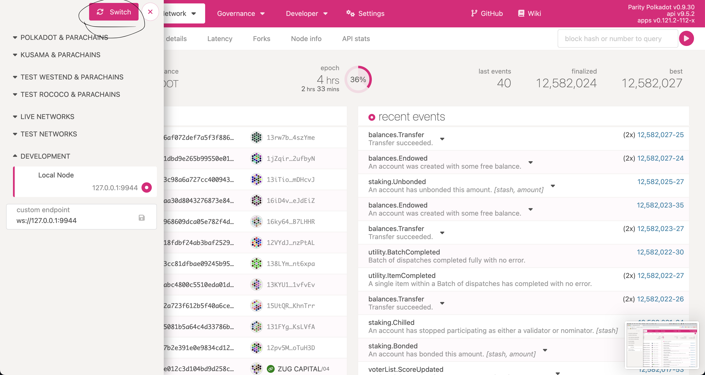

すると下のような画面が出てくるはずです。

※`Brave`を使用している方で想定した動きにならない場合、`Google Chrome`を用いて開いてください。

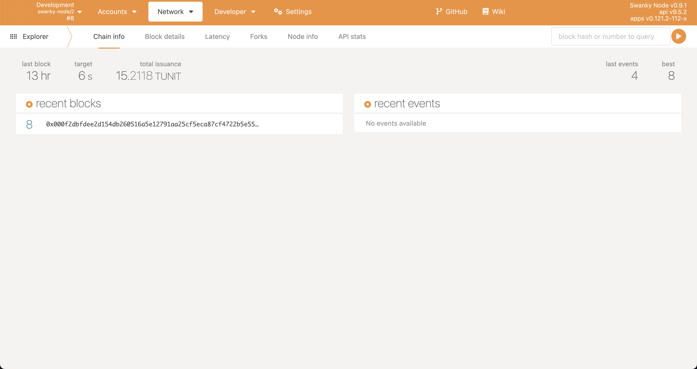
この画面ではすでにデプロイがされているので`recent block`という部分にblockのハッシュ値がありますが、みなさんの画面には何もないかもしれません。

ではヘッダーにある`Developer`直下の`contract`をクリックしてみましょう。
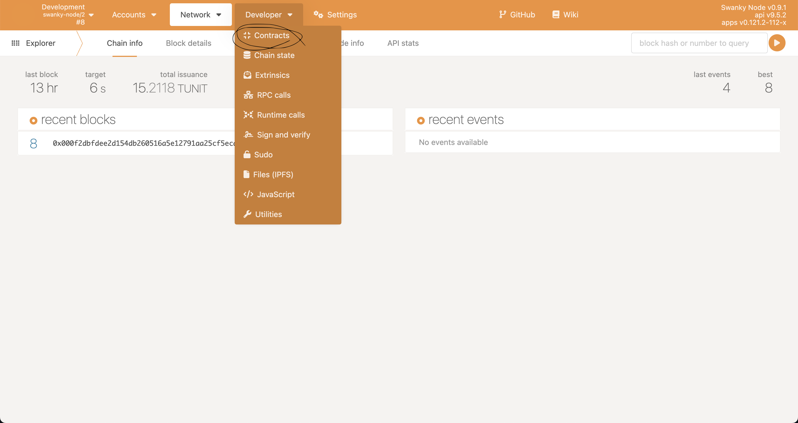

すると下のような画面が出てくるので`Upload & deploy code`をクリックしてみましょう。


これで下のようなモーダルが出てくるはずなのでそこにさきほどデプロイした際に取得したmetadata.jsonと.wasmファイルをアップロードします。これらは`astar-sns-contract/contracts/astar_sns/target/ink`直下に生成されています。
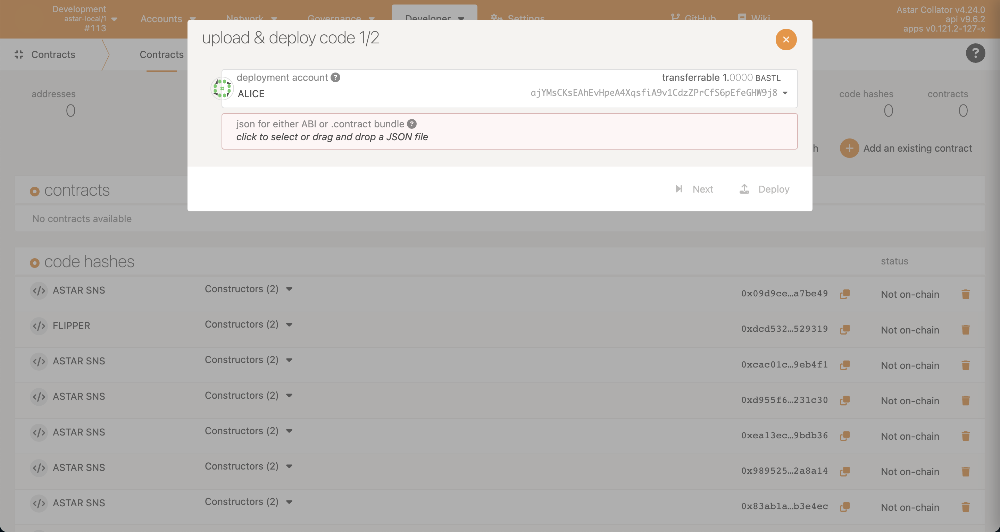

その後モーダルの中の入力欄が増えるので`astar_sns_constract.wasm`を追加しましょう。
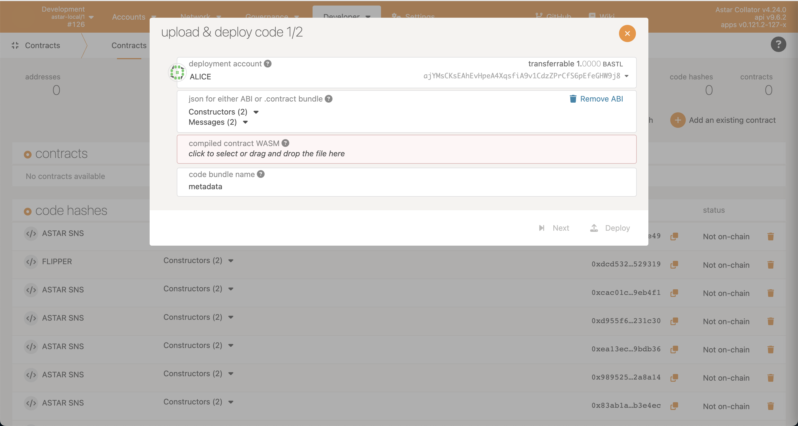

するとデプロイされたコントラクトのところに`ASTAR-SNS-CONTRACT`というのが見えると思います。
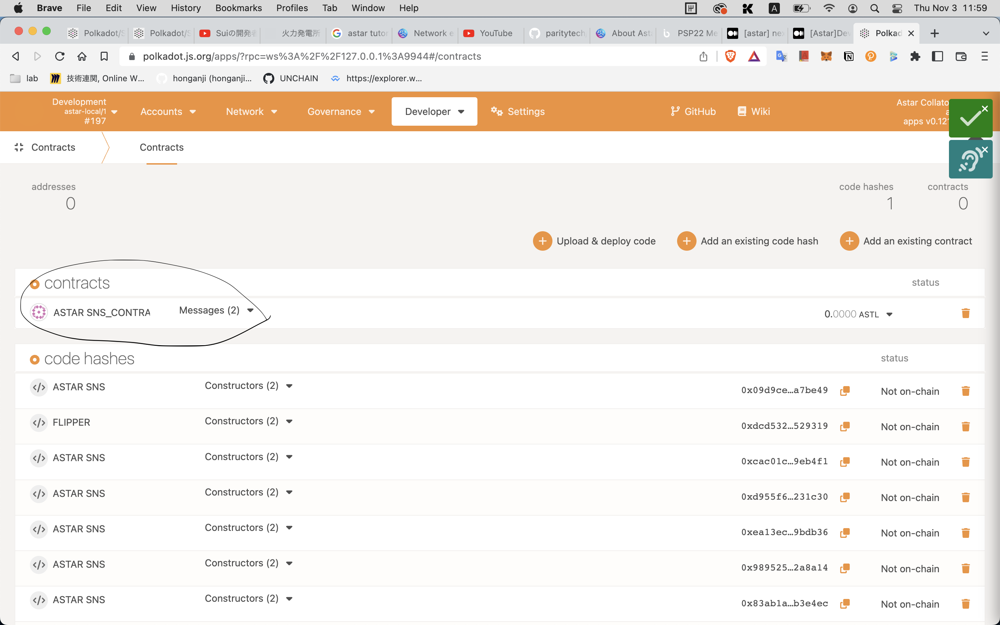

では下のようにデプロイしたコントラクトの`Messages`という部分をクリックしてexecを押してみましょう。

その後、Readというボタンを押してもう一度Readというボタン（ポップアップの左下）を押すと

`current value`という部分は初期値の`false`になっているはずです。

その後右下に現れる`Execute`, `Sign and Submit`というボタンを押すと下のようにコントラクト内の状態変数が`true`に変わっていることがわかると思います！


これでコントラクトがきちんと機能していてかつpolkadot.jsから操作できることが確認できたのでバックエンドの環境構築は終了となります！

開発する上でRustでの開発を行うときにエラーや候補を表示してくれる拡張機能があるととても便利です！

なのでvscodeを使っている方はぜひ下の画像の拡張機能`rust-analyzer`を入れることをおすすめします。
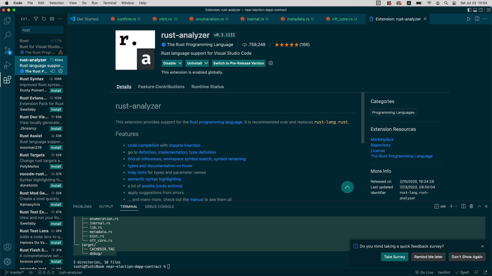

お疲れ様でした 💥

これでバックエンドの環境構築は完了です。

### 🌝 フロントエンドの環境構築

次にフロントエンドに取り掛かっていきます

#### `Next.js`

今回フロントで使用するのは`Next.js`です。Next.jsとは、JavaScriptでwebアプリを開発できるフレームワークです。

特徴としては、通常のようにクライアント側でHTMLを生成するのではなくサーバー側でHTMLを作成していることです。

これによってより良いパフォーマンスを実現しています。

では早速下のコマンドをターミナルで実行して新しいnext.jsのプロジェクトを作成していきましょう。

今回はtypescriptを使用していくのでその指定もしておきます。

`packages`ディレクトリにいることを確認して下のコマンドを実行しましょう。

```
npx create-next-app@latest client --typescript
```

次に`Tailwind CSS`を導入していきます。Tailwind CSSを使用することで簡単に自由なCSSを記述することができます。

まずは先ほど作成したプロジェクトの一番上のディレクトリにいることを確認して下のコマンドをターミナルで実行しましょう。

```
yarn add -D tailwindcss@latest postcss@latest autoprefixer@latest
```

```
npx tailwindcss init -p
```

次に作成されたtailwind.config.jsのファイルを下のように書き換えていきましょう。

[`tailwind.config.js`]

```js
/** @type {import('tailwindcss').Config} */
module.exports = {
  content: [
    "./app/**/*.{js,ts,jsx,tsx}",
    "./pages/**/*.{js,ts,jsx,tsx}",
    "./components/**/*.{js,ts,jsx,tsx}",

    // Or if using `src` directory:
    "./src/**/*.{js,ts,jsx,tsx}",
  ],
  theme: {
    extend: {},
  },
  plugins: [],
}
```

次に`style/globals.css`を下のように書き換えましょう。

[`style/globals.css`]

```css
@tailwind base;
@tailwind components;
@tailwind utilities;
```

では一番上のディレクトリにいることを確認して、下のコマンドをターミナルで実行してローカルでアプリを動かせるか確認しましょう。

```
yarn client dev
```

下のようにターミナルに表示されていればきちんとノードが立てられているので、 ターミナルに表示されているローカルのページurlをブラウザにコピー&ペーストしてみてみましょう。

```
ready - started server on 0.0.0.0:3000, url: http://localhost:3000
info  - Loaded env from /Users/toshi/Programming_Work/Unchain/Astar-Project/astar-sns-dapp/.env
event - compiled client and server successfully in 806 ms (150 modules)
```

下のように見えていればOKです。
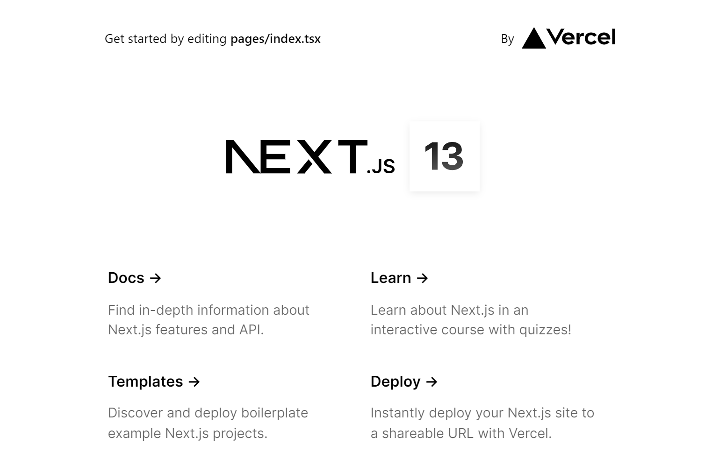

では`index.tsx`の7行目の`className`を少し改良してきちんとTailwind CSSが機能しているかを確認してみましょう。

[`index.tsx`]

```ts
<div className="bg-[#D083EB]">
```

次に変更内容を保存してみましょう。自動的に変更内容が反映されるはずです。

下のように背景色が変更されていれば成功です！
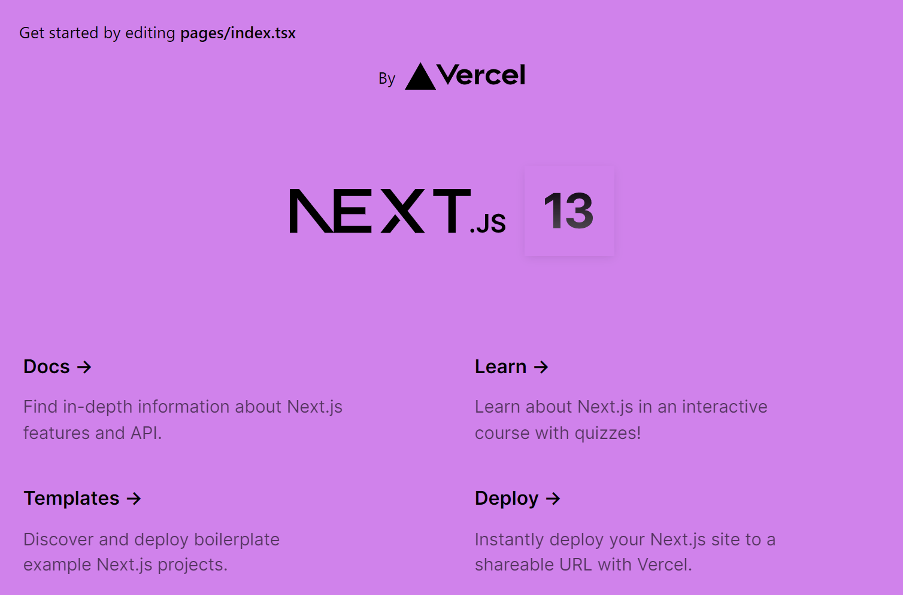

ここまで完了すればフロントエンドの環境構築は成功です！
お疲れ様でした 🤞

### 🙋‍♂️ 質問する

わからないことがあれば、Discordの`#astar`でsection ・ Lesson名とともに質問をしてください 👋

---

次のレッスンでは、Rustを用いたスマートコントラクト作成をしていきます！ 🎉
