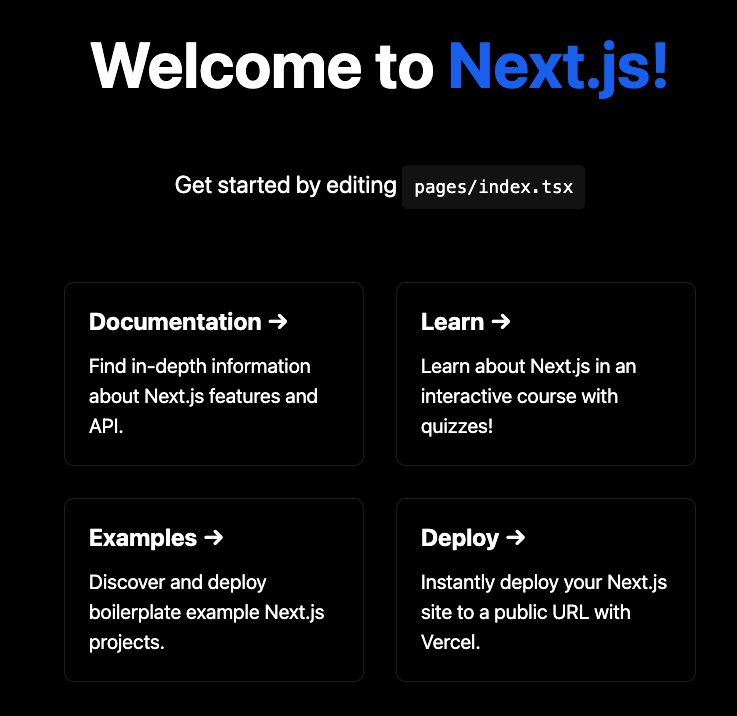
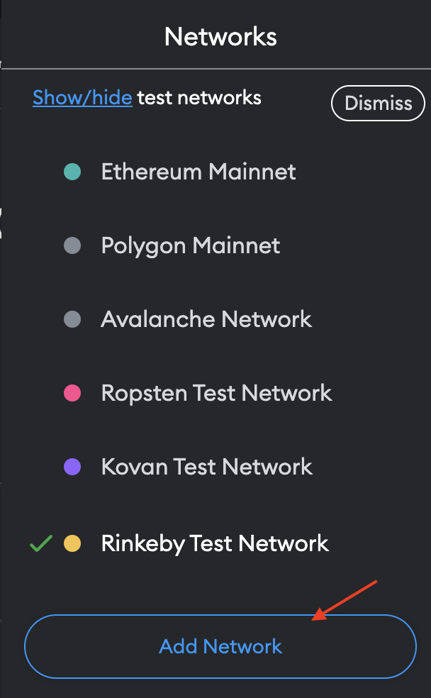
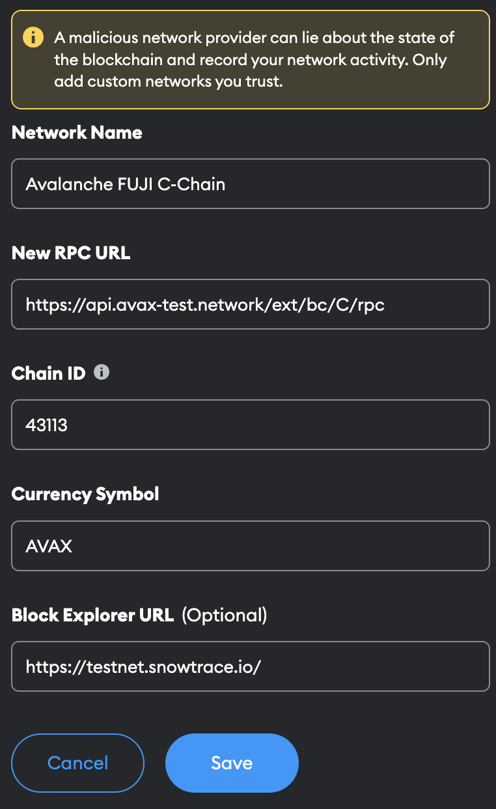
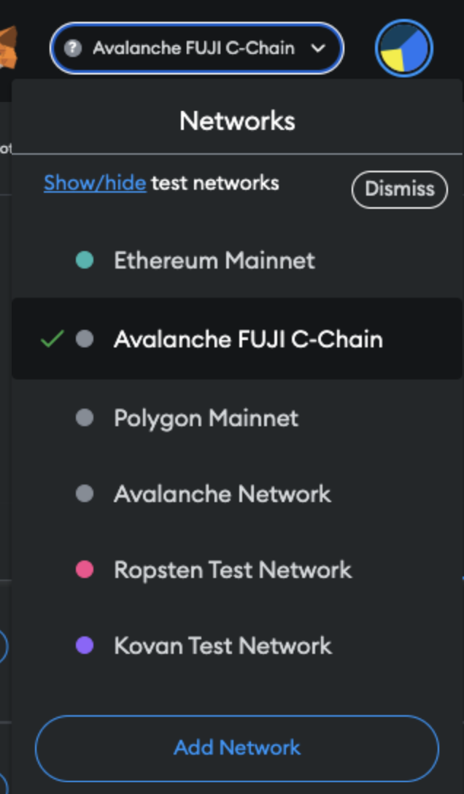

### 🍽 フロントエンドを作成しよう

このセクションでは、スマートコントラクトと連携するフロントエンドを構築します。

今回は`typescript` + `React` + `Next.js`を使ってフロントエンド開発を進めていきます。

- `typescript`: プログラミング言語
- `React.js`: ライブラリ
- `Next.js`: `React.js`のフレームワーク

それぞれの概要については[こちら](https://app.unchain.tech/learn/AVAX-Messenger/ja/2/1/)に説明を載せていますので、
初めて触れる方はご参照ください 💁

### 🛠️ 　フロントエンドのセットアップをしよう

`AVAX-AMM/packages`ディレクトリに移動し、以下のコードを実行して下さい。

```
yarn create next-app client --ts
```

ここでは`create-next-app`というパッケージを利用して`client`という名前のプロジェクトを作成しました。
`--ts`は`typescript`を使用することの指定しています。
`client`ディレクトリには`Next.js`を使ったプロジェクト開発に最低限必要なものがあらかじめ作成されます。

この段階で、フォルダ構造は下記のようになっているはずです。

```diff
AVAX-AMM
 ├── .gitignore
 ├── package.json
 ├── packages/
+│   ├── client/
 │   └── contract/
 └── tsconfig.json
```

`client`ディレクトリ内に生成された`package.json`の設定を確認します。contractディレクトリの`package.json`と同様に、`"private": true`となっていることを確認し、設定されていない場合は記述しておきます。

それでは、開発に必要なパッケージをインストールしましょう。先ほど生成された`client`ディレクトリに移動し、以下のコマンドを実行してください。

```
yarn add ethers@5.7.1 @metamask/providers@9.1.0 react-icons
```

- `ethers`: スマートコントラクトとの連携に使用します。
- `@metamask/providers`: metamaskとの連携の際にオブジェクトの型を取得するために使用します。
- `react-icons`: reactが用意するアイコンを使用できます。

ここで、開発環境がきちんと動作するか確認したいと思います。`client`ディレクトリ内に`node_modules/`や`yarn.lock`が生成されている場合は、いったん削除してください。次に、`AVAX-AMM`直下で下記を実行しましょう。

```
yarn install
yarn client dev
```

あなたのお使いのブラウザで
`http://localhost:3000`
へアクセスするとWebサイトのフロントエンドが表示されるはずです。

⚠️ 本手順では`Chromeブラウザ`を使用しておりますので、何か不具合が生じた場合はブラウザを合わせるのも1つの解決策かもしれません。

例)ローカル環境で表示されているWebサイト



上記のような形でフロントエンドが確認できれば成功です。

これからフロントエンドの表示を確認する際は、`AVAX-AMM`ディレクトリ上で`yarn client dev`(`client`ディレクトリ上では`yarn dev`)を実行します。

webサイトの立ち上げを終了する場合は以下のコマンドが使えます ✍️

- Mac: `ctrl + c`
- Windows: `ctrl + shift + w`

`client`ディレクトリのフォルダ構造は以下のようになっています。

```
client
├── README.md
├── next-env.d.ts
├── next.config.js
├── package.json
├── pages
│   ├── _app.tsx
│   ├── api
│   │   └── hello.ts
│   └── index.tsx
├── public
│   ├── favicon.ico
│   └── vercel.svg
├── styles
│   ├── Home.module.css
│   └── globals.css
└── tsconfig.json
```

### 🦊 MetaMask をダウンロードする

あなたのwebアプリケーションと接続するウォレットをダウンロードしましょう。

このプロジェクトではMetaMaskを使用します。

> 📓 [Core](https://support.avax.network/en/collections/3391518-core) ウォレット について
> Ava Labs(Avalanche エコシステムの開発チーム) がサポートしている Core というウォレットが存在します。
> Core でのウォレットを使用すると Avalanche に適した処理により、高速なトランザクションが実現する可能性があります。
> 現在は beta 版ということもありバグや仕様変更が日々改善されているため、ここでは使用しませんが注目なウォレットです。

- [こちら](https://MetaMask.io/download.html) からブラウザの拡張機能をダウンロードし、MetaMaskウォレットをあなたのブラウザに設定します。

> ✍️: MetaMask が必要な理由
> ユーザーが、スマートコントラクトを呼び出すとき、本人のアドレスと秘密鍵を備えたウォレットが必要となります。
> これは、認証作業のようなものです。

MetaMaskを設定できたら、Avalancheのテストネットワークを追加しましょう。

MetaMaskの上部のネットワークタブを開き、`Add Network`をクリックします。



開いた設定ページ内で以下の情報を入力して保存をクリックしましょう。

```
Network Name: Avalanche FUJI C-Chain
New RPC URL: https://api.avax-test.network/ext/bc/C/rpc
ChainID: 43113
Symbol: AVAX
Explorer: https://testnet.snowtrace.io/
```



登録が成功したらAvalancheのテストネットである`Avalanche Fuji C-Chain`が選択できるはずです。



### 🚰 `Faucet`を利用して`AVAX`をもらう

続いて、[Avalanche Faucet](https://faucet.avax.network/)で`AVAX`を取得します。

テストネットでのみ使用できる偽の`AVAX`です。

上記リンクへ移動して、あなたのウォレットのアドレスを入力してavaxを受け取ってください。
💁 アドレスはMetaMask上部のアカウント名の部分をクリックするとコピーができます。

### 🙋‍♂️ 質問する

ここまでの作業で何かわからないことがある場合は、Discordの`#avalanche`で質問をしてください。

ヘルプをするときのフローが円滑になるので、エラーレポートには下記の3点を記載してください ✨

```
1. 質問が関連しているセクション番号とレッスン番号
2. 何をしようとしていたか
3. エラー文をコピー&ペースト
4. エラー画面のスクリーンショット
```

---

フロントエンドの環境構築が完了したら次のレッスンに進みましょう 🎉
