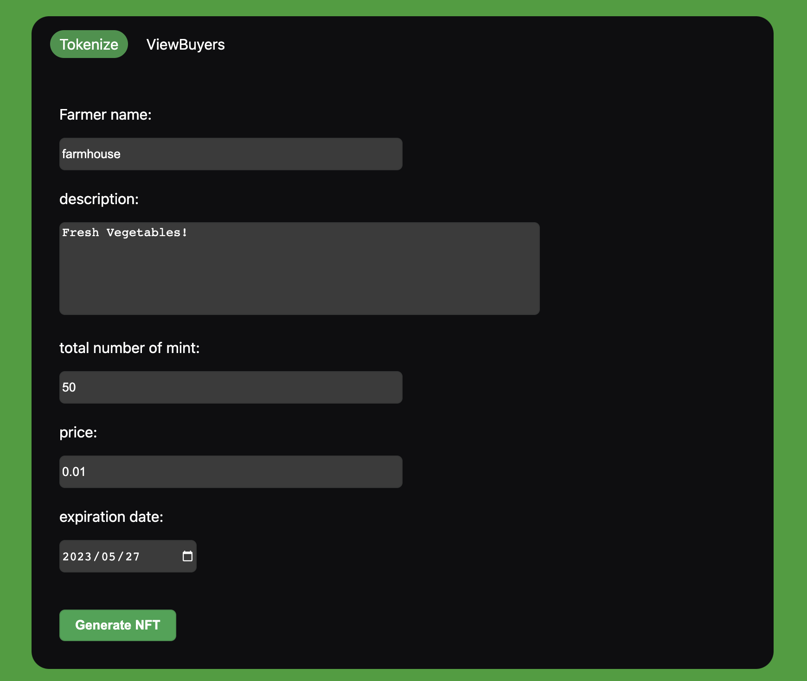
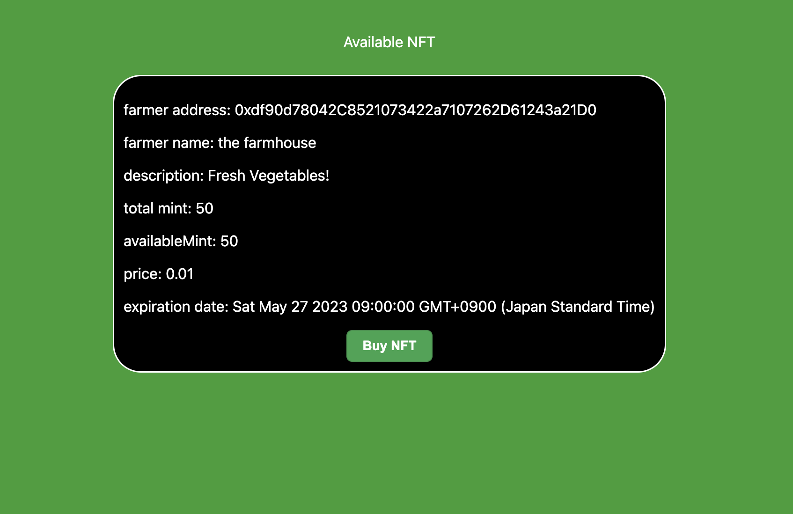
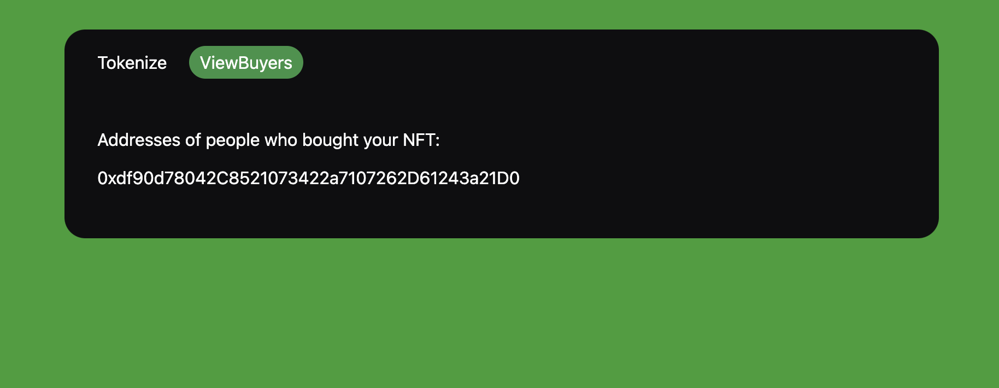

### コンポーネントを追加しましょう

フロントエンドが完成に近づいてきました！

このレッスンでは残りのコンポーネントを実装してフロントエンドを完成させましょう。

各コンポーネント作成ごとにUIを確認していくので、Webサイトを立ち上げておくと楽かもしれません。

```
yarn client dev
```

### 📁 `components`ディレクトリ

📁 `Form`ディレクトリ

ここでは貼り付けるコード量が多いので、 [本プロジェクトの packages/client/components](https://github.com/unchain-dev/AVAX-Asset-Tokenization/tree/main/packages/client/components)を参照します。

`components/Form`ディレクトリのファイルの内容をコピーしてください。
既にあるファイルの場合は上書きしてください。

`Form`に関するフォルダ構成はこのようになっています。

```
client
└── components
    └── Form
        ├── ListNftForm.module.css
        ├── ListNftForm.tsx
        ├── TokenizeForm.module.css
        ├── TokenizeForm.tsx
        ├── ViewBuyersForm.module.css
        └── ViewBuyersForm.tsx
```

💁 `TokenizeForm.tsx`

このコンポーネントは、 農家がNFTを作成する際に触るUI部分を構成します。

コンポーネントのはじめに前sectionで実装した`useContract`を使用しています。

```ts
const { assetTokenization } = useContract({ currentAccount });
```

次に状態変数を用意しています。
農家がNFTを作成するにあたって入力した情報を保存します。

```ts
const [farmerName, setFarmerName] = useState('');
const [description, setDescription] = useState('');
const [totalMint, setTotalMint] = useState('');
const [price, setPrice] = useState('');
const [expirationDate, setExpirationDate] = useState('');
```

`onClickGenerateNFT`は、 農家がNFTを作成する際に動かす関数です。
内部で`assetTokenization.generateNftContract()`を呼び出しています。

💁 `ViewBuyersForm.tsx`

このコンポーネントは、 農家が自身の作成したNFTの購入者のアドレスを確認するUIを構成します。
`getBuyers`関数内で`assetTokenization.getBuyers();`を呼び出し、 返り値であるアドレスの配列を状態変数に格納しています。

💁 `ListNftForm.tsx`

このコンポーネントは、 デプロイされたNFTのリストの表示と、 購入者がNFTを購入するUIを構成します。

`getAllNftDetails`関数内部では`assetTokenization.getNftContractDetails()`を呼び出し、NFTのリストを取得しています。
取得したリストを状態変数`allNftDetails`に格納します。

レンダリング時にはリストの要素の数だけmap関数を使用して、 `NftDetailsCard`コンポーネント（同じコンポーネント内にあり）を表示しています。

`NftDetailsCard`コンポーネント内では、 `Buy`ボタンをクリックした場合に`onClickBuyNft`を実行し内部では`assetTokenization.buyNft()`を呼び出しています。

🖥️ 画面で確認しましょう

それでは`AVAX-Asset-Tokenization`ディレクトリ直下で以下のコマンドを実行してください！

```
yarn client dev
```

そしてブラウザで`http://localhost:3000 `へアクセスしてください。

はじめに`For Farmer`ボタンをクリックしページを移動します。

`Tokenize`タブにてフォームを記入してNFTを作成しましょう。

例)



※ お使いのコンピュータの外観/Appearanceの設定により、 白黒の表示が若干違う可能性があります。ここではDarkモードで確認しています。

`generate NFT`ボタンをクッリクしトランザクションにサイン後、 しばらくすると`success`のアラートが表示されるはずなのでokをクリックしましょう。

農家としてNFTを作成できました。

ホームページへ戻り、 次は`For Buyers`ボタンをクリックします。

ここで先ほど作成したNFTの情報が表示されるはずです。



`Buy`ボタンをクッリクしトランザクションにサイン後、 しばらくすると`success`のアラートが表示されるはずなのでokをクリックしましょう。
※ 本来は別アカウントからの購入を想定していますが、 同じアカウントでも問題ありません。

購入者としてNFTの購入が完了しました。

再びホームページへ戻り、 `For Farmer`ボタンをクリック -> `ViewBuyers`タブをクリックするとNFT購入者のアドレスが表示されます。



### 🌔 参考リンク

> [こちら](https://github.com/unchain-dev/AVAX-Asset-Tokenization)に本プロジェクトの完成形のレポジトリがあります。
> 期待通り動かない場合は参考にしてみてください。

### 🙋‍♂️ 質問する

ここまでの作業で何かわからないことがある場合は、Discordの`#avalanche`で質問をしてください。

ヘルプをするときのフローが円滑になるので、 エラーレポートには下記の3点を記載してください ✨

```
1. 質問が関連しているセクション番号とレッスン番号
2. 何をしようとしていたか
3. エラー文をコピー&ペースト
4. エラー画面のスクリーンショット
```

---

おめでとうございます!
セクション2が終了しました!

次のセクションではコントラクトの自動化を実装しましょう 🛫
