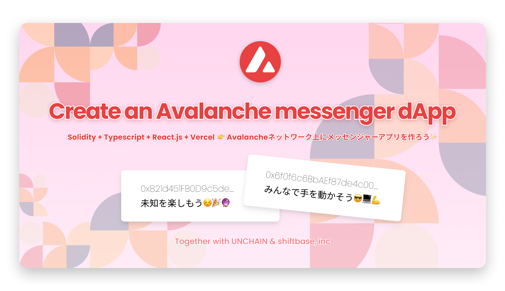

### 👋 dApp 開発プロジェクトへようこそ!

このプロジェクトでは、`Avalanche`にスマートコントラクトを実装して、スマートコントラクトとやりとりできる独自のWebアプリケーションを構築します。

このプロジェクトでは以下の技術が必要です。

- Terminal基本操作
- HTML/CSS
- [TypeScript](https://typescriptbook.jp/overview/features)
- [React.js](https://ja.reactjs.org/)

いますべてを理解している必要はありません。
わからないことがあったらインターネットで検索したり、コミュニティで質問しながらプロジェクトを進めていきましょう!

また、Solidityでの開発が初めての方は[ETH dApp](https://app.unchain.tech/learn/ETH-dApp)を先に進めることをお勧めします。
本プロジェクトでは、`ETH dApp`で行うようなスマートコントラクト開発に加え、
テスト実装・`Next.js`を用いたフロントエンド実装・Avalancheの利用など新しい知識が組み込まれているため、
一度に扱う情報量が多すぎないようにするためです。

また基礎知識として
ブロックチェーン、スマートコントラクト、dappの説明に関しては[こちら](https://app.unchain.tech/learn/ETH-dApp/ja/0/1/)をご覧ください。

### ⛄ `Avalanche`とは何か

`Avalanche`とは分散型アプリケーションとブロックチェーンをデプロイ・運用・利用するためのオープンソースプラットフォームです。
高速かつ低コストなトランザクションが特徴で、多くのプロジェクトが`Avalanche`上で展開され人気が高まっています。
また独自のブロックチェーンを作れるところも注目されています。

`Avalanche`のネットワークはマルチチェーンフレームワークというものを採用していて、3つのブロックチェーンによって構成されています。
重要な機能を分割し最適なデータ構造を採用することで、開発者により柔軟性と制御性のある環境を提供しています。
以下に簡単にまとめます。

1. `C-Chain`（Contract Chain）。
   スマートコントラクトのデプロイ・実行ができるブロックチェーンです。
2. `P-Chain`（Platform Chain）。
   Subnet（独自ブロックチェーン）を作成できるブロックチェーンです。
3. `X-Chain`（Exchange Chain）。
   デジタル資産の作成及びトレードに特化したチェーンです。

### ⛓️ `C-Chain`とは何か？

`C-Chain`（Contract Chain）はスマートコントラクトのデプロイ・実行ができるブロックチェーンで、`Avalanche`を構成するネットワークの1つです。
`C-Chain`は [EVM](https://phemex.com/ja/academy/%E3%82%A4%E3%83%BC%E3%82%B5%E3%83%AA%E3%82%A2%E3%83%A0%E3%83%90%E3%83%BC%E3%83%81%E3%83%A3%E3%83%AB%E3%83%9E%E3%82%B7%E3%83%B3-%E3%81%9D%E3%81%AE%E4%BB%95%E7%B5%84%E3%81%BF%E3%81%A8%E3%81%AF#:~:text=%E3%82%A4%E3%83%BC%E3%82%B5%E3%83%AA%E3%82%A2%E3%83%A0%E3%83%90%E3%83%BC%E3%83%81%E3%83%A3%E3%83%AB%E3%83%9E%E3%82%B7%E3%83%B3%EF%BC%88EVM,%E3%81%99%E3%82%8B%E3%81%93%E3%81%A8%E3%81%8C%E3%81%A7%E3%81%8D%E3%81%BE%E3%81%99%E3%80%82) 互換となっています。
つまりEthereum上で動作するスマートコントラクトをそのまま`Avalanche`の`C-Chain`上にデプロイすることができます。
Ethereumはとても大きなプラットフォームですから、多くのブロックチェーン開発者にとって
既存のスマートコントラクトを高スループットな`Avalanche`のブロックチェーン上で展開できるという点が人気の理由の1つです。

本プロジェクトもこの`C-Chain`上にデプロイすることを想定して進めていきます。
⚠️ 本番環境ではなく、テスト環境であるテストネット([FUJI C-Chain](https://docs.avax.network/quickstart/fuji-workflow))を利用します。

そのためスマートコントラクトの開発自体はイーサリアムの開発と変わりません。
デプロイ先のブロックチェーンが`Avalanche C-Chain`となります。

### 🛠 何を構築するのか？

`Messenger`という **分散型 Web アプリケーション（dApp）** を構築します。

`Messenger`では、以下の機能を実装します。

1. ユーザは他のユーザへメッセージを送ることができる。
2. メッセージにはテキストと`AVAX`（Avalancheのネイティブトークン）を送付することができる。
3. メッセージデータは、`C-Chain`上のスマートコントラクトを介してブロックチェーン上に保存される。
4. メッセージの受信者であるユーザはテキストの確認と、送付された`AVAX`を受け取る（または返却する）ことができる 🎉

アプリケーション全体としては
バックエンドの役目を担うスマートコントラクトを`Solidity`という言語を使用して実装し、
フロントエンドを`TypeScript` + `React.js` + `Next.js`で構築します。

### 🌍 プロジェクトをアップグレードする

[UNCHAIN](https://unchain.tech/) のプロジェクトは [UNCHAIN License](https://github.com/unchain-dev/UNCHAIN-projects/blob/main/LICENSE) により運用されています。

プロジェクトに参加していて、「こうすればもっと分かりやすいのに!」「これは間違っている!」と思ったら、ぜひ`pull request`を送ってください。

GitHubから直接コードを編集して直接`pull request`を送る方法は、[こちら](https://docs.github.com/ja/repositories/working-with-files/managing-files/editing-files#editing-files-in-another-users-repository)を参照してください。

どんなリクエストでも大歓迎です 🎉

また、プロジェクトを自分のGitHubアカウントに`Fork`して、中身を編集してから`pull request`を送ることもできます。

- プロジェクトを`Fork`する方法は、[こちら](https://docs.github.com/ja/get-started/quickstart/fork-a-repo) を参照してください。
- `Fork`から`pull request`を作成する方法は、[こちら](https://docs.github.com/ja/pull-requests/collaborating-with-pull-requests/proposing-changes-to-your-work-with-pull-requests/creating-a-pull-request-from-a-fork) です。

**👋 `UNCHAIN-projects`に`pull request`を送る! ⏩ [UNCHAIN の GitHub](https://github.com/unchain-tech/UNCHAIN-projects) にアクセス!**

### ⚡️ `Issue`を作成する

`pull request`送るほどでもないけど、提案を残したい!　と思ったら、[こちら](https://github.com/unchain-tech/UNCHAIN-projects/issues) に`Issue`を作成してみましょう。

`Issue`の作成方法に関しては、[こちら](https://docs.github.com/ja/issues/tracking-your-work-with-issues/creating-an-issue)を参照してください。

`pull request`や`issue`の作成は実際にチームで開発する際、重要な作業になるので、ぜひトライしてみてください。

UNCHAINのプロジェクトをみんなでより良いものにしていきましょう ✨

> Windows を使用している方へ
> Windows をお使いの場合は、[Git for Windows](https://gitforwindows.org/) をダウンロードし、それに付属する Git Bash を使うことをお勧めします。
> 本手順では UNIX 固有のコマンドをサポートしています。
> [Windows Subsystem for Linux (WSL)](https://docs.microsoft.com/en-us/windows/wsl/install) も選択肢の一つです。

---

次のレッスンに進んでプログラミングの環境構築しましょう 🎉

Documentation created by [ryojiroakiyama](https://github.com/ryojiroakiyama)（UNCHAIN discord ID: rakiyama#8051）
