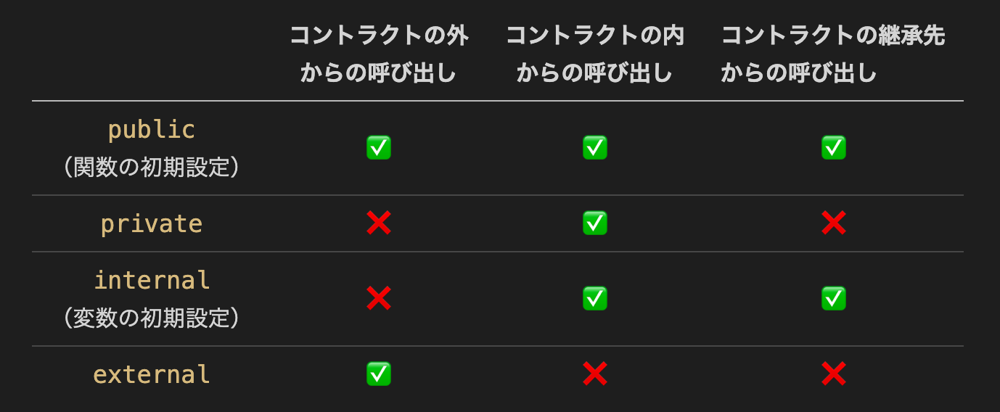
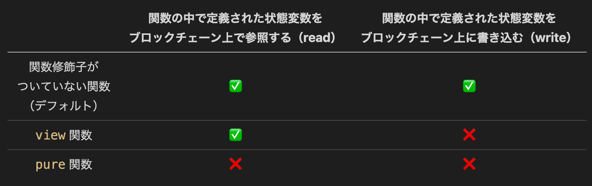
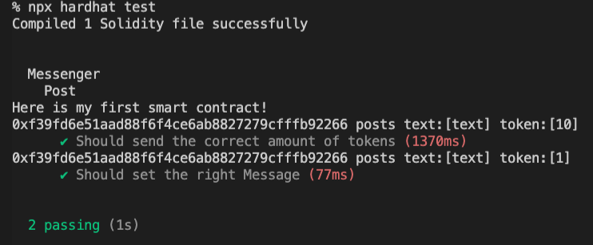

### 🔥 スマートコントラクトに機能を追加しましょう

前回のレッスンでは、`Messenger`というスマートコントラクトを作成しました。

今回のレッスンでは以下の機能を実装します。

- メッセージを格納するデータ構造の用意
- メッセージの送信
- テスト

💁 これから実装するコントラクトの内部の処理をここで整理したいと思います。

プロジェクト内で出てくる「メッセージ」とは、テキストとそこに添付されたトークンを総称して指すこととします。
メッセージのテキストを**メッセージテキスト**、メッセージに添付されたトークンを**メッセージトークン**と呼ぶこととします。

メッセージのやり取りは、送信者から受信者へ直接ではなく、間にコントラクトを介して行われます。

- 送信者がメッセージの送信を行うと、メッセージテキストや関連情報がコントラクト内で保存されます。
- また、メッセージトークンはコントラクトへ送信されます。
- 送信されたメッセージはコントラクト内で**保留**という状態を取ります。
- その後メッセージの受信者が自分宛のメッセージの確認を行い、保留中のメッセージに対して以下の2つの動作を実行することができます。
  - 承諾 -> メッセージトークンを受け取ることができます。コントラクトから受信者へトークンが送信されます。
  - 拒否 -> メッセージトークンは返却されます。コントラクトから送信者へトークンが送信されます。

### 🪙 トークン

ブロックチェーン上には多くのトークンが存在しますが,
本プロジェクトで出てくるトークンとは`AVAX`か`ETH`をさします。

`AVAX`は`Avalanche`のネイティブトークンで、`ETH`は`Ethereum`のネイティブトークンです。
どちらも、それぞれのブロックチェーン上でトランザクションの際に手数料として必要です。

**ブロックチェーンに新しく情報を書き込むこと**を,**トランザクション**と呼びます。

ブロックチェーンは、AWSのようなクラウド上にデータを保存できるサーバーのようなものです。
しかし、誰もそのデータを所有していません。
ブロックチェーン上にデータを保存する作業をする人々が世界中に存在します。
この作業に対して、私たちは代金を支払います。
その代金が、**ガス代**です。 `Avalanche`の`C-Chain`上にデータを書き込む際、私たちは代金として`AVAX`を支払う必要があります。

本プロジェクトにおいて,
`C-Chain`のEVM互換という特性から,
スマートコントラクトの開発は`Ethereum`上で動くものを作り、デプロイ先はAvalancheの`C-Chain`です。

スマートコントラクトの開発としては`Ethereum`上で動くものとして`ETH`(または`wei`) の単位を基準に実装した方がわかりやすいです。

しかし、実際にトランザクションで支払われるトークンは`AVAX`なので、アプリ全体の話として`AVAX`という言葉もしばし出てきます。

以上のことを覚えておいて下さい 🙌

実装段階で`ETH`を使用しているものが、トランザクション時にどのように`AVAX`の単位に変化されるのかはフロントエンドの章でお話しします。

### 🏠 メッセージを格納するデータ構造を用意しよう

`Messenger.sol`内を以下のコードで書き換えて下さい。

```solidity
// Messenger.sol
// SPDX-License-Identifier: MIT

pragma solidity ^0.8.17;

import "hardhat/console.sol";

contract Messenger {
    // メッセージ情報を定義します。
    struct Message {
        address payable sender;
        address payable receiver;
        uint256 depositInWei;
        uint256 timestamp;
        string text;
        bool isPending;
    }

    // メッセージの受取人アドレスをkeyにメッセージを保存します。
    mapping(address => Message[]) private _messagesAtAddress;

    constructor() payable {
        console.log("Here is my first smart contract!");
    }
}
```

追加した内容を見ていきましょう！

```solidity
    struct Message {
        address payable sender;
        address payable receiver;
        uint256 depositInWei;
        uint256 timestamp;
        string text;
        bool isPending;
    }
```

メッセージの情報を[構造体](https://ja.wikipedia.org/wiki/%E6%A7%8B%E9%80%A0%E4%BD%93)として定義しています。
構造体の中には`型 変数名;`という形で要素が並んでいます。まずは各変数が何を表すのか整理しましょう。

- sender
  メッセージの送信者のアドレス。
- receiver
  メッセージの受取人のアドレス。
- depositInWei
  メッセージトークンの量を表します。
  単位を`wei`で記録します。
  > `wei`は、イーサリアムの最小額面です。
  > `1ETH ＝ 1,000,000,000,000,000,000 wei (10^18)`です。
- タイムスタンプ
  送信者がメッセージを投稿したタイムスタンプを表します。
- text
  メッセージテキストを表します。
- isPending
  メッセージが保留中であるかどうかを表します。
  `isPending = true`であれば保留中です。

次に型について整理します。

- `uint256`: 非常に大きな数を扱うことができる**符号なし整数**を格納できます。
- `string`: 文字列データに使用できます。
- `bool`: `true`か`false`のどちらかの値をとります。
- `address`: ethereumのアドレス（20バイト）を表す値に使用できます。
- `address payable`: `address`と同じですが、加えてトークンのやり取りを可能にする型です。
  具体的には`transfer`と`send`というメンバーが追加されています（後ほど出てきます 😏）。

```solidity
    // メッセージの受取人アドレスをkeyにメッセージを保存します。
    mapping(address => Message[]) private _messagesAtAddress;
```

ここではメッセージの情報を`mapping`というデータ構造を利用して格納できるように定義しています。

> 📓 `mapping`
> Solidity の`mapping`は、ほかの言語におけるハッシュテーブルや辞書のような役割を果たします。
> これらは、下記のように`_Key`と`_Value`のペアの形式でデータを格納するために使用されます。
>
> ```javascript
> mapping（_Key => _Value）public mappingName
> ```

また、`Message[]`は`Message`の[配列](https://ja.wikipedia.org/wiki/%E9%85%8D%E5%88%97)を表します。

今回は、ユーザーのアドレス(= `_Key` = `address`)をそのユーザー宛のメッセージの集合(= `_Value` = `Message[]`)に関連付けるために`mapping`を使用しました。

```solidity
    constructor() payable {
        console.log("Here is my first smart contract!");
    }
```

`constructor`に`payable`という修飾子が追加されています。
`payable`はトランザクションにトークンのやり取りが発生することを伝える**関数修飾子**です。
関数修飾子については後ほど整理します。

スマートコントラクト自体に資金としてトークンを持たせておく場合、スマートコントラクトのデプロイ時にトークンも併せて送信します。
そのためデプロイ時に実行する`constructor`に`payable`をつける必要があります。

> ⚠️ 本プロジェクトで作成するスマートコントラクトは、ユーザ間のトークンやり取りを仲介するだけなので
> スマートコントラクト自体が資金を持っておく必要がなくなりました。
> そのため`constructor`につける`payable`と、この後デプロイ時に行うトークンの送信は必要ありませんが,
> 本手順ではこのまま進めます。 🙌

続いて以下のように関数を追加していきます。

```diff
// SPDX-License-Identifier: MIT

pragma solidity ^0.8.17;

import "hardhat/console.sol";

contract Messenger {
    // メッセージ情報を定義します。
    struct Message {
        address payable sender;
        address payable receiver;
        uint256 depositInWei;
        uint256 timestamp;
        string text;
        bool isPending;
    }

    // メッセージの受取人アドレスをkeyにメッセージを保存します。
    mapping(address => Message[]) private _messagesAtAddress;

    constructor() payable {
        console.log("Here is my first smart contract!");
    }

+    // ユーザからメッセージを受け取り、状態変数に格納します。
+    function post(string memory _text, address payable _receiver)
+        public
+        payable
+    {
+        console.log(
+            "%s posts text:[%s] token:[%d]",
+            msg.sender,
+            _text,
+            msg.value
+        );
+
+        _messagesAtAddress[_receiver].push(
+            Message(
+                payable(msg.sender),
+                _receiver,
+                msg.value,
+                block.timestamp,
+                _text,
+                true
+            )
+        );
+    }
+
+    // ユーザのアドレス宛のメッセージを全て取得します。
+    function getOwnMessages() public view returns (Message[] memory) {
+        return _messagesAtAddress[msg.sender];
+    }
}

```

追加した関数を見ていきましょう。

```solidity
function post(string memory _text, address payable _receiver)
    public
    payable
{
    console.log(
        "%s posts text:[%s] token:[%d]",
        msg.sender,
        _text,
        msg.value
    );

    _messagesAtAddress[_receiver].push(
        Message(
            payable(msg.sender),
            _receiver,
            msg.value,
            block.timestamp,
            _text,
            true
        )
    );
}
```

メッセージの送信時に呼び出される関数です。
メッセージはコントラクト内に蓄積されるデータなので、実際には送信者から受信者への送信というより、送信者からコントラクトへの投稿という意味合いが強いです。
そのためコントラクト内では`post`という関数名にしています。
`post`関数は引数にテキストデータと受信者のアドレスを受け取ります。
さらに関数呼び出し時にはトークン（メッセージトークンに当たります）が併せて送られるので、修飾子として`payable`を指定しています。
関数内ではログの出力と、メッセージ情報を格納しています。

```solidity
_messagesAtAddress[_receiver].push(
    Message(
        payable(msg.sender), // 関数を呼び出したアドレス値をメッセージ送信者として記録します。
        _receiver,
        msg.value, // 関数呼び出し時に送信されたトークンの値をメッセージトークンとして記録します。
        block.timestamp, // 投稿時のタイムスタンプ
        _text,
        true // 全てのメッセージは投稿直後は保留状態となるので、isPendingをtrueとします。
    )
);
```

ここでは`_messagesAtAddress[_receiver]`により、受信者アドレス(`_receiver`)に紐ついたメッセージ配列(`Message[]`)を取り出しています。
`push`メソッドにより配列に新たなメッセージ情報を追加します。

`msg`はグローバルな変数で,
`msg.value`によって関数呼び出し時に送信されたトークンの値を
`msg.sender`によって関数を呼び出しアカウントのアドレス値を取得することができます。

関数を呼び出す際にどのようにトークンを送信するのかはテストで行います。

```solidity
    // ユーザのアドレス宛のメッセージを全て取得します。
    function getOwnMessages() public view returns (Message[] memory) {
        return _messagesAtAddress[msg.sender];
    }
```

`getOwnMessages`関数は
関数を呼び出したユーザのアドレス宛のメッセージを`_messagesAtAddress[msg.sender]`にアクセスすることで取得できるようにしています。

### 🎁 Solidity の関数修飾子について

ここでは`Solidity`の用意する関数修飾子について簡単に整理したいと思います。

🪟 関数へのアクセスに関連する修飾子

- **`public`**: `public`で定義された関数や変数は、それらが定義されているコントラクト、そのコントラクトが継承された別のコントラクト、それらコントラクトの外部と、**基本的にどこからでも**呼び出すことができます。Solidityでは、アクセス修飾子がついてない**関数**を、自動的に`public`として扱います。

- **`private`**: `private`で定義された関数や変数は、**それらが定義されたコントラクトでのみ**呼び出すことができます。

- **`internal`**: `internal`で定義された関数や変数は、**それらが定義されたコントラクト**と、**そのコントラクトが継承された別のコントラクト**の**両方**から呼び出すことができます。Solidityでは、アクセス修飾子がついてない**変数**を、自動的に`internal`として扱います。

- **`external`**: `external`で定義された関数や変数は、**外部からのみ**呼び出すことができます。

以下に、Solidityのアクセス修飾子とアクセス権限についてまとめています。



📡 関数の状態に関連する修飾子

Solidity開発ではこれらの修飾子を意識しておかないとデータを記録する際のコスト（＝ガス代）が跳ね上がってしまうので注意が必要です。

ここでポイントとなるのは、**ブロックチェーンに値を書き込むにはガス代を払う必要があること、そしてブロックチェーンから値を参照するだけなら、ガス代を払う必要がないことです。**

- **`view`**: `view`関数は、読み取り専用の関数であり、呼び出した後に関数の中で定義された状態変数が変更されないようにします。
- **`pure`**: `pure`関数は、関数の中で定義された状態変数を読み込んだり変更したりせず、関数に渡されたパラメータや関数に存在するローカル変数のみを使用して値を返します。

以下に、Solidityの関数修飾子`pure`と`view`についてまとめています。



ここで重要なのは、`pure`や`view`関数を使用すれば、**ガス代を削減できる**ということです。

同時に、ブロックチェーン上にデータを書き込まないことで、**処理速度も向上します**。

🪙 関数がトークンをやり取りすることに関連する修飾子

関数に`payable`を指定するとその関数の呼び出しにトークンを送ることができます。
逆に`payable`が無い関数にトークンを送ろうとすると関数はトランザクションを拒否します。

🚎 カスタムできる修飾子

関数の挙動に影響するような処理を自分で作って修飾子として使うことができます。
こちらは`section3`で実装します。

### 🧪 テストを追加しよう

追加した機能に対するテストを追加しましょう。
testディレクトリの中の`Messenger.ts`ファイルを以下のように変更してください。

- 変更すると環境によって赤の波線が表示される箇所があるかもしれませんが、テストを実行すると消えますので、一旦気にせず進めてください。

```ts
import { loadFixture } from '@nomicfoundation/hardhat-network-helpers';
import { expect } from 'chai';
import { Overrides } from 'ethers';
import hre, { ethers } from 'hardhat';

describe('Messenger', function () {
  async function deployContract() {
    // 初めのアドレスはコントラクトのデプロイに使用されます。
    const [owner, otherAccount] = await ethers.getSigners();

    const funds = 100;

    const Messenger = await hre.ethers.getContractFactory('Messenger');
    const messenger = await Messenger.deploy({
      value: funds,
    } as Overrides);

    return { messenger, funds, owner, otherAccount };
  }

  describe('Post', function () {
    it('Should send the correct amount of tokens', async function () {
      const { messenger, owner, otherAccount } = await loadFixture(
        deployContract
      );
      const test_deposit = 10;

      // メッセージをpostした場合は、送り主(owner)からコントラクト(messenger)へ送金されます。
      await expect(
        messenger.post('text', otherAccount.address, {
          value: test_deposit,
        })
      ).to.changeEtherBalances(
        [owner, messenger],
        [-test_deposit, test_deposit]
      );
    });

    it('Should set the right Message', async function () {
      const { messenger, owner, otherAccount } = await loadFixture(
        deployContract
      );
      const test_deposit = 1;
      const test_text = 'text';

      await messenger.post(test_text, otherAccount.address, {
        value: test_deposit,
      });
      const messages = await messenger.connect(otherAccount).getOwnMessages();
      const message = messages[0];
      expect(message.depositInWei).to.equal(test_deposit);
      expect(message.text).to.equal(test_text);
      expect(message.isPending).to.equal(true);
      expect(message.sender).to.equal(owner.address);
      expect(message.receiver).to.equal(otherAccount.address);
    });
  });
});
```

ファイル冒頭には使用する関数をライブラリからimportしています。
環境構築時にインストールした`@nomicfoundation/hardhat-network-helpers`も使用していて,
`loadFixture`という関数をimportしています。

さらに追加した内容を見ていきましょう。

```ts
async function deployContract() {
  // 初めのアドレスはコントラクトのデプロイに使用されます。
  const [owner, otherAccount] = await ethers.getSigners();

  const funds = 100;

  const Messenger = await hre.ethers.getContractFactory('Messenger');
  const messenger = await Messenger.deploy({
    value: funds,
  } as Overrides);

  return { messenger, funds, owner, otherAccount };
}
```

こちらは各テスト関数で使用されるヘルパー関数の役目を担います。
処理内容は、hardhatが用意するローカルのイーサリアムネットワーク上にコントラクトをデプロイして,
デプロイ情報を返却するというものです。
前回のテストでは、デプロイ作業とテストを同じ関数内で直接行っていましたが、複数のテストで同じような処理をするので関数に切り出しています。

関数内で使用している`ethers.getSigners()`はHardhatが提供する任意のアドレスを配列で返す関数です。
各アドレスには`10000ether`がデフォルト値として与えられています。
返り値のはじめの要素は、テスト内でコントラクトの関数を呼び出す際に使用されるアカウントのアドレスです。ここでは`owner`と名づけています。
またテスト内ではメッセージのやり取りをシミュレーションするために複数のアドレスが必要なため`otherAccount`という名前で他のアドレスも取得しています。

`deploy`に注目します。

```ts
const messenger = await Messenger.deploy({
  value: funds,
} as Overrides);
```

現状の`Messenger`コントラクトはコンストラクタに引数を取りませんが、追加の引数として`Overrides`というオブジェクトを渡すことができます。
`Overrides`にはいくつかフィールドがありますが、`value`フィールドは関数呼び出しに併せて送るトークンの量を指定することができます。詳しくは[こちら](https://docs.ethers.io/v5/api/contract/contract/#Contract-functionsCall)
テストを行う上で、コントラクト側にもある程度のトークンを持たせておきたいのでこの処理を行っています。
トークンは関数を呼び出している`owner`から引かれます。
`funds`はコントラクトに渡されるトークンの量となります。

続いてテスト内の1つ目の関数を確認しましょう。

```ts
describe('Post', function () {
  it('Should send the correct amount of tokens', async function () {
    const { messenger, owner, otherAccount } = await loadFixture(
      deployContract
    );
    const test_deposit = 10;

    // メッセージをpostした場合は、送り主(owner)からコントラクト(messenger)へ送金されます。
    await expect(
      messenger.post('text', otherAccount.address, {
        value: test_deposit,
      })
    ).to.changeEtherBalances([owner, messenger], [-test_deposit, test_deposit]);
  });

  // ...
});
```

ここでは`post`関数を呼び出した後、トークンの送信が正しくできているかを確認しています。
初めに`loadFixture`を通して`deployContract`を呼び出し、コントラクトやアカウント情報を取得します。
テスト材料として`10wei`を関数呼び出しに併せて送信します。
メッセージの受信者を`otherAccount`として`post`関数を呼び出します。

> 📓 `loadFixture`とは
> `loadFixture`は引数にローカルチェーンのセットアップをする関数を渡します。
> 今回はコントラクトのデプロイまでを行う`deployContract`を渡しています。
> `loadFixture`が初回に呼ばれた時は引数の関数を実行し、そのチェーンの状態を記録します。
> `loadFixture`が二回目に以降に呼ばれた場合は初回に記録したチェーンの状態を返却します。
> つまりテストを行う中でコントラクトの関数を呼び出してチェーンの状態を書き換えてしまいますが,
> `loadFixture`を呼び出すだけで初期状態を取得することができるので便利なのです。

`expect`を使用して、`post`関数の実行後に`changeEtherBalances`という関数を使うことでトークン保有数に変化があったのか確認しています。
下記の引数の部分は

```
[owner, messenger], [-test_deposit, test_deposit]
```

それぞれ、`owner`（関数を呼び出したアカウント）のトークンが`test_deposit`分減り、`messenger`（コントラクト）のトークンが`test_deposit`分増えていることを確認することを表しています。

最後にもう1つのテスト内容を確認しましょう。

```ts
describe('Post', function () {
  // ...

  it('Should set the right Message', async function () {
    const { messenger, owner, otherAccount } = await loadFixture(
      deployContract
    );
    const test_deposit = 1;
    const test_text = 'text';

    await messenger.post(test_text, otherAccount.address, {
      value: test_deposit,
    });
    const messages = await messenger.connect(otherAccount).getOwnMessages();
    const message = messages[0];
    expect(message.depositInWei).to.equal(test_deposit);
    expect(message.text).to.equal(test_text);
    expect(message.isPending).to.equal(true);
    expect(message.sender).to.equal(owner.address);
    expect(message.receiver).to.equal(otherAccount.address);
  });
});
```

コントラクトの`post`を呼び出すところまでは先ほどと同じ流れです。
`post`の呼び出し後に`getOwnMessages`で投稿されたメッセージ情報を取得し中身を確認します。
`getOwnMessages`を呼び出すアカウントはメッセージの受信者である必要があり、`messenger.connect(otherAccount)`を呼び出すことでそれを指定できます。
取り出したメッセージの内容が正しいかを確かめます。

それではテストを実行しましょう！　ターミナル上で`AVAX-Messenger/`直下にいることを確認し、以下のコマンドを実行してください。

```
yarn test
```

以下のような表示がされたらテスト成功です！



### 🙋‍♂️ 質問する

ここまでの作業で何かわからないことがある場合は、Discordの`#avalanche`で質問をしてください。

ヘルプをするときのフローが円滑になるので、エラーレポートには下記の3点を記載してください ✨

```
1. 質問が関連しているセクション番号とレッスン番号
2. 何をしようとしていたか
3. エラー文をコピー&ペースト
4. エラー画面のスクリーンショット
```

---

テストが通ったら、次のレッスンに進んでください 🎉
