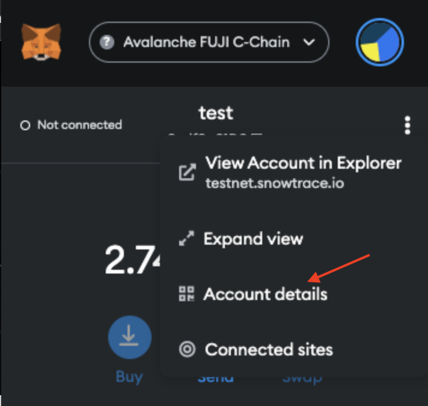
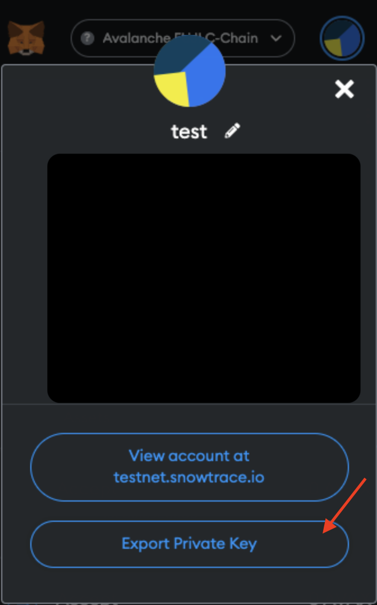
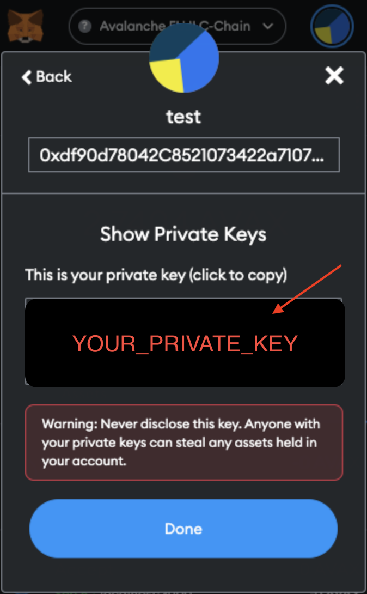

### コントラクトをテストネットにデプロイしよう 🎉

これまでフロントエンドにUIを用意し、ウォレットとの接続も出来ました！

このレッスンではフロントエンドとスマートコントラクトを連携するために、あなたのスマートコントラクトをデプロイします。

今回のプロジェクトではコスト（＝ 本物のETH）が発生するメインネットではなく、**テストネットにコントラクトをデプロイします。**

テストネットはメインネットを模しています。

`contract`ディレクトリへ移動し、`.env`という名前のファイルを作成します。
💁 ドットを先頭につけたファイルは`ls`などでは非表示になる特殊なファイルです。

`.env`ファイルの中に以下を記入してください。
`"YOUR_PRIVATE_KEY"`の部分をあなたのアカウントの秘密鍵と入れ替えてください。

```
TEST_ACCOUNT_PRIVATE_KEY="YOUR_PRIVATE_KEY"
```

> `YOUR_PRIVATE_KEY`の取得
>
> 1.  お使いのブラウザから、MetaMask プラグインをクリックして、ネットワークを`Avalanche FUJI C-Chain`に変更します。
>
> 
>
> 2.  それから、`Account details`を選択してください。
>
> 
>
> 3.  `Account details`から`Export Private Key`をクリックしてください。
>
> 
>
> 4.  MetaMask のパスワードを求められるので、入力したら`Confirm`を押します。
>     あなたの秘密鍵（＝ `Private Key` ）が表示されるので、クリックしてコピーします。
>
> 

> - `.env`の`YOUR_PRIVATE_KEY`の部分をここで取得した秘密鍵とを入れ替えます。

⚠️packages/contract/.gitignoreファイルに.envが記述されていることを確認して下さい。
秘密鍵は外部に漏れないようにGitHub上に上げません。

> **✍️: スマートコントラクトをデプロイするのに秘密鍵が必要な理由** > **新しくスマートコントラクトをブロックチェーン上にデプロイすること**も、トランザクションの一つです。
>
> トランザクションを行うためには、ブロックチェーンに「ログイン」する必要があります。
>
> 「ログイン」には公開アドレスと秘密鍵の情報が必要となります。
>
> ユーザー名とパスワードを使用して、AWS にログインしてプロジェクトをデプロイするのと同じです。

次に`contract`ディレクトリ直下にある`hardhat.config.ts`中身を以下のコードに書き換えてください。

```ts
import * as dotenv from 'dotenv'; // 環境構築時にこのパッケージはインストールしてあります。
import '@nomicfoundation/hardhat-toolbox';
import { HardhatUserConfig } from 'hardhat/config';

// .envファイルから環境変数をロードします。
dotenv.config();

if (process.env.TEST_ACCOUNT_PRIVATE_KEY === undefined) {
  console.log('private key is missing');
}

const config: HardhatUserConfig = {
  solidity: '0.8.17',
  networks: {
    fuji: {
      url: 'https://api.avax-test.network/ext/bc/C/rpc',
      chainId: 43113,
      accounts:
        process.env.TEST_ACCOUNT_PRIVATE_KEY !== undefined
          ? [process.env.TEST_ACCOUNT_PRIVATE_KEY]
          : [],
    },
  },
};

export default config;
```

続いて、`scripts`ディレクトリ内にある`deploy.ts`を以下のコードに書き換えてください。

```ts
import { Overrides } from 'ethers';
import { ethers } from 'hardhat';

async function deploy() {
  // コントラクトをデプロイするアカウントのアドレスを取得します。
  const [deployer] = await ethers.getSigners();
  console.log('Deploying contract with the account:', deployer.address);

  const funds = 100;

  // コントラクトのインスタンスを作成します。
  const Messenger = await ethers.getContractFactory('Messenger');

  // The deployed instance of the contract
  const messenger = await Messenger.deploy({
    value: funds,
  } as Overrides);

  await messenger.deployed();

  console.log('Contract deployed at:', messenger.address);
  console.log(
    "Contract's fund is:",
    await messenger.provider.getBalance(messenger.address)
  );
}

deploy()
  .then(() => process.exit(0))
  .catch((err) => {
    console.error(err);
    process.exit(1);
  });
```

`deploy`関数の中身を見てましょう。

```ts
// コントラクトをデプロイするアカウントのアドレスを取得します。
const [deployer] = await ethers.getSigners();
console.log('Deploying contract with the account:', deployer.address);

// デプロイ処理。テストと同じような内容です。

console.log('Contract deployed at:', messenger.address);
console.log(
  "Contract's fund is:",
  await messenger.provider.getBalance(messenger.address)
);
```

はじめに`ethers.getSigners()`でアカウントのアドレスを取得しています。
このスクリプトを実行する際に先ほど`hardhat.config.ts`で設定したネットワークを指定すると、`ethers.getSigners()`の返す初めのアカウントの値はあなたのアカウントのアドレスになります。
ログが出力されるので後ほど確認しましょう。

またデプロイの処理後もログを出力するようにしています。

それではターミナル上で`AVAX-Messenger/`直下にいることを確認して、下記のコマンドを実行してデプロイします！

```
yarn contract deploy
```

このような出力結果が出たら成功です！

```
Deploying contract with the account: 0xdf90d78042C8521073422a7107262D61243a21D0
Contract deployed at: 0xf531A6BCF3cD579f5A367cf45ff996dB1FC3beA1
Contract's fund is: BigNumber { value: "100" }
```

`Contract deployed at:`の後に続くアドレスはコントラクトがデプロイされた先のアドレスです。
この後の項目で必要になるのでどこかに保存しておいてください。

ブロックチェーンにデプロイすると、世界中の誰でもコントラクトにアクセスできます。

実際のブロックチェーン上には、すでに何百万ものスマートコントラクトがデプロイされています。

最後に`packages/contract/.gitignore`に`.env`が含まれていることを確認してください!

### 🙋‍♂️ 質問する

ここまでの作業で何かわからないことがある場合は、Discordの`#avalanche`で質問をしてください。

ヘルプをするときのフローが円滑になるので、エラーレポートには下記の3点を記載してください ✨

```
1. 質問が関連しているセクション番号とレッスン番号
2. 何をしようとしていたか
3. エラー文をコピー&ペースト
4. エラー画面のスクリーンショット
```

---

Avalanche Fuji C-Chainにスマートコントラクトをデプロイしたら、次のレッスンに進みましょう 🎉
