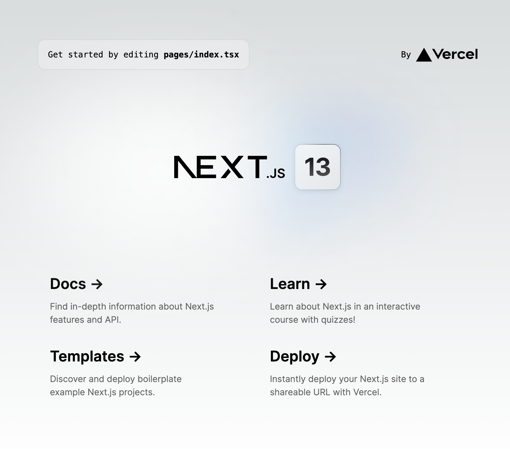

### 🍽 フロントエンドを作成しよう

このセクションでは、スマートコントラクトと連携するフロントエンドを構築します。

今回は`typescript` + `React.js` + `Next.js`を使ってフロントエンド開発を進めていきます。

- `typescript`: プログラミング言語
- `React.js`: ライブラリ
- `Next.js`: `React.js`のフレームワーク

それぞれの概要については[こちら](https://app.unchain.tech/learn/AVAX-Messenger/ja/2/1/)に説明を載せていますので、初めて触れる方はご参照ください 💁

### 🛠️ 　フロントエンドのセットアップをしよう

`AVAX-Subnet/packages`ディレクトリに移動し、以下のコマンドを実行して下さい。

```
yarn create next-app client --ts
```

ここでは`create-next-app`というパッケージを利用して`client`という名前のプロジェクトを作成しました。  
`--ts`は`typescript`を使用することを指定しています。`client`ディレクトリには`Next.js`を使ったプロジェクト開発に最低限必要なものがあらかじめ作成されます。

この段階で、フォルダ構造は下記のようになっているはずです。

```diff
 AVAX-Subnet
  ├── .gitignore
  ├── genesis/
  ├── package.json
  ├── packages/
+ │   ├── client/
  │   └── contract/
  └── tsconfig.json
```

clientディレクトリ内に生成されたpackage.jsonの設定を確認します。contractディレクトリのpackage.jsonと同様に、`"private": true`となっていることを確認し、設定されていない場合は記述しておきます。

ここで、開発環境がきちんと動作するか確認したいと思います。clientディレクトリ内に`node_modules/`や`yarn.lock`が生成されている場合は、いったん削除してください。次に、ターミナル上で`AVAX-Subnet`直下に移動し下記を実行しましょう。

```
yarn install
yarn client dev
```

あなたのお使いのブラウザで`http://localhost:3000`へアクセスするとWebサイトのフロントエンドが表示されるはずです。

⚠️ 本手順では`Chromeブラウザ`を使用しておりますので、何か不具合が生じた場合はブラウザを合わせるのも1つの解決策かもしれません。

例)ローカル環境で表示されているWebサイト  

> ここでのcreate-next-appは`version 13.1.1`を使用しています（`yarn create next-app --version`で確認できます）。  
> versionの違いによりここで表示されるフロントエンドが別のものでも、この後のディレクトリ構成などに大きな違いがなければ問題ありません。



上記のような形でフロントエンドが確認できれば成功です。

これからフロントエンドの表示を確認する際は,`AVAX-Subnet`上で`yarn client dev`(`client`ディレクトリ上では`yarn dev`)を実行します。

Webサイトの立ち上げを終了する場合は以下のコマンドが使えます ✍️

- Mac: `ctrl + c`
- Windows: `ctrl + shift + w`

`client`ディレクトリのフォルダ構造は以下のようになっています。
※`node_modules`は内部ファイルの表示を省略しています。

```
client
├── README.md
├── next-env.d.ts
├── next.config.js
├── node_modules
├── package-lock.json
├── package.json
├── pages
│   ├── _app.tsx
│   ├── api
│   │   └── hello.ts
│   └── index.tsx
├── public
│   ├── favicon.ico
│   └── vercel.svg
├── styles
│   ├── Home.module.css
│   └── globals.css
└── tsconfig.json
```

続いて`client`ディレクトリ直下で以下のコマンドを実行して必要なパッケージをインストールしてください。

```
yarn add ethers@^5.7.2 @metamask/providers@^10.0.0
```

- `ethers`: スマートコントラクトとの連携に使用します。
- `@metamask/providers`: metamaskとの連携の際にオブジェクトの型を取得するために使用します。

### 🐊 tailwindをセットアップしよう

本プロジェクトはtailwindを使用してブラウザの見た目を構築します。

[こちら](https://tailwindcss.com/docs/guides/nextjs)を参考にtailwindをセットアップします。

まずは必要なパッケージのインストールやinitコマンドを実行します。

`client`ディレクトリ直下で以下のコマンドを実行します。

```
yarn add --dev tailwindcss@^3.2.4 postcss@^8.4.20 autoprefixer@^10.4.13
npx tailwindcss init -p
```

続いて、`tailwind.config.js`内に以下のコードを貼り付けてtailwindを使用するファイルへのパスを記述します。

vscodeがエラーを出す可能性もありますが、気にせず進めて問題ありません。

```js
/** @type {import('tailwindcss').Config} */
module.exports = {
  content: [
    './pages/**/*.{js,ts,jsx,tsx}',
    './components/**/*.{js,ts,jsx,tsx}',
  ],
  theme: {
    extend: {},
  },
  plugins: [],
}
```

`./styles/globals.css`内を以下のコードで上書きしてください。

```css
@tailwind base;
@tailwind components;
@tailwind utilities;
```

tailwindの初期設定が終了したので、挙動を確認します。

`pages/index.tsx`内を以下のコードで上書きしてください。

```tsx
import type { NextPage } from 'next';

const Home: NextPage = () => {
  return <h1 className="text-3xl font-bold underline">Hello world!</h1>;
};

export default Home;
```

`AVAX-Subnet`ディレクトリ直下で`yarn client dev`を実行し、ブラウザで`http://localhost:3000`へアクセスします。

以下のようなフロントエンドが確認できれば成功です。


### 🙋‍♂️ 質問する

ここまでの作業で何かわからないことがある場合は、Discordの`#avalanche`で質問をしてください。

ヘルプをするときのフローが円滑になるので、エラーレポートには下記の3点を記載してください ✨

```
1. 質問が関連しているセクション番号とレッスン番号
2. 何をしようとしていたか
3. エラー文をコピー&ペースト
4. エラー画面のスクリーンショット
```

---

フロントエンドの環境構築が完了したら次のレッスンに進みましょう 🎉
