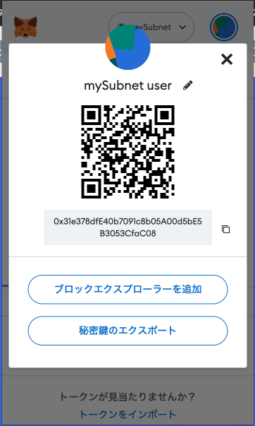
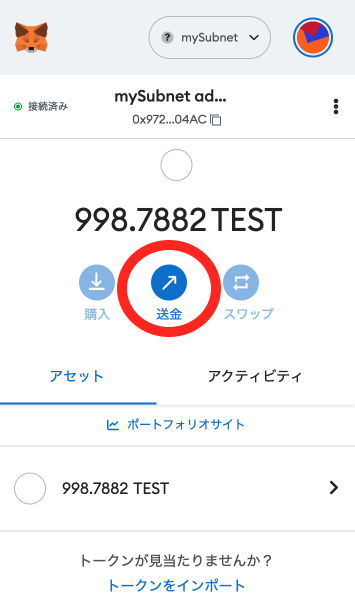
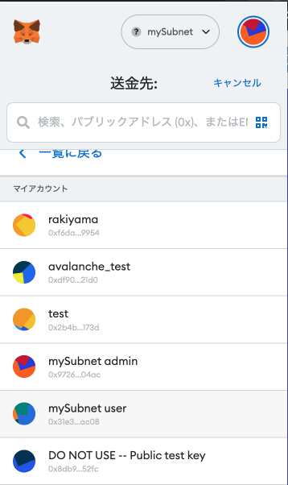
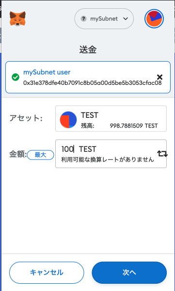
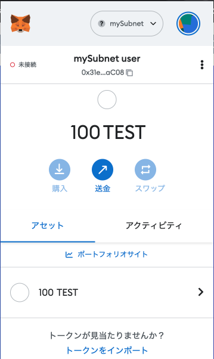
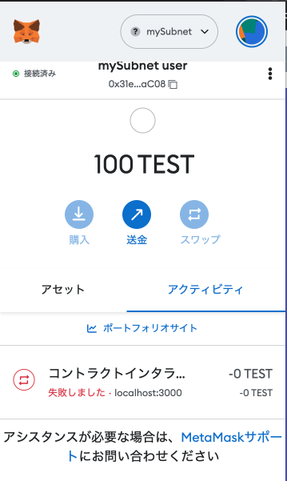
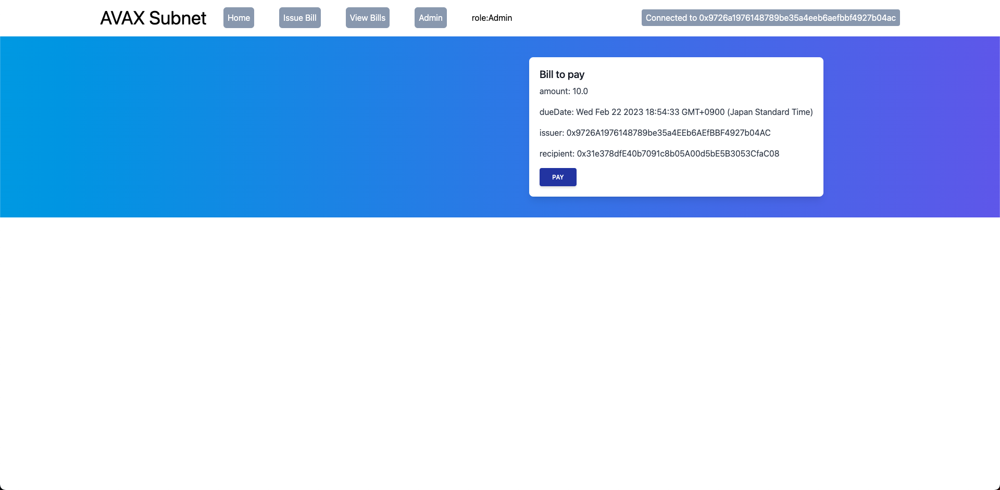
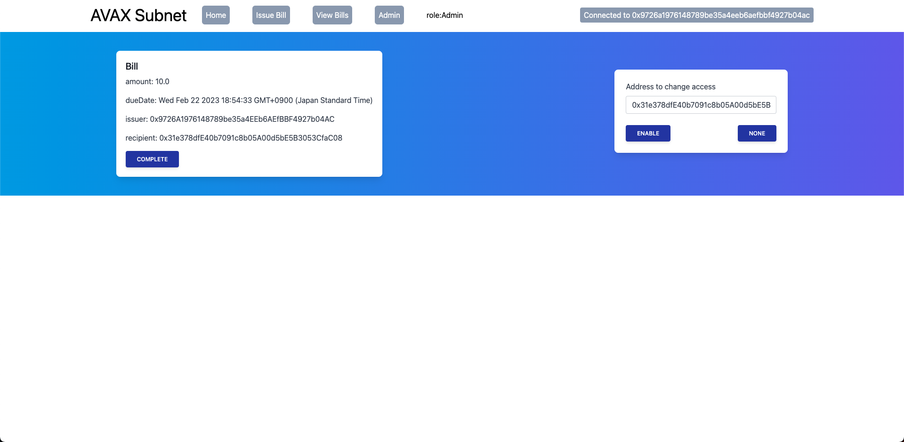
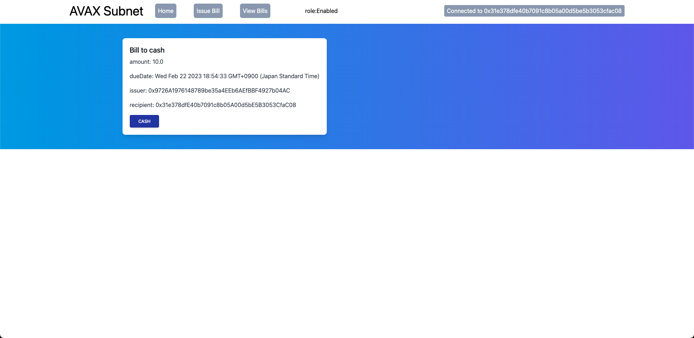
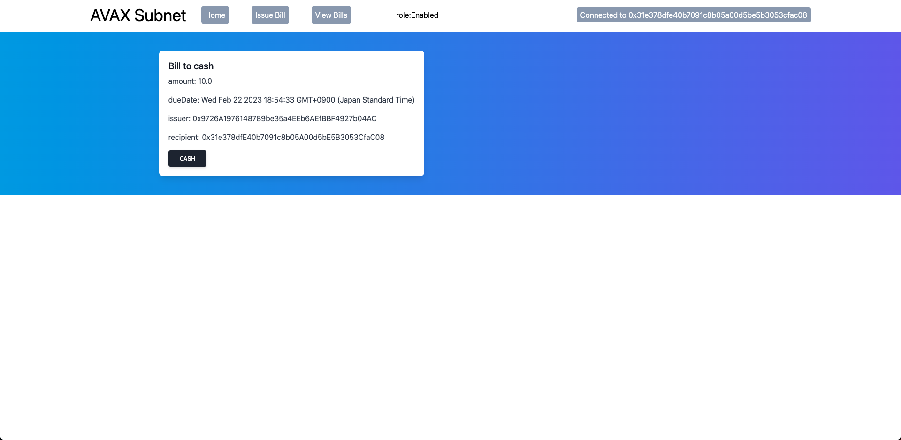

### 🌵 スマートコントラクトの情報をフロントエンドに反映しましょう

これまでフロントエンドを実装し、ウォレットとの接続も出来ました！

このレッスンではあなたのスマートコントラクトとフロントエンドを連携します。

コントラクトは既にデプロイしたので、実際に使えるようにスマートコントラクトの情報をフロントエンドに渡します。

📽️ コントラクトのアドレスをコピーする

コントラクトをデプロイし、そのアドレスをフロントエンドにコピーします。

ここでもう一度コントラクトをデプロイしますが、 
PreCompileである`TransactionAllowList`の型定義ファイルもフロントエンド側で必要なので`packages/contract/contracts`ディレクトリ内に`IAllowList.sol`ファイルを作成し、中に以下のコードを貼り付けてください。

```
//SPDX-License-Identifier: MIT
pragma solidity ^0.8.17;

interface IAllowList {
  // Set [addr] to have the admin role over the precompile
  function setAdmin(address addr) external;

  // Set [addr] to be enabled on the precompile contract.
  function setEnabled(address addr) external;

  // Set [addr] to have no role the precompile contract.
  function setNone(address addr) external;

  // Read the status of [addr].
  function readAllowList(address addr) external view returns (uint256 role);
}
```

`IAllowList`はPreCompileが実装しているインタフェースです。

> 📓 型定義ファイル  
> フロントエンドで使用しているTypeScriptは静的型付け言語なので、外部から取ってきたコントラクトのオブジェクトの情報として型を知りたい場合があります。  
> その時に役に立つのが型定義ファイルです。
>
> コントラクトの型定義ファイルは、コントラクトがコンパイルされた時に生成され、`typechain-types`ディレクトリに自動的に格納されます。  
> これは`npx hardhat init`実行時にtypescriptを選択したため、初期設定が済んでいるためです。

それでは`packages/contract`ディレクトリ直下で下記のコマンドを実行してデプロイします！

```
% npx hardhat run scripts/deploy.ts --network local
Compiled 1 Solidity file successfully
bank address: 0xFD6866b81c681ba8127b5fbB874d971744774208
deployer address: 0x9726A1976148789be35a4EEb6AEfBBF4927b04AC
```

ここで`Compiled 1 Solidity file successfully`と出ているのは`IAllowList`のコンパイルです。

```
bank address: 0xFD6866b81c681ba8127b5fbB874d971744774208
```

を`packages/client`ディレクトリ内、`hooks/useContract.ts`の中の以下の部分に貼り付けてください。

```ts
export const BankAddress = '0x8C6dFbFC0b3e83cBBB82E4b5A187Bc9C0EcE0630';
```

例:

```ts
export const BankAddress = '0xFD6866b81c681ba8127b5fbB874d971744774208';
```

📽️ ABIファイルを取得する

ABIファイルは,コントラクトがコンパイルされた時に生成され,`artifacts`ディレクトリに自動的に格納されます。

`contract`からパスを追っていくと、`contract/artifacts/contracts/~.sol/~.json`というファイルがそれぞれのコントラクトに対して生成されているはずです。

これらを`client/artifacts`ディレクトリ内にコピーします。

`contract`直下からターミナルでコピーを行う場合、このようなコマンドになります。

```
cp artifacts/contracts/Bank.sol/Bank.json ../client/artifacts/
cp artifacts/contracts/IAllowList.sol/IAllowList.json ../client/artifacts 
```

📽️ 型定義ファイルを取得する

`typechain-types`内に型定義ファイルが出力されているので、`client/artifacts`ディレクトリ内にコピーします。 

`contract`直下からターミナルでコピーを行う場合、このようなコマンドになります。

```
cp -r typechain-types/* ../client/types/
```

以上でコントラクトの情報を反映することができました。

### アカウントの用意

手形取引をシミュレーションするためにネットワークの管理者アカウントと別にもう1つユーザアカウントを用意しました。



ユーザアカウントにTESTトークンを送信します。

管理者アカウントの送金ボタンを押下します。



`自分のアカウント間での振替`を選択


送金先アカウントの選択



100TEST送金



ユーザアカウントに100TEST送金されました。



🖥️ 画面で確認しましょう

それでは`AVAX-Subnet`ディレクトリ直下で以下のコマンドを実行し、ブラウザで`http://localhost:3000 `へアクセスします。

```
yarn client dev
```

アプリにユーザアカウントでアクセスします。

別のアカウントで接続済みの場合、以下の手順で接続を解除できますので、解除後windowをリロードしてください。


ユーザアカウントから管理者アカウントに対してBillの発行を試みます。  
※ここで確認できるように、ユーザアカウントのネットワーク権限はまだ`None`です。


必要な情報を入力して`ISSUE`ボタンを押下した後、Metamaskのアクティビティを確認すると直前のトランザクションが失敗していることがわかります。



> フロントエンドのコード内、関数呼び出し後にSuccessかerrorをアラートで表示すようにしているはずですが確認ができる場合とできない場合があります。  
> もしその理由がご存知の方がいれば教えて頂けると嬉しいです！  
> ひとまずここではMetamaskの履歴からトランザクションの結果を確認することとします 💁

次に管理者アカウントに切り替え、同じくBillの発行をユーザカウントに対して試みます。


`ISSUE`押下後にMetamaskを確認するとトランザクションが成功しています。


`ViewBill`ページに移動すると、画面右側に自分が発行したBillが表示されます。  
（画面左側は自分が受取人のBillが表示されます）



続いて、`Admin`ページに移動し、画面右側の入力フォームにユーザアカウントのアドレスを入力し、`ENABLE`を押下します。  
（画面右側には発行者・受取人関わらず全てのBillが表示されます）



トランザクションの成功を確認します。


ユーザアカウントに切り替えます。  
`ViewBill`ページに移動すると,（先ほど管理者アカウントが発行した）自分が受取人のBillが表示されます。  
※ネットワーク権限が`Enabled`になっています！



`CASH`を押下すると、今回は権限があるためトランザクションを提出することができます。  
少し待ってから画面をリロードすると`CASH`が完了しています。(`CASH`ボタンの色が変わります)



また、初めに試みたようにBillの発行を行い、少し待ってから`ViewBill`ページを表示すると自分が発行者のBillが表示されます。


### 🗯️ トラブルシューティング

トランザクションを提出することは可能でも、リクエストがキュー待ちになり停止してしまうことがあります。  

その後`ISSUE`などのボタンを押しても何も反応が無くなってしまいます。

その場合は以下の手順から、`アカウントをリセット`を実行すると履歴がリセットされ解消されます。


### 🌔 参考リンク

> [こちら](https://github.com/unchain-dev/AVAX-Subnet)に本プロジェクトの完成形のレポジトリがあります。  
> 期待通り動かない場合は参考にしてみてください。  

### 🙋‍♂️ 質問する

ここまでの作業で何かわからないことがある場合は、Discordの`#avalanche`で質問をしてください。

ヘルプをするときのフローが円滑になるので、エラーレポートには下記の3点を記載してください ✨

```
1. 質問が関連しているセクション番号とレッスン番号
2. 何をしようとしていたか
3. エラー文をコピー&ペースト
4. エラー画面のスクリーンショット
```

---

アプリが完成し、その挙動を確認することができました! 🎉
