### 🖥 本番環境の構築を行う

ローカル環境のイーサリアムネットワークを終了します。

- ターミナルを閉じれば完了です。

これから、実際のブロックチェーンにコントラクトをデプロイするための環境を構築していきます。

### 🦊 MetaMask をダウンロードする

次に、イーサリアムウォレットをダウンロードしましょう。

このプロジェクトでは MetaMask を使用します。

- [こちら](https://MetaMask.io/download.html) からブラウザの拡張機能をダウンロードし、MetaMask ウォレットをあなたのブラウザに設定します。

すでに別のウォレットをお持ちの場合でも、今回は MetaMask を使用してください。

> ✍️: MetaMask が必要な理由
> ユーザーが、スマートコントラクトを呼び出すとき、本人のイーサリアムアドレスと秘密鍵を備えたウォレットが必要となります。
> これは、認証作業のようなものです。

### 💳 トランザクション

**イーサリアムネットワーク上でブロックチェーンに新しく情報を書き込むこと**を、**トランザクション**と呼びます。

ここまでのレッスンに登場した**トランザクション**は以下です。

- **新規にスマートコントラクトをデプロイした**という情報をブロックチェーン上に書き込む。
- **Web サイト上で送信された「👋（wave）」の数**をブロックチェーンに書き込む。

トランザクションにはマイナーの承認が必要ですので、Alchemy を導入します。

Alchemy は、世界中のトランザクションを一元化し、マイナーの承認を促進するプラットフォームです。

[こちら](https://www.alchemy.com/) から Alchemy のアカウントを作成してください。

### 💎 Alchemy でネットワークを作成

Alchemy のアカウントを作成したら、Apps ページの`+ Create new app`ボタンを押してください。

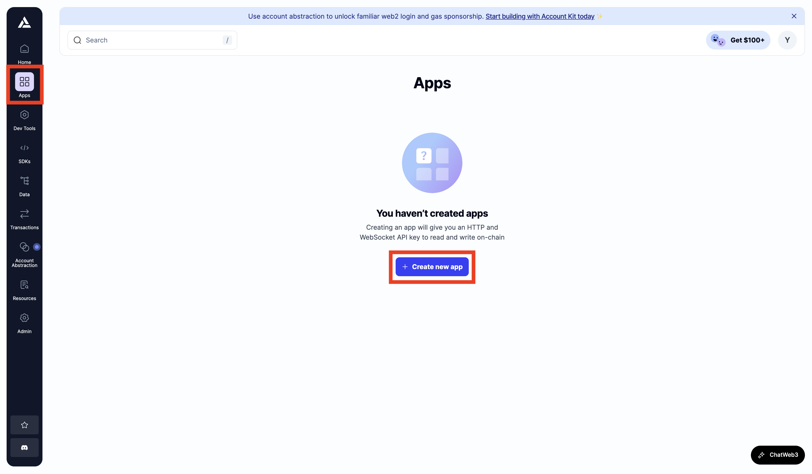

次に、下記の項目を埋めていきます。下図を参考にしてください。

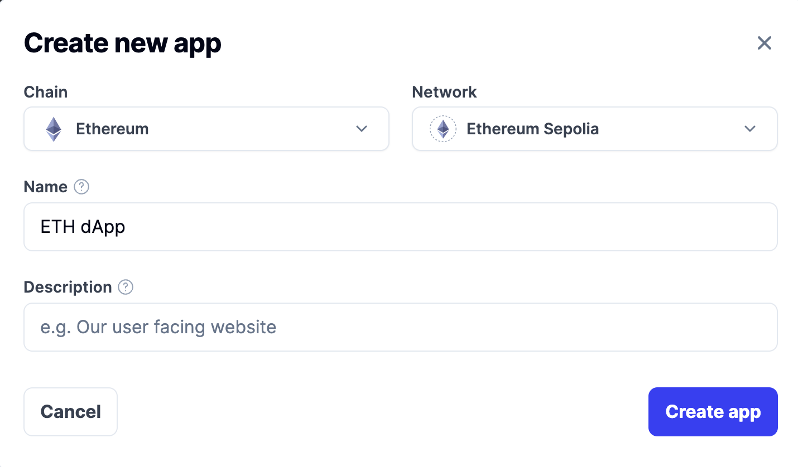

- `Chain`: `Ethereum`を選択
- `Network`: `Ethereum Sepolia`を選択
- `Name`: プロジェクトの名前(例: `ETH dApp`)
- `Description`: プロジェクトの概要（任意）

`Create app`ボタンを押すと、プロジェクトが作成されます。`API Key`をクリックすると、表示されたポップアップから Key を取得することができます（今回のプロジェクトで使用するのは、`HTTPS`に表示されているものになります）。

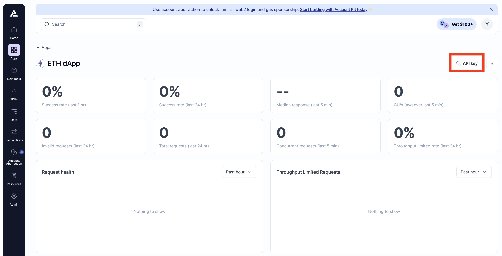

これがあなたが本番環境のネットワークに接続する際に使用する`API Key`になります。

- **`API Key`は、今後必要になるので、PC 上のわかりやすいところに保存しておきましょう。**

### 🐣 テストネットから始める

今回のプロジェクトでは、コスト（＝ 本物の ETH）が発生するイーサリアムメインネットではなく、**テストネットにコントラクトをデプロイします。**

テストネットはイーサリアムメインネットを模しています。

- イーサリアムメインネットにコントラクトをデプロイした際に発生するイベントのテストを行うのに最適です。
- テストネットは偽の ETH を使用しているため、いくらでもトランザクションのテストを行えます。

今回は、以下のイベントをテストしていきます。

1. トランザクションの発生を世界中のマイナーたちに知らせる
2. あるマイナーがトランザクションを発見する
3. そのマイナーがトランザクションを承認する
4. そのマイナーがトランザクションを承認したことをほかのマイナーたちに知らせ、トランザクションのコピーを更新する

このセクションでは、コードを書きながら、これらのイベントについての理解を深めていきます。

### 🚰 Testnet ETH を取得する

今回は、`Sepolia`というイーサリアム財団によって運営されているテストネットを使用します。

`Sepolia`にコントラクトをデプロイし、コードのテストを行うために、偽の ETH を取得しましょう。ユーザーが偽の ETH を取得するために用意されたインフラは、「フォーセット（＝蛇口）」と呼ばれています。

フォーセットを使用する前に、あなたの MetaMask ウォレットを`Sepolia Test Network`に設定してください。

> ✍️: MetaMask で`Sepolia Test Network`を設定する方法
>
> 1 \. MetaMask ウォレットのネットワークトグルを開きます。
>
> 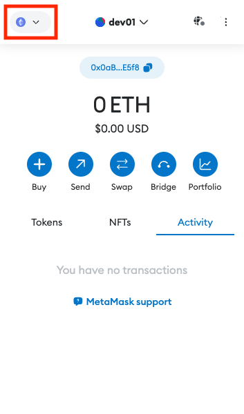
>
> 2 \. `Show test networks`を`ON`にして、表示された`Sepolia`を選択します。
>
> 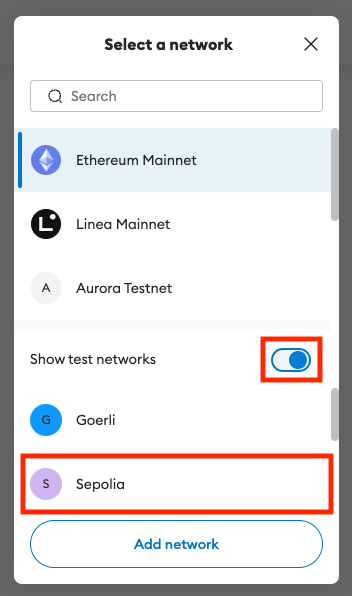
>
> 3 \. ネットワークが`Sepolia`に切り替わったことを確認します。
>
> 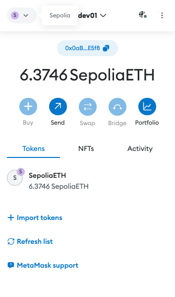

MetaMask ウォレットに`Sepolia Test Network`が設定されたら、下記のリンクの中から条件に合うものを選んで、少量の偽 ETH を取得しましょう。

- [Alchemy](https://sepoliafaucet.com/) - 1 Sepolia ETH（24 時間に 1 度もらうことができる）
  - ウォレットアドレスを入力して`Send Me ETH`ボタンを押下するとその場でもらえます。

### 📈 `hardhat.config.js`ファイルを編集する

`hardhat.config.js`ファイルを変更する必要があります。

これは、スマートコントラクトプロジェクトのルートディレクトリにあります。

- 今回は、`packages/contract`ディレクトリの直下に`hardhat.config.js`が存在するはずです。

例)ターミナル上で`packages/contract`に移動し、`ls`を実行した結果

```
$ ls
README.md         artifacts         cache             contracts         hardhat.config.js package.json      scripts           test
```

`hardhat.config.js`を VS Code で開いて、中身を編集していきます。

```javascript
require("@nomicfoundation/hardhat-toolbox");

module.exports = {
  solidity: "0.8.19",
  networks: {
    sepolia: {
      url: "YOUR_ALCHEMY_API_URL",
      accounts: ["YOUR_PRIVATE_SEPOLIA_ACCOUNT_KEY"],
    },
  },
};
```

1\. `YOUR_ALCHEMY_API_URL`の取得

> `hardhat.config.js`の`YOUR_ALCHEMY_API_URL`の部分を先ほど取得した Alchemy の URL（ `HTTP`リンク） と入れ替えます。

2\. `YOUR_PRIVATE_SEPOLIA_ACCOUNT_KEY`の取得

> [ドキュメント](https://support.metamask.io/hc/en-us/articles/360015289632)を参考に取得していきます。
>
> 1.  お使いのブラウザから、MetaMask プラグインをクリックして、画面上部のアカウント選択をクリックします。
>
> 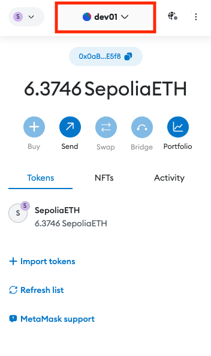
>
> 2.  秘密鍵をエクスポートしたいアカウントの横にあるメニューをクリックし、`Account details`を開きます。
>
> 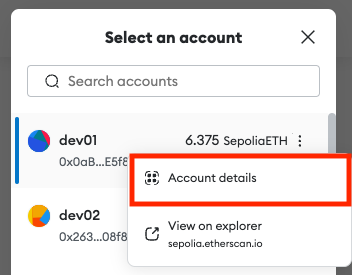
>
> 3.  `Show Private Key`をクリックしてください。
>
> 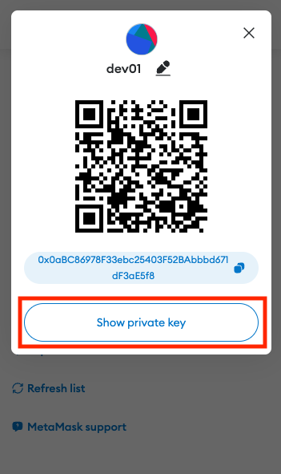
>
> 4.  MetaMask のパスワードを求められるので、入力したら`Confirm`を押します。
>
> 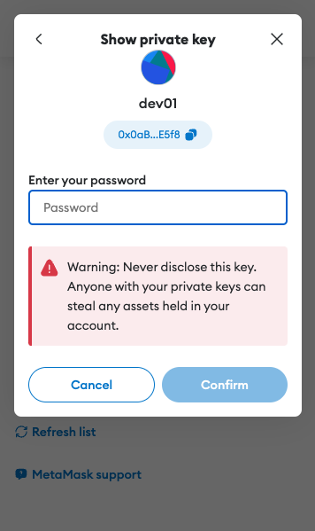
>
> 5. `Hold to reveal Private Key`を長押しすると、あなたの秘密鍵（＝ `Private Key` ）が表示されるので、クリックしてコピーします。
>
> 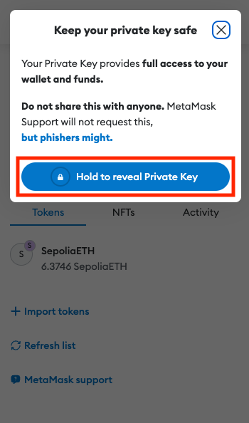

> - `hardhat.config.js`の`YOUR_PRIVATE_SEPOLIA_ACCOUNT_KEY`の部分をここで取得した秘密鍵とを入れ替えます。

### 🙊 秘密鍵は誰にも教えてはいけません

`hardhat.config.js`を更新したら、ここで一度立ち止まりましょう。

**🚨: `hardhat.config.js`ファイルをあなたの秘密鍵の情報を含んだ状態で GitHub にコミットしてはいけません**。

> この秘密鍵は、あなたのイーサリアムメインネットの秘密鍵と同じです。
>
> 秘密鍵が流出してしまうと、誰でもあなたのウォレットにアクセスすることができてしまうので、とても危険です。
>
> **絶対に秘密鍵を自分以外の人が見れる場所に置かないようにしましょう**。

下記を実行して、VS Code で`.gitignore`ファイルを編集しましょう。

```
code .gitignore
```

`.gitignore`に`hardhat.config.js`の行を追加します。

`.gitignore`の中身が下記のようになっていれば、問題ありません。

```
node_modules
.env
coverage
coverage.json
typechain
typechain-types

#Hardhat files
cache
artifacts
hardhat.config.js
```

`.gitignore`に記載されているファイルやディレクトリは、GitHub にディレクトリをプッシュされずに、ローカル環境にのみ保存されます。

> **✍️: スマートコントラクトをデプロイするのに秘密鍵が必要な理由** > **新しくスマートコントラクトをイーサリアムネットワーク上にデプロイすること**も、トランザクションの一つです。
>
> トランザクションを行うためには、ブロックチェーンに「ログイン」する必要があります。
>
> 「ログイン」には下記の情報が必要となります。
>
> - ユーザー名: 公開アドレス
>   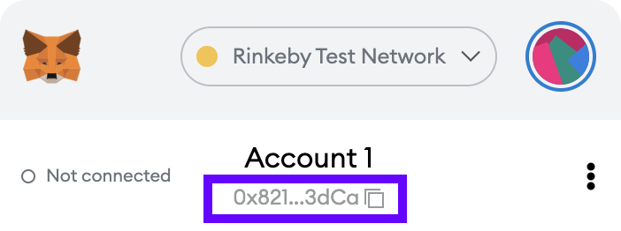
> - パスワード: 秘密鍵
>   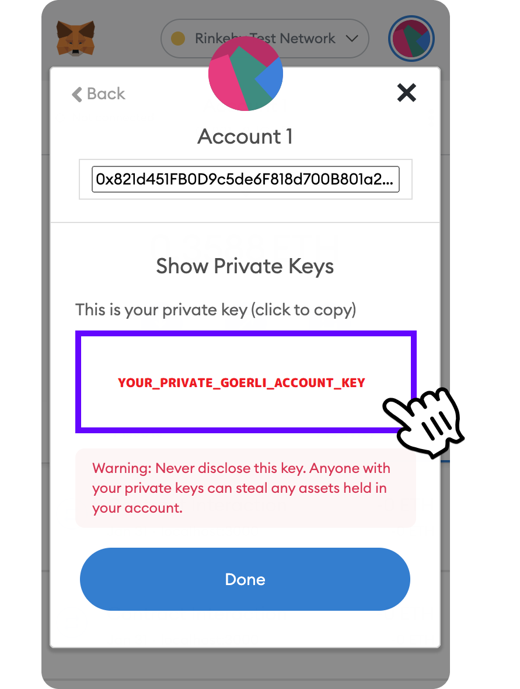
>   ユーザー名とパスワードを使用して、AWS にログインしてプロジェクトをデプロイするのと同じです。

⚠️: すでに GitHub に`hardhat.config.js`を push してしまった場合の対処法

すでに GitHub にコードを push している場合は、ターミナル上で下記を実行してください。

```
git rm --cached hardhat.config.js
```

これで、ローカルリポジトリの`hardhat.config.js`ファイルを残した状態で、リモートリポジトリのファイルを消すことができます。再度、`git push`まで行ったら、GitHub 上に`hardhat.config.js`が存在しないことを確認してください。

### 🚀 Sepolia Test Network にコントラクトをデプロイする

`hardhat.config.js`の更新が完了したら、Sepolia Test Network にコントラクトをデプロイしてみましょう。

ではルートディレクトリにいることを確認して、ターミナル上で下記のコマンドを実行しましょう。

```
yarn contract deploy
```

下記のような結果が出力されていれば成功です 🎉

```
Deploying contracts with account:  0x1A7f14FBF50acf10bCC08466743fB90384Cbd720
Account balance:  174646846389073382
Contract deployed to:  0x04da168454AFA19Eb43D6A28b63964D8DCE8351e
Contract deployed by:  0x1A7f14FBF50acf10bCC08466743fB90384Cbd720
```

あなたのターミナル上で、`Contract deployed to`の後に出力されたコントラクトアドレス(`0x..`)をコピーして、保存しておきましょう。後でフロントエンドを構築する際に必要となります。

### 👀 Etherscan でトランザクションを確認する

コピーした`Contract deployed to`に続くアドレスを、[Etherscan](https://sepolia.etherscan.io/) に貼り付けて、あなたのスマートコントラクトのトランザクション履歴を見てみましょう。

Etherscan は、イーサリアムネットワーク上のトランザクションに関する情報を確認するのに便利なプラットフォームです。

_表示されるまでに約 1 分程度かかる場合があります。_

### 🙋‍♂️ 質問する

ここまでの作業で何かわからないことがある場合は、Discord の`#ethereum`で質問をしてください。

ヘルプをするときのフローが円滑になるので、エラーレポートには下記の 3 点を記載してください ✨

```
1. 質問が関連しているセクション番号とレッスン番号
2. 何をしようとしていたか
3. エラー文をコピー&ペースト
4. エラー画面のスクリーンショット
```

---

Sepolia Test Network にスマートコントラクトをデプロイしたら、次のレッスンに進みましょう 🎉
