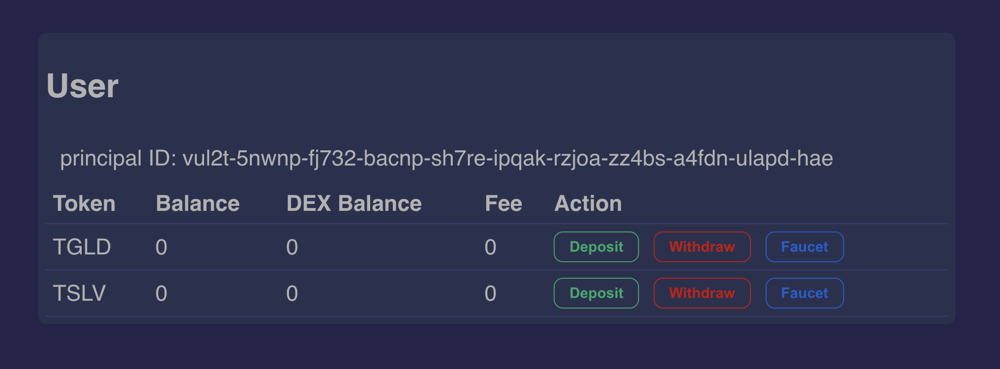

### 📃 ユーザーボードを作成しよう

このレッスンでは、ユーザーが保有するトークンの情報を一覧表示するボードを作成していきます。



ユーザーボードは以下の機能を持ちます。

- ユーザーのPrincipalを表示する
- トークンの保有量が表示される
- 各トークンに対しての操作（Faucet / Deposit / Withdraw）が行えるボタンを表示する

まずは、必要なファイルを作成します。

```
touch ./src/icp_basic_dex_frontend/src/components/UserBoard.jsx
```

続いて、DEX上で扱うトークンの情報をまとめておくためのファイルを作成します。

```
mkdir ./src/icp_basic_dex_frontend/src/utils && touch ./src/icp_basic_dex_frontend/src/utils/token.js
```

ここまでで、`icp_basic_dex_frontend/src`ディレクトリ下のフォルダ構成が以下のようになっているでしょう。

```diff
 src/
 ├── App.css
 ├── App.jsx
 ├── components/
 │   ├── Header.jsx
+│   └── UserBoard.jsx
+├── utils/
+│   └── token.js
 ├── index.html
 └── index.js
```

それでは、実装をしていきます。まずはトークンの情報をまとめておく配列を`utils/token.js`ファイルに実装します。

[tokens.js]

```javascript
import {
  canisterId as GoldDIP20canisterId,
  createActor as GoldDIP20CreateActor,
  GoldDIP20,
} from "../../../declarations/GoldDIP20";
import {
  canisterId as SilverDIP20canisterId,
  createActor as SilverDIP20CreateActor,
  SilverDIP20,
} from "../../../declarations/SilverDIP20";

// DEX上で扱うトークンのデータを配列に格納
export const tokens = [
  {
    canisterName: "GoldDIP20",
    canister: GoldDIP20,
    tokenSymbol: "TGLD",
    createActor: GoldDIP20CreateActor,
    canisterId: GoldDIP20canisterId,
  },
  {
    canisterName: "SilverDIP20",
    canister: SilverDIP20,
    tokenSymbol: "TSLV",
    createActor: SilverDIP20CreateActor,
    canisterId: SilverDIP20canisterId,
  },
];
```

次に、ユーザーボードの機能と、トークン一覧を表示するための実装をします。`components/UserBoard.jsx`ファイルに以下のコードを記述しましょう。

[UserBoard.jsx]

```javascript
import {
  canisterId as faucetCanisterId,
  createActor as faucetCreateActor,
} from '../../../declarations/faucet';
import {
  canisterId as DEXCanisterId,
  createActor as DEXCreateActor,
  icp_basic_dex_backend as DEX,
} from '../../../declarations/icp_basic_dex_backend';
import { tokens } from '../utils/token';
import { Principal } from '@dfinity/principal';

export const UserBoard = (props) => {
  const { agent, userPrincipal, userTokens, setUserTokens } = props;

  const TOKEN_AMOUNT = 500;

  const options = {
    agent,
  };

  // ユーザーボード上のトークンデータを更新する
  const updateUserToken = async (updateIndex) => {
    // ユーザーが保有するトークン量を取得
    const balance = await tokens[updateIndex].canister.balanceOf(userPrincipal);
    // ユーザーがDEXに預けたトークン量を取得
    const dexBalance = await DEX.getBalance(
      userPrincipal,
      Principal.fromText(tokens[updateIndex].canisterId)
    );

    setUserTokens(
      userTokens.map((userToken, index) =>
        index === updateIndex
          ? {
              symbol: userToken.symbol,
              balance: balance.toString(),
              dexBalance: dexBalance.toString(),
              fee: userToken.fee,
            }
          : userToken
      )
    );
  };

  const handleDeposit = async (updateIndex) => {
    try {
      const DEXActor = DEXCreateActor(DEXCanisterId, options);
      const tokenActor = tokens[updateIndex].createActor(
        tokens[updateIndex].canisterId,
        options
      );

      // ユーザーの代わりにDEXがトークンを転送することを承認する
      const resultApprove = await tokenActor.approve(
        Principal.fromText(DEXCanisterId),
        TOKEN_AMOUNT
      );
      if (!resultApprove.Ok) {
        alert(`Error: ${Object.keys(resultApprove.Err)[0]}`);
        return;
      }
      // DEXにトークンを入金する
      const resultDeposit = await DEXActor.deposit(
        Principal.fromText(tokens[updateIndex].canisterId)
      );
      if (!resultDeposit.Ok) {
        alert(`Error: ${Object.keys(resultDeposit.Err)[0]}`);
        return;
      }
      console.log(`resultDeposit: ${resultDeposit.Ok}`);

      updateUserToken(updateIndex);
    } catch (error) {
      console.log(`handleDeposit: ${error} `);
    }
  };

  const handleWithdraw = async (updateIndex) => {
    try {
      const DEXActor = DEXCreateActor(DEXCanisterId, options);
      // DEXからトークンを出金する
      const resultWithdraw = await DEXActor.withdraw(
        Principal.fromText(tokens[updateIndex].canisterId),
        TOKEN_AMOUNT
      );
      if (!resultWithdraw.Ok) {
        alert(`Error: ${Object.keys(resultWithdraw.Err)[0]}`);
        return;
      }
      console.log(`resultWithdraw: ${resultWithdraw.Ok}`);

      updateUserToken(updateIndex);
    } catch (error) {
      console.log(`handleWithdraw: ${error} `);
    }
  };

  // Faucetからトークンを取得する
  const handleFaucet = async (updateIndex) => {
    try {
      const faucetActor = faucetCreateActor(faucetCanisterId, options);
      const resultFaucet = await faucetActor.getToken(
        Principal.fromText(tokens[updateIndex].canisterId)
      );
      if (!resultFaucet.Ok) {
        alert(`Error: ${Object.keys(resultFaucet.Err)[0]}`);
        return;
      }
      console.log(`resultFaucet: ${resultFaucet.Ok}`);

      updateUserToken(updateIndex);
    } catch (error) {
      console.log(`handleFaucet: ${error}`);
    }
  };

  return (
    <>
      <div className="user-board">
        <h2>User</h2>
        <li>principal ID: {userPrincipal.toString()}</li>
        <table>
          <tbody>
            <tr>
              <th>Token</th>
              <th>Balance</th>
              <th>DEX Balance</th>
              <th>Fee</th>
              <th>Action</th>
            </tr>
            {/* トークンのデータを一覧表示する */}
            {userTokens.map((token, index) => {
              return (
                <tr key={`${index} : ${token.symbol} `}>
                  <td data-th="Token">{token.symbol}</td>
                  <td data-th="Balance">{token.balance}</td>
                  <td data-th="DEX Balance">{token.dexBalance}</td>
                  <td data-th="Fee">{token.fee}</td>
                  <td data-th="Action">
                    <div>
                      {/* トークンに対して行う操作（Deposit / Withdraw / Faucet）のボタンを表示 */}
                      <button
                        className="btn-green"
                        onClick={() => handleDeposit(index)}
                      >
                        Deposit
                      </button>
                      <button
                        className="btn-red"
                        onClick={() => handleWithdraw(index)}
                      >
                        Withdraw
                      </button>
                      <button
                        className="btn-blue"
                        onClick={() => handleFaucet(index)}
                      >
                        Faucet
                      </button>
                    </div>
                  </td>
                </tr>
              );
            })}
          </tbody>
        </table>
      </div>
    </>
  );
};
```

トークンを取得するためのFaucetボタンを押した際に実行される、`handleFaucet`関数を見てみましょう。ユーザーのPrincipalが必要な関数をコールする際には、ログイン認証後に作成した`agent`を用いて、キャニスターの関数をコールする必要があります。ここでは、faucetキャニスターの`getToken`関数を実行する際にユーザー Principalが必要になります。入金を行う`handleDeposit`関数や、出金を行う`handleWithdraw`関数でも同様にagentを使用します。

続いて、ログインをした時にユーザーが保有するトークンの情報を取得できるようにしたいと思います。前回のレッスンで作成した`Header.jsx`ファイルを編集しましょう。

まずは、`props`の部分を以下ように更新します。トークンの情報を更新するための関数や、ユーザーの情報を保存するための関数を追加で渡します。

[Header.jsx]

```diff
export const Header = (props) => {
  const {
+    updateOrderList,
+    updateUserTokens,
+    setAgent,
    setUserPrincipal,
  } = props;
```

続いて、`handleSuccess`関数を以下の内容に書き換えます。`props`で渡された関数をコールして、データの保存・更新を行います。

```diff
const handleSuccess = async (authClient) => {
  // 認証したユーザーの`identity`を取得
  const identity = await authClient.getIdentity();

  // 認証したユーザーの`principal`を取得
  const principal = identity.getPrincipal();
-  setUserPrincipal(principal);

  console.log(`User Principal: ${principal.toString()}`);

+  // 取得した`identity`を使用して、ICと対話する`agent`を作成する
+  const newAgent = new HttpAgent({ identity });
+  if (process.env.DFX_NETWORK === "local") {
+    newAgent.fetchRootKey();
+  }
+
+  // 認証したユーザーが保有するトークンのデータを取得
+  updateUserTokens(principal);
+  // オーダー一覧を取得
+  updateOrderList();
+
+  // ユーザーのデータを保存
+  setUserPrincipal(principal);
+  setAgent(newAgent);
};
```

ポイントは`fetchRootKey`をコールする部分です。ログイン認証後に取得したユーザーの情報を用いて、ICと対話する`agent`を作成します。`HttpAgent`はキャニスターの機能をコールするための関数や、必要なデータがさまざま定義されているクラスになります。ローカル環境の`agent`はICの公開鍵を持っていないため、このままでは関数をコールすることができません。そのため、`fetchRootKey()`で鍵を取得する必要があります。

それでは最後に、`App.jsx`を更新します。新たに、以下の機能を追加します。

- `UserBoard.jsx`をインポートしてユーザーボードを表示する
- 画面のリロード時にユーザーの情報を再取得する
- `Header.jsx`に渡す`props`を更新する

それでは、`App.jsx`ファイルの中身を以下のコードで書き換えてください。

[App.jsx]

```javascript
import React, { useEffect, useState } from "react";
import "./App.css";

import { HttpAgent } from "@dfinity/agent";
import { AuthClient } from "@dfinity/auth-client";
import { Principal } from "@dfinity/principal";

import { icp_basic_dex_backend as DEX } from "../../declarations/icp_basic_dex_backend";
import { Header } from "./components/Header";
import { UserBoard } from "./components/UserBoard";
import { tokens } from "./utils/token";

const App = () => {
  const [agent, setAgent] = useState();
  const [userPrincipal, setUserPrincipal] = useState();
  const [userTokens, setUserTokens] = useState([]);
  const [orderList, setOrderList] = useState([]);

  const updateUserTokens = async (principal) => {
    let getTokens = [];
    // ユーザーの保有するトークンのデータを取得
    for (let i = 0; i < tokens.length; ++i) {
      // トークンのメタデータを取得
      const metadata = await tokens[i].canister.getMetadata();
      // ユーザーのトークン保有量を取得
      const balance = await tokens[i].canister.balanceOf(principal);
      // DEXに預けているトークン量を取得
      const dexBalance = await DEX.getBalance(
        principal,
        Principal.fromText(tokens[i].canisterId)
      );

      // 取得したデータを格納
      const userToken = {
        symbol: metadata.symbol.toString(),
        balance: balance.toString(),
        dexBalance: dexBalance.toString(),
        fee: metadata.fee.toString(),
      };
      getTokens.push(userToken);
    }
    setUserTokens(getTokens);
  };

  // オーダー一覧を更新する
  const updateOrderList = async () => {
    const orders = await DEX.getOrders();
    const createdOrderList = orders.map((order) => {
      const fromToken = tokens.find(
        (e) => e.canisterId === order.from.toString()
      );

      return {
        id: order.id,
        from: order.from,
        fromSymbol: fromToken.tokenSymbol,
        fromAmount: order.fromAmount,
        to: order.to,
        toSymbol: tokens.find((e) => e.canisterId === order.to.toString())
          .tokenSymbol,
        toAmount: order.toAmount,
      };
    });
    setOrderList(createdOrderList);
  };

  // ユーザーがログイン認証済みかを確認
  const checkClientIdentity = async () => {
    try {
      const authClient = await AuthClient.create();
      const resultAuthenticated = await authClient.isAuthenticated();
      // 認証済みであればPrincipalを取得
      if (resultAuthenticated) {
        const identity = await authClient.getIdentity();
        // ICと対話する`agent`を作成する
        const newAgent = new HttpAgent({ identity });
        // ローカル環境の`agent`はICの公開鍵を持っていないため、`fetchRootKey()`で鍵を取得する
        if (process.env.DFX_NETWORK === "local") {
          newAgent.fetchRootKey();
        }

        updateUserTokens(identity.getPrincipal());
        updateOrderList();
        setUserPrincipal(identity.getPrincipal());
        setAgent(newAgent);
      } else {
        console.log(`isAuthenticated: ${resultAuthenticated}`);
      }
    } catch (error) {
      console.log(`checkClientIdentity: ${error}`);
    }
  };

  // ページがリロードされた時、以下の関数を実行
  useEffect(() => {
    checkClientIdentity();
  }, []);

  return (
    <>
      <Header
        updateOrderList={updateOrderList}
        updateUserTokens={updateUserTokens}
        setAgent={setAgent}
        setUserPrincipal={setUserPrincipal}
      />
      {/* ログイン認証していない時 */}
      {!userPrincipal && (
        <div className="title">
          <h1>Welcome!</h1>
          <h2>Please push the login button.</h2>
        </div>
      )}
      {/* ログイン認証済みの時 */}
      {userPrincipal && (
        <main className="app">
          <UserBoard
            agent={agent}
            userPrincipal={userPrincipal}
            userTokens={userTokens}
            setUserTokens={setUserTokens}
          />
        </main>
      )}
    </>
  );
};

export default App;
```

ポイントは`checkClientIdentity`関数です。**useEffect**でコールしている関数で、画面のリロードが行われた際に実行されます。この関数では、ログインしているユーザーの情報を再取得しています。ログインしているかどうかは、AuthClientが提供する`isAuthenticated`関数で確認ができます。

それでは、ブラウザで確認をしてみましょう。開発中は、フロントエンドの変更が動的に反映されるwebpackの使用がおすすめです。まずは、サーバーを立ち上げましょう。

```
npm start
```

起動が完了すると、最後に`compiled successfully`と出力されます。

```
webpack 5.74.0 compiled successfully in 1260 ms
```

それでは、`npm start`コマンドを実行したターミナルに表示されている`<i> [webpack-dev-server] Project is running at:`以降のURL (例えば http://localhost:8080/ )にアクセスしてみましょう。

ログインのセッションが切れている場合、再度ログインボタンを押してアンカーを入力しましょう。認証後、以下のようにユーザーボードが表示されていたら完成です！


### 🙋‍♂️ 質問する

ここまでの作業で何かわからないことがある場合は、Discordの`#icp`で質問をしてください。

ヘルプをするときのフローが円滑になるので、エラーレポートには下記の4点を記載してください ✨

```
1. 質問が関連しているセクション番号とレッスン番号
2. 何をしようとしていたか
3. エラー文をコピー&ペースト
4. エラー画面のスクリーンショット
```

---

次のレッスンに進んで、オーダーを作成・表示する機能を実装しましょう！
