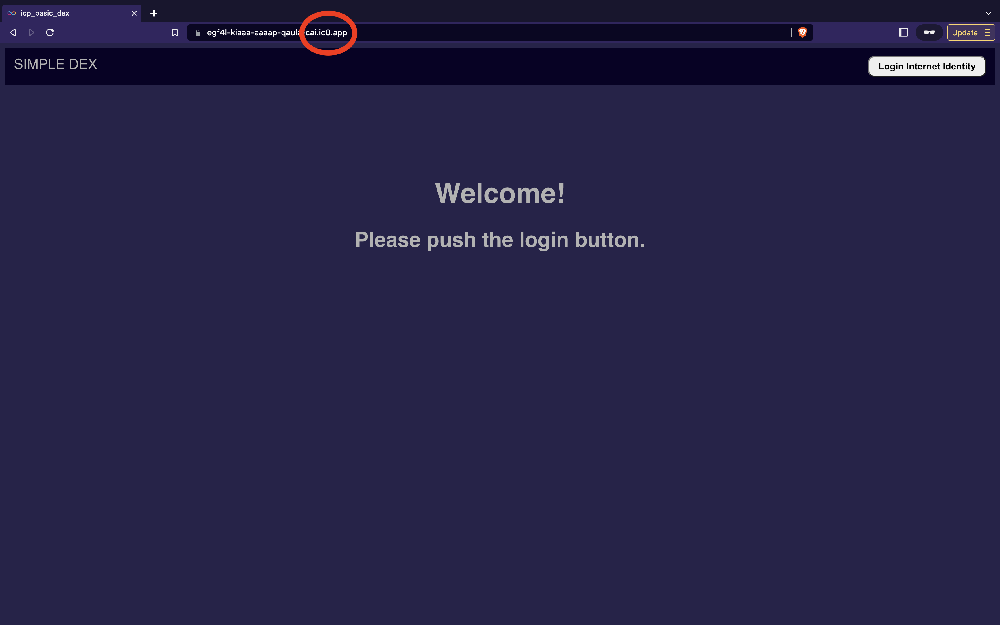
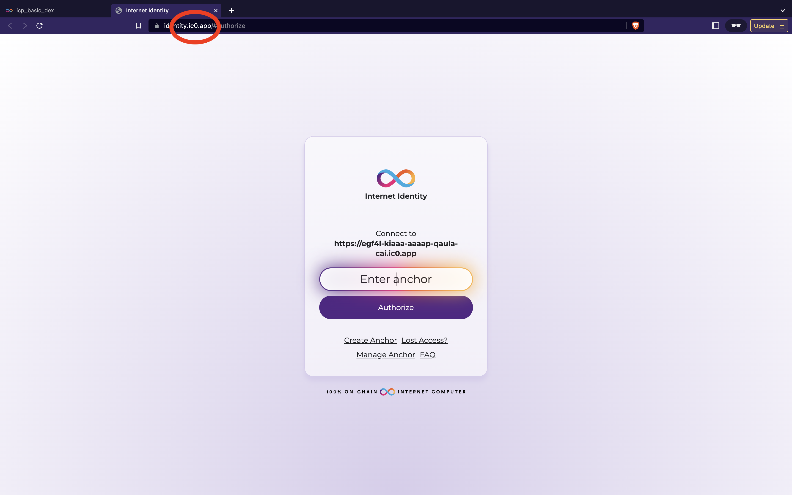
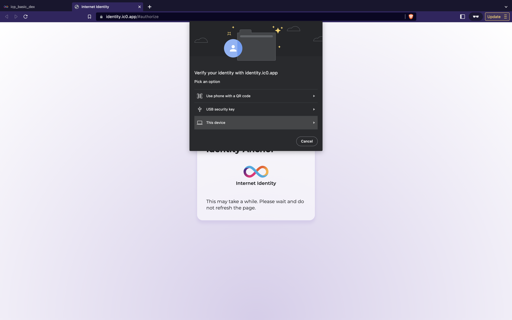

### 🏭 サイクルウォレットを用意しよう

セクション0で申請をしたクーポンコードは取得できたでしょうか？ メインネットへデプロイする前に、サイクルウォレットを作成する必要があります。クーポンコードを取得できた方は、[Cycles Faucet - 2.Redeem](https://anv4y-qiaaa-aaaal-qaqxq-cai.ic0.app/coupon)にアクセスをして、指示通りにセットアップを行なってください。

今回は全部で`5 TC`を使用します。必ず残高の確認を行い、きちんとサイクルが取得できていることを確認しましょう。

```
dfx wallet --network=ic balance
#20.099 TC (trillion cycles).
```

サイクルウォレットの準備ができたら実際にデプロイを行なっていきましょう！

### 🌏 アプリケーションをメインネットにデプロイしよう

完成したDEXをIC上にデプロイしてみましょう！

今回メインネットにデプロイをするキャニスターは全部で5つになります。ローカル環境でデプロイした`Interenet Identity`キャニスターは、開発用であったことを思い出してください。ここでは、ICのメインネットにすでにデプロイされている`Internet Identity`キャニスターに接続するため、自分でデプロイする必要がありません。

それでは、デプロイ作業を行なっていきましょう。まずは、メインネットへデプロイを行うユーザーのプリンシパルを変数に登録しておきます。

```
export ROOT_PRINCIPAL=$(dfx identity get-principal)
```

続いて、実際にキャニスターをデプロイしていきましょう。最初に`GoldDIP20`キャニスターをデプロイします。

```
dfx deploy GoldDIP20 --argument='("Token Gold Logo", "Token Gold", "TGLD", 8, 1_000_000_000_000, principal '\"$ROOT_PRINCIPAL\"', 0)'  --network ic --with-cycles 1000000000000
```

`SilverDIP20`キャニスターをデプロイします。

```
dfx deploy SilverDIP20 --argument='("Token Silver Logo", "Token Silver", "TSLV", 8, 1_000_000_000_000, principal '\"$ROOT_PRINCIPAL\"', 0)'  --network ic --with-cycles 1000000000000
```

`faucet`キャニスターをデプロイします。

```
dfx deploy faucet --network ic --with-cycles 1000000000000
```

デプロイが完了したら、`faucet`キャニスターにトークンをプールしましょう。先に変数へIDを保存しておきます。

```
export IC_FAUCET_PRINCIPAL=$(dfx canister id --network ic faucet)
```

それでは、`mint`メソッドを実行してトークンをプールしましょう。まずは`GoldDIP20`キャニスターの`mint`を実行します。

```
dfx canister call  --network ic GoldDIP20 mint '(principal '\"$IC_FAUCET_PRINCIPAL\"', 100_000)'

#(variant { Ok = 0 : nat })
```

`faucet`キャニスターのトークン残高を確認するには、以下のコマンドを実行します。

```
dfx canister call --network ic GoldDIP20 balanceOf '(principal '\"$IC_FAUCET_PRINCIPAL\"')'

#(100_000 : nat)
```

同様に、`SilverDIP20`キャニスターの`mint`を実行します。

```
dfx canister call  --network ic SilverDIP20 mint '(principal '\"$IC_FAUCET_PRINCIPAL\"', 100_000)'

#(variant { Ok = 0 : nat })
```

先ほどと同様に残高を確認してみましょう。問題がなければ、デプロイの作業に戻ります。

`icp_basic_dex_backend`キャニスターをデプロイします。

```
dfx deploy icp_basic_dex_backend --network ic --with-cycles 1000000000000
```

最後に、`icp_basic_dex_frontend`キャニスターをデプロイします。

```
dfx deploy icp_basic_dex_frontend --network ic --with-cycles 1000000000000
```

デプロイが完了すると、合計5つのURLが表示されます。

```
URLs:
  Frontend canister via browser
    icp_basic_dex_frontend: https://egf4l-kiaaa-aaaap-qaula-cai.ic0.app/
  Backend canister via Candid interface:
    GoldDIP20: https://a4gq6-oaaaa-aaaab-qaa4q-cai.raw.ic0.app/?id=e2bg2-5iaaa-aaaap-qauja-cai
    SilverDIP20: https://a4gq6-oaaaa-aaaab-qaa4q-cai.raw.ic0.app/?id=e5aao-qqaaa-aaaap-qaujq-cai
    faucet: https://a4gq6-oaaaa-aaaab-qaa4q-cai.raw.ic0.app/?id=eihrd-ryaaa-aaaap-qauka-cai
    icp_basic_dex_backend: https://a4gq6-oaaaa-aaaab-qaa4q-cai.raw.ic0.app/?id=epgxx-4aaaa-aaaap-qaukq-cai
```

また、デプロイをしたキャニスターに関する情報は以下のコマンドで確認することができます。

```
dfx canister status --network ic icp_basic_dex_backend
```

ステータスやサイクルの残高などがわかります。

```
Canister status call result for icp_basic_dex_backend.
Status: Running
Controllers: c45eh-eqaaa-aaaap-qatca-cai hcctz-gzgbz-vlfb3-3ppbp-rzq45-sbk5l-eqlpo-d7ejs-eejpz-l5cva-aqe
Memory allocation: 0
Compute allocation: 0
Freezing threshold: 2_592_000
Memory Size: Nat(394158)
Balance: 899_449_088_968 Cycles
Module hash: 0xaa54f3c23ababdb0dcb5bfd8c96fd741e3fb7ad18ee155a06a38b383ed5af063
```

それでは、実際にメインネットへデプロイされたDEXにブラウザから接続してみましょう。`icp_basic_dex_frontend:`の右に表示されたURLにアクセスをします。

確認してほしいポイントは2つです。

1つ目はURLに`ic0`とついていることです。これがICのメインネットにデプロイされているアプリケーションの特徴です。



2つ目は、ログイン認証で使用されるInternet Identityの確認です。早速ログインボタンを押してみましょう。DEX同様に、URLに`ic0`がついていることがわかります。



また、開発用とは違う点がいくつか確認できます。それでは、セクション3で行なったように認証をしてみましょう。

違いとしては、デバイス名を登録する際に実際登録するデバイスの認証を求められる点があります。例えば3つ目の`This device`を選択した時、デバイスのユーザー認証機能（例えば指紋認証）を用いた登録が促されます。そのほかの認証機能については[こちら](https://internetcomputer.org/docs/current/tokenomics/identity-auth/auth-how-to#create-an-identity-anchor)を参照してください。



問題なく認証ができればOKです！　実際にメインネットへデプロイされたDEXを操作してみましょう！

### 🙋‍♂️ 質問する

ここまでの作業で何かわからないことがある場合は、Discordの`#icp`で質問をしてください。

ヘルプをするときのフローが円滑になるので、エラーレポートには下記の4点を記載してください ✨

```
1. 質問が関連しているセクション番号とレッスン番号
2. 何をしようとしていたか
3. エラー文をコピー&ペースト
4. エラー画面のスクリーンショット
```

### 🎫 NFT を取得しよう!

NFTを取得する条件は、以下のようになります。

1. MVPの機能がすべて実装されている（実装OK）

2. WebアプリケーションでMVPの機能が問題なく実行される（テストOK）

3. このページの最後にリンクされているProject Completion Formに記入する

4. Discordの`🔥｜completed-projects`チャンネルに、あなたのWebサイトをシェアしてください 😉🎉 Discordに投稿する際に、追加実装した機能とその概要も教えていただけると幸いです!

プロジェクトを完成させていただいた方には、NFTをお送りします。

### 🎉 おつかれさまでした!

今回のプロジェクトで、ブロックチェーン上にホストされたDEXが完成しました！

あなたは、複数のキャニスタースマートコントラクトをデプロイし、トークンの取引を運用するために必要なWebアプリケーションを立ち上げました。

これらは、分散型の世界を目指すうえで非常に重要なスキルです。

これからもweb3への旅をあなたが続けてくれることを願っています 🚀

---

Project Completion Formは[こちら](https://airtable.com/shrf1cCtTx0iQuszX)です。
