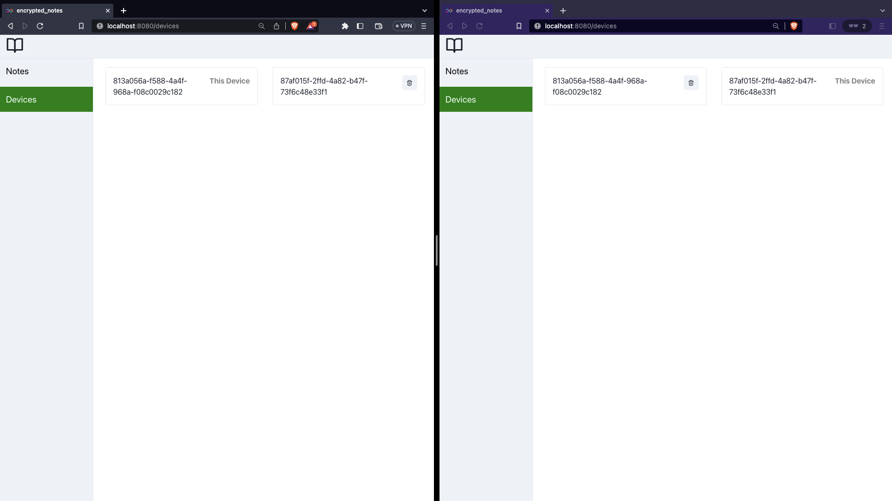
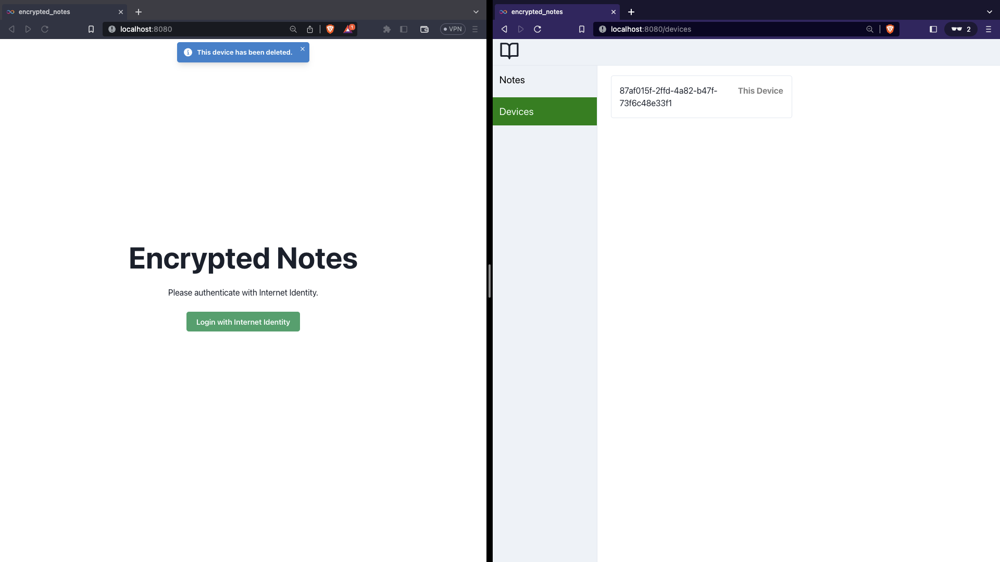

### 🗑 デバイスデータを削除しよう

ここまでのレッスンで、3つのデバイスデータ（デバイスエイリアス、対称鍵、公開鍵と秘密鍵のペア）を生成・共有し、保存する機能が完成しました。このレッスンでは、ノートを共有するデバイス一覧から、デバイスを削除する機能を完成させましょう。

デバイスの削除アイコンが押されたときに実行される関数は、`route/devices/index.tsx`のDevicesコンポーネントに定義されている`deleteDevice`関数です。deleteDevice関数のログ出力をしている部分を下記のように更新しましょう。

```tsx
  const deleteDevice = async () => {
    if (auth.status !== 'SYNCED') {
      console.error(`CryptoService is not synced.`);
      return;
    }
    setIsLoading(true);
    try {
      // デバイスを削除します。
      await auth.actor.deleteDevice(deleteAlias);
      await getDevices();
    } catch (err) {
      console.error(err);
      showMessage({
        title: 'Failed to delete device',
        status: 'error',
      });
    } finally {
      onCloseDeleteDialog();
      setIsLoading(false);
    }
  };
```

バックエンドキャニスターの`deleteDevice`関数に、削除したいデバイスエイリアスを渡して呼び出します。この時渡される`deleteAlias`は、ステート変数です。どのようにステート変数が更新されるかは、`setDeleteAlias`関数を辿って確認してみてください！

```tsx
  const [deleteAlias, setDeleteAlias] = useState<string | undefined>(undefined);
```

デバイスを削除するということはノートの共有から外すということなので、削除されたデバイスからは、アプリケーションの機能（Notesページ・Devicesページへのアクセスとそのページで行える操作）を使えないようにしたいですね。そのために、自身がノートを共有するデバイス一覧から削除されたことを検知したら、ローカルストレージとバックエンドキャニスターに保存しているデバイスデータを削除し、ログインページへリダイレクトするようにしましょう。そうすることで、削除されたデバイスは再度認証を行わないとアプリケーションの機能が利用できないようになります。

上記の機能を実現するために、デバイスデータが削除されたかどうかをチェックするisDeviceRemoved関数を`hooks/useDeviceCheck.ts`に用意しています。ただし、この関数は未完成なので、足りない機能を追加しましょう。下記のように更新してください。

```ts
  const isDeviceRemoved = useCallback(async () => {
    if (auth.status !== 'SYNCED') {
      return false;
    }

    // バックエンドキャニスターからデバイスエイリアスを取得します。
    const deviceAlias = await auth.actor.getDeviceAliases();
    // 自身のデバイスエイリアスが含まれていない場合は、デバイスが削除されたと判断します。
    return !deviceAlias.includes(auth.cryptoService.deviceAlias);
  }, [auth]);
```

追加したコードを確認しましょう。

`auth.actor.getDeviceAlias()`で、バックエンドキャニスターからノートを共有しているデバイスのエイリアス一覧を取得します。取得したデバイスエイリアス一覧に、自身のデバイスエイリアス（auth.cryptoService.deviceAlias）が含まれていない場合は、デバイスが削除されたみなしてtrueを返します。

これで、isDeviceRemoved関数は完成ですが、自身のデバイスがいつ削除されるかはわからないので、この関数を定期的に実行してチェックする必要があります。NotesコンポーネントとDevicesコンポーネントに、isDeviceRemoved関数を定期的に呼び出すuseEffectを定義しているので該当箇所を確認しましょう。

```tsx
// routes/notes/index.tsx
  useEffect(() => {
    // 1秒ごとにポーリングします。
    const intervalId = window.setInterval(async () => {
      console.log('Check device data...');

      const isRemoved = await isDeviceRemoved();
      if (isRemoved) {
        try {
          await logout();
          showMessage({
            title: 'This device has been deleted.',
            status: 'info',
          });
          navigate('/');
        } catch (err) {
          showMessage({ title: 'Failed to logout', status: 'error' });
          console.error(err);
        }
      }
    }, 1000);

    // クリーンアップ関数を返します。
    return () => {
      clearInterval(intervalId);
    };
  }, [auth]);
```

前回のレッスンで対称鍵の同期処理を実装する際に、[setInterval](https://developer.mozilla.org/en-US/docs/Web/API/setInterval)を使用したのを覚えているでしょうか？ 同様にsetInterval関数を用いて、一定の時間（ここでは1秒）ごとにisDeviceRemoved関数の結果を確認します。デバイスデータが削除されていた場合は、ログアウト処理を行ってログインページへリダイレクトします。logout関数は`hooks/authContext.ts`に定義されています。

```ts
// hooks/authContext.ts
  const logout = async (): Promise<void> => {
    if (auth.status !== 'SYNCED') {
      return;
    }

    try {
      // デバイスデータを削除します。
      await auth.cryptoService.clearDeviceData();
      // AuthClient内のデータをクリアします。
      await auth.authClient.logout();
      setAuth({ status: 'ANONYMOUS' });
    } catch (err) {
      return Promise.reject(err);
    }
  };
```

logout関数では、デバイスデータとAuthClient内のデータを削除します。AuthClient内のデータ削除には、[authClient.logout](https://agent-js.icp.xyz/auth-client/classes/AuthClient.html#logout)メソッドを呼び出します。デバイスデータの削除には、CryptoServiceクラスの`clearDeviceData`を呼び出しますがこの関数はまだ未完成です。

`lib/cryptoService.ts`内の`clearDeviceData`関数を下記のように更新しましょう。

```tsx
  public async clearDeviceData(): Promise<void> {
    if (this.intervalId !== null) {
      // インターバルを停止します。
      window.clearInterval(this.intervalId);
      // インターバルIDを初期化します。
      this.intervalId = null;
    }

    // idbに保存された公開鍵と秘密鍵を削除します。
    await clearKeys();
    // ブラウザのローカルストレージに保存されたデバイスエイリアスを削除します。
    window.localStorage.removeItem('deviceAlias');

    // CryptoServiceクラスのメンバー変数を初期化します。
    this.publicKey = null;
    this.privateKey = null;
    this.symmetricKey = null;
    this.exportedPublicKeyBase64 = null;
  }
```

コードを確認しましょう。

`clearDeviceData`関数で行うことは、ストレージに保存したデバイスデータの削除と、CryptoServiceクラスのメンバー変数の初期化です。最初に初期化しているintervalIdは、前回のレッスン、対称鍵の同期処理で定義したインターバルのIDです。ログアウトするデバイスが実行している対称鍵の同期処理は、[window.clearInterval](https://developer.mozilla.org/ja/docs/Web/API/clearInterval)を使ってここで停止させます。

これで、デバイスの削除機能が完成しました。

### ✅ 動作確認をしよう

まずは、現在の状態を確認しましょう。前回のレッスンで動作確認を行った状態のままであれば、2つのデバイスが登録されているはずです。



どちらか一方のデバイスを削除してみましょう。


削除されたデバイスは、ログインページにリダイレクトされて`This device has been deleted.`というメッセージが表示されているはずです。



### 📝 このレッスンで追加したコード

- `routes/devices/index.tsx`

```diff
export const Devices = () => {

...

  const deleteDevice = async () => {
    if (auth.status !== 'SYNCED') {
      console.error(`CryptoService is not synced.`);
      return;
    }
    setIsLoading(true);
    try {
      // デバイスを削除します。
-      console.log('delete device');
+      await auth.actor.deleteDevice(deleteAlias);
+      await getDevices();
    } catch (err) {
      console.error(err);
      showMessage({
        title: 'Failed to delete device',
        status: 'error',
      });
    } finally {
      onCloseDeleteDialog();
      setIsLoading(false);
    }
  };

...

```

- `hooks/useDeviceCheck.ts`

```diff
import { useCallback } from 'react';

import { useAuthContext } from './authContext';

export const useDeviceCheck = () => {
  const { auth } = useAuthContext();

  const isDeviceRemoved = useCallback(async () => {
    if (auth.status !== 'SYNCED') {
      return false;
    }

-    // デバイスエイリアス一覧を取得して、自身のエイリアスが含まれているかを確認します。
-    return false;
+    // バックエンドキャニスターからデバイスエイリアスを取得します。
+    const deviceAlias = await auth.actor.getDeviceAliases();
+    // 自身のデバイスエイリアスが含まれていない場合は、デバイスが削除されたと判断します。
+    return !deviceAlias.includes(auth.cryptoService.deviceAlias);
  }, [auth]);

  return { isDeviceRemoved };
};
```

- `lib/cryptoService.ts`

```diff
...

  public async clearDeviceData(): Promise<void> {
    if (this.intervalId !== null) {
      // インターバルを停止します。
      window.clearInterval(this.intervalId);
      // インターバルIDを初期化します。
      this.intervalId = null;
    }

-    // ストレージからデバイスデータを削除します。
+    // idbに保存された公開鍵と秘密鍵を削除します。
+    await clearKeys();
+    // ブラウザのローカルストレージに保存されたデバイスエイリアスを削除します。
+    window.localStorage.removeItem('deviceAlias');

    // CryptoServiceクラスのメンバー変数を初期化します。
    this.publicKey = null;
    this.privateKey = null;
    this.symmetricKey = null;
    this.exportedPublicKeyBase64 = null;
  }

...

```

### 🙋‍♂️ 質問する

ここまでの作業で何かわからないことがある場合は、Discordの`#icp`で質問をしてください。

ヘルプをするときのフローが円滑になるので、エラーレポートには下記の4点を記載してください ✨

```
1. 質問が関連しているセクション番号とレッスン番号
2. 何をしようとしていたか
3. エラー文をコピー&ペースト
4. エラー画面のスクリーンショット
```

---

次のセクションに進み、ノートの暗号化・復号処理を実装しましょう 🎉