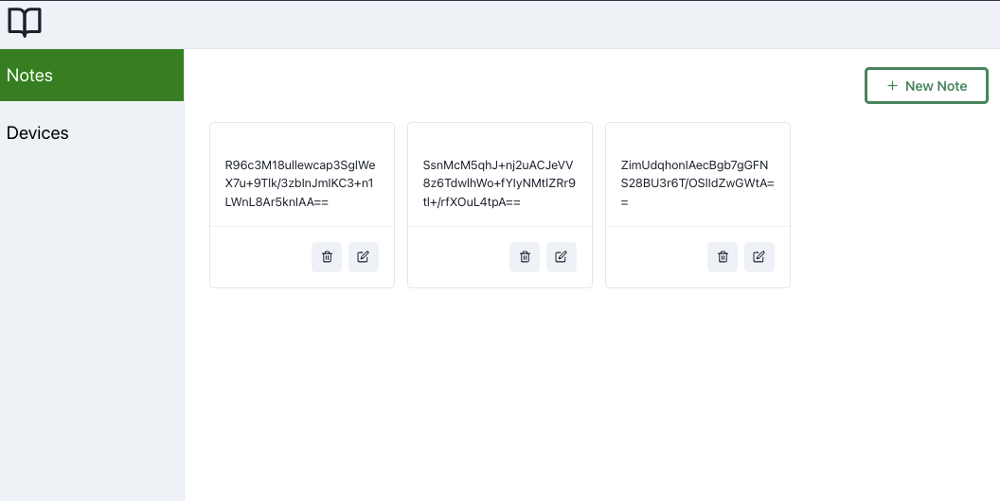

### 🔐 ノートを暗号化する

前回のセクションで、アプリケーションの要となる対称鍵の同期処理が完成しました。このレッスンでは、対称鍵を使用してノートを暗号化します。

それでは実際に、ノートを暗号化するコードを書いていきましょう。

`lib/cryptoService.ts`内に定義されている`encryptNote`関数を下記の内容に更新します。

```ts
  public async encryptNote(data: string): Promise<string> {
    if (this.symmetricKey === null) {
      throw new Error('Not found symmetric key');
    }

    // 12バイトのIV（初期化ベクター）を生成します。
    // // 同じ鍵で繰り返し暗号化を行う際に、それぞれの暗号文が同じにならないようにするためです。
    const iv = window.crypto.getRandomValues(
      new Uint8Array(CryptoService.INIT_VECTOR_LENGTH),
    );

    // ノートをUTF-8のバイト配列に変換します。
    const encodedNote: Uint8Array = new TextEncoder().encode(data);

    // 対称鍵を使ってノートを暗号化します。
    const encryptedNote: ArrayBuffer = await window.crypto.subtle.encrypt(
      // 使用するアルゴリズム
      {
        name: 'AES-GCM',
        iv,
      },
      // 使用する鍵
      this.symmetricKey,
      // 暗号化するデータ
      encodedNote,
    );

    // テキストデータとIVを結合します。
    // // IVは、復号時に再度使う必要があるためです。
    const decodedIv: string = this.arrayBufferToBase64(iv);
    const decodedEncryptedNote: string =
      this.arrayBufferToBase64(encryptedNote);

    return decodedIv + decodedEncryptedNote;
  }
```

コードを確認しましょう。

ノートの暗号化を行う前に、[crypto.getRandomValues](https://developer.mozilla.org/ja/docs/Web/API/Crypto/getRandomValues)メソッドを使用して、乱数を生成します。乱数は、8ビットの整数値（0 ~ 255）が12個生成されます。この乱数はノートの暗号化に用いられるもので、同じ鍵で繰り返し暗号化を行う際に、同じデータが同じ暗号文とならないようにしてくれます。

```ts
    // 12バイトのIV（初期化ベクター）を生成します。
    // // 同じ鍵で繰り返し暗号化を行う際に、それぞれの暗号文が同じにならないようにするためです。
    const iv = window.crypto.getRandomValues(
      new Uint8Array(CryptoService.INIT_VECTOR_LENGTH),
    );
```

暗号化には、[subtle.encrypt](https://developer.mozilla.org/ja/docs/Web/API/SubtleCrypto/encrypt)メソッドを使用します。

```ts
    // 対称鍵を使ってノートを暗号化します。
    const encryptedNote: ArrayBuffer = await window.crypto.subtle.encrypt(
      // 使用するアルゴリズム
      {
        name: 'AES-GCM',
        iv,
      },
      // 暗号化に使用する鍵
      this.symmetricKey,
      // 暗号化するデータ
      encodedNote,
    );
```

iv（乱数の配列）は暗号文の復号に必要なため、暗号文とivを結合したものをバックエンドキャニスターに保存する必要があります。そのために、ivと暗号文を結合したものを戻り値とします。

```ts
    // テキストデータとIVを結合します。
    // // IVは、復号時に再度使う必要があるためです。
    const decodedIv: string = this.arrayBufferToBase64(iv);
    const decodedEncryptedNote: string =
      this.arrayBufferToBase64(encryptedNote);

    return decodedIv + decodedEncryptedNote;
```

これで、ノートの暗号化を行うencryptNote関数が完成しました。では、この関数をコンポーネントから呼び出してみましょう。ノートを暗号化するタイミングは、ユーザーがノートを追加・更新するときです。

まずは、`routes/notes/index.tsx`のNotesコンポーネントに定義された`addNote`関数を下記のように更新します。

```tsx
  const addNote = async () => {
    if (auth.status !== 'SYNCED') {
      console.error(`CryptoService is not synced.`);
      return;
    }

    setIsLoading(true);

    try {
      // ノートの暗号化を行います。
      const encryptedNote = await auth.cryptoService.encryptNote(
        currentNote.data,
      );
      await auth.actor.addNote(encryptedNote);
      await getNotes();
    } catch (err) {
      showMessage({
        title: 'Failed to add note',
        status: 'error',
      });
    } finally {
      onCloseNoteModal();
      setIsLoading(false);
    }
  };
```

続いて、`updateNote`関数を更新します。

```tsx
  const updateNote = async () => {
    if (auth.status !== 'SYNCED') {
      console.error(`CryptoService is not synced.`);
      return;
    }

    setIsLoading(true);

    try {
      // ノートの暗号化を行います。
      const encryptedData = await auth.cryptoService.encryptNote(
        currentNote.data,
      );
      const encryptedNote = {
        id: currentNote.id,
        data: encryptedData,
      };
      await auth.actor.updateNote(encryptedNote);
      await getNotes();
    } catch (err) {
      showMessage({
        title: 'Failed to update note',
        status: 'error',
      });
    } finally {
      onCloseNoteModal();
      setIsLoading(false);
    }
  };
```

暗号化の機能が完成しました！ 

✅ 動作確認を使用

実際にノートを追加・更新してみましょう。入力したテキストが暗号化されていることが確認できます！



### 🙋‍♂️ 質問する

ここまでの作業で何かわからないことがある場合は、Discordの`#icp`で質問をしてください。

ヘルプをするときのフローが円滑になるので、エラーレポートには下記の4点を記載してください ✨

```
1. 質問が関連しているセクション番号とレッスン番号
2. 何をしようとしていたか
3. エラー文をコピー&ペースト
4. エラー画面のスクリーンショット
```

---

次のレッスンに進み、ノートの復号を行いましょう！