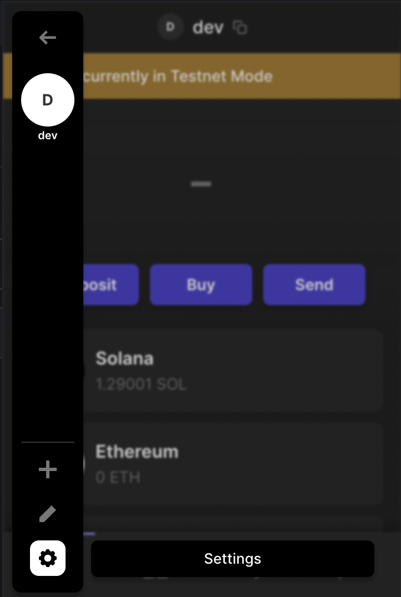

### 🤖 ローカル開発環境を設定する

まずはアプリの雛形であるスタータープロジェクトをもとに、ローカル環境を作成します。

まだ`GitHub`のアカウントをお持ちでない方は、[こちら](https://qiita.com/okumurakengo/items/848f7177765cf25fcde0) の手順に沿ってアカウントを作成してください。

`GitHub`のアカウントをお持ちの方は、下記の手順に沿ってフロントエンドの基盤となるリポジトリをあなたのGitHubに[フォーク](https://denno-sekai.com/github-fork/)しましょう。

1\. [こちら](https://github.com/unchain-tech/Solana-NFT-Drop)からunchain-tech/Solana-NFT-Dropリポジトリにアクセスをして、ページ右上の`Fork`ボタンをクリックします。


2\. Create a new forkページが開くので、「Copy the `main` branch only」という項目に**チェックが入っていることを確認します**。


3\. 設定が完了したら`Create fork`ボタンをクリックします。あなたのGitHubアカウントに`Solana-NFT-Drop`リポジトリのフォークが作成されたことを確認してください。

それでは、フォークしたリポジトリをローカル環境にクローンしましょう。

`Code`ボタンをクリックして`SSH`を選択し、Gitリンクをコピーしましょう。


ターミナルで任意の作業ディレクトリに移動し、先ほどコピーしたリンクを貼り付け、下記を実行してください。

```
git clone コピーした_github_リンク
```

クローンしたプロジェクトに移動し、パッケージのインストールを行いましょう。

```
cd Solana-NFT-Drop/
yarn install
```

次に、下記を実行してみましょう。

```
yarn dev
```

ターミナルに表示されたURLにアクセスをしましょう。あなたのローカル環境で、Webサイトのフロントエンドが立ち上がりましたか？

**ローカル環境で表示されている Web サイト**


上記のような形でフロントエンドが確認できれば成功です。

これからフロントエンドの表示を確認したい時は、ターミナルに向かい、`Solana-NFT-Drop`ディレクトリ上で、`yarn dev`を実行します。これからも必要となる作業ですので、よく覚えておいてください。

ターミナルを閉じるときは、以下のコマンドが使えます ✍️

- Mac: `ctrl + c`
- Windows: `ctrl + shift + w`

### ✅ テストスクリプトについて

このプロジェクトには、コンポーネントのテストスクリプトが`__tests__/コンポーネント名.test.js`として格納されています。これらは、期待するMVPの機能が実装されているかをテストする内容となっており、テストフレームワークとして[Jest](https://jestjs.io/ja/)を、UIコンポーネントのテストを行うために[Testing Library](https://testing-library.com/)を導入しています。Solanaネットワークとやり取りを行う機能をモック（模擬）しているため、ブラウザ上で実際に動作確認を行うよりもより迅速に機能テストを行うことが可能です。対象コンポーネントの実装が完成したら、テストを実行してみましょう!

ただし、あくまでも模擬的なので、各コンポーネントの実装ができたら実際にSolanaネットワークを使用した動作確認をブラウザ上で行いましょう 🚀

### 🔌 Phantom Wallet を使用してウォレット接続ボタンを作成する

このプロジェクトでは、[ Phantom Wallet ](https://phantom.app/)という、SolanaのNFT取扱に優れたウォレットを使用します。

まずは拡張機能をダウンロードしてPhantom Walletをセットアップしてください。

Phantom Walletは **Chrome**、 **Brave**、 **Firefox**、および **Edge** をサポートしています。

Chromeの方は[ こちら ](https://chrome.google.com/webstore/detail/phantom/bfnaelmomeimhlpmgjnjophhpkkoljpa)からPhantom Walletをインストールすることがきます。

Phantom WalletのネットワークをDevnetに変更してください。今回作成するCandy MachineはDevnet上にあるので、ウォレットもDevnetに変更する必要があります。

Phantom Wallet左上のメニューを開き、「Settings」に進みます。



「Developer Settings」に進み、`Testnet Mode`をオンにします。Solanaのテストネットが表示されるので、Devnetを選択します。


※ 本プロジェクトではBraveとChromeでのみ動作が確認できます。

### 👻 Solana オブジェクトを設定する

ユーザーのPhantom Walletを、作成するWebアプリケーションと接続する必要があります。

エディタより、`pages/index.tsx`ファイルを開いてください。これはアプリケーションのメインのエントリポイントになるファイルです。

Phantom Wallet拡張機能がインストールされている場合は、`window`オブジェクトに`solana`という名前の特別なオブジェクトが自動的に代入されます。

ミントする前に、`solana`が代入されているか確認する必要があります。存在しない場合はダウンロードするようにユーザーに指示しましょう。

`index.tsx`を下記の通り変更します。

```jsx
// index.tsx
import Head from 'next/head';
import Image from 'next/image';
import { useEffect } from 'react';

import twitterLogo from '@/public/twitter-logo.svg';
import styles from '@/styles/Home.module.css';

// 定数の宣言
const TWITTER_HANDLE = 'あなたのTwitterハンドル';
const TWITTER_LINK = `https://twitter.com/${TWITTER_HANDLE}`;

const Home = () => {
  // Actions

  /*
   * 関数を宣言します
   */
  const checkIfWalletIsConnected = async () => {
    try {
      const { solana } = window;

      if (solana && solana.isPhantom) {
        console.log('Phantom wallet found!');
      } else {
        alert('Solana object not found! Get a Phantom Wallet 👻');
      }
    } catch (error) {
      console.error(error);
    }
  };

  /*
   * コンポーネントが最初にマウントされたら、Phantom Walletが
   * 接続されているかどうかを確認しましょう。
   */
  useEffect(() => {
    const onLoad = async () => {
      await checkIfWalletIsConnected();
    };
    onLoad();
  }, []);

  return (
    <>
      <Head>
        <title>Candy Drop</title>
        <meta name="description" content="Generated by create next app" />
        <meta name="viewport" content="width=device-width, initial-scale=1" />
        <link rel="icon" href="/favicon.ico" />
      </Head>
      <main className={styles.main}>
        <div className={styles.container}>
          <div>
            <p className={styles.header}>🍭 Candy Drop</p>
            <p className={styles.subText}>NFT drop machine with fair mint</p>
          </div>
          <div className={styles.footerContainer}>
            <Image
              alt="Twitter Logo"
              className={styles.twitterLogo}
              src={twitterLogo}
            />
            <a
              className={styles.footerText}
              href={TWITTER_LINK}
              target="_blank"
              rel="noreferrer"
            >{`built on @${TWITTER_HANDLE}`}</a>
          </div>
        </div>
      </main>
    </>
  );
};

export default Home;

```

`index.tsx`を分解して説明します。

```jsx
// index.tsx
const checkIfWalletIsConnected = async () => {
  try {
    const { solana } = window;

    if (solana && solana.isPhantom) {
      console.log('Phantom wallet found!');
    } else {
      alert('Solana object not found! Get a Phantom Wallet 👻');
    }
  } catch (error) {
    console.error(error);
  }
};
```

関数`checkIfWalletIsConnected`は、DOMの`window`オブジェクトをチェックして 、Phantom Walletが`solana`オブジェクトを挿入したかどうかを確認します。

`solana`オブジェクトが存在しているか、またそれがPhantom Walletであるかどうかを確認しています。

```jsx
// index.tsx
useEffect(() => {
  const onLoad = async () => {
    await checkIfWalletIsConnected();
  };
  onLoad();
}, []);
```

最後に、これを呼び出す必要があります。

Reactでは、2番目のパラメータ( `[]` )が空の場合、コンポーネントをマウント時に`useEffect` hookが1回呼び出されます。

これで、私たちのWebアプリケーションにアクセスするとすぐに、Phantom Walletがインストールされているかどうかを確認できます。これは **非常に重要**な機能です。

最後に、あなたのTwitterハンドルを以下に貼り付けるのをお忘れなく!

```jsx
// index.tsx
const TWITTER_HANDLE = 'あなたのTwitterハンドル';
```

### 🔒 ユーザーのアカウントにアクセスする

一度、ブラウザでインタフェースを確認してみましょう。

Webアプリケーションのコンソールに`Phantom Wallet found!`という行が表示されるはずです。


次に、ユーザーのウォレットにアクセスすることが**許可**されているか確認する必要があります。アクセスが許可されていると、Solanaプログラムの関数にアクセスできます。

Phantom Walletは、すべてのWebアプリケーションにウォレット情報を提供する訳ではなく、許可したWebアプリケーションだけに許可します。

Webアプリケーションで最初に行う必要があるのは、ユーザーがWebアプリケーションでウォレットを使用する許可を与えているか確認することです。

これはユーザーが「ログイン」しているかどうかを確認するようなものです。

ここで`checkIfWalletIsConnected`関数にもう1行追加する必要があります。以下のコードを修正してください。

```jsx
// index.tsx
const checkIfWalletIsConnected = async () => {
  try {
    const { solana } = window;

    if (solana && solana.isPhantom) {
      console.log('Phantom wallet found!');

      /*
       * "solana"オブジェクトは、ユーザーのウォレットに直接
       * 接続できる機能を提供しています。
       * 下記からコードを修正してください。
       */
      const response = await solana.connect({ onlyIfTrusted: true });
      console.log(
        'Connected with Public Key:',
        response.publicKey.toString(),
      );
    } else {
      alert('Solana object not found! Get a Phantom Wallet 👻');
    }
  } catch (error) {
    console.error(error);
  }
};
```

`connect`を呼び出すだけで、Webアプリケーションがそのウォレットに関する情報へのアクセスを許可されていることをPhantom Walletに通知できます。

`onlyIfTrusted`プロパティは、ユーザーがすでにウォレットをアプリケーションに接続している場合、`true`になります。

別の接続ポップアップを表示せずに、すぐにデータをpullします。詳細は [Phantom の公式ドキュメント](https://docs.phantom.app/integrating/establishing-a-connection#eagerly-connecting)をご覧ください。

以上です!

現時点では、コンソールのログに`Phantom wallet found!`と表示されるだけです。

もしコンソールに`UserRejectedRequest`エラーが表示されても心配しないでください。

現段階のみの問題で、`connect`メソッド内に`onlyIfTrusted：true`パラメータを追加したためです。

`onlyIfTrusted`パラメータが`true`に設定された`connect`メソッドは 、ユーザーがウォレットとWebアプリケーション間の接続をすでに承認している場合にのみ実行されます。次のレッスンで修正します。

### 🙋‍♂️ 質問する

ここまでの作業で何かわからないことがある場合は、Discordの`#solana`で質問をしてください。

ヘルプをするときのフローが円滑になるので、エラーレポートには下記の3点を記載してください ✨

```
1. 質問が関連しているセクション番号とレッスン番号
2. 何をしようとしていたか
3. エラー文をコピー&ペースト
4. エラー画面のスクリーンショット
```

---

次のレッスンに進んで、開発を進めましょう 🎉
