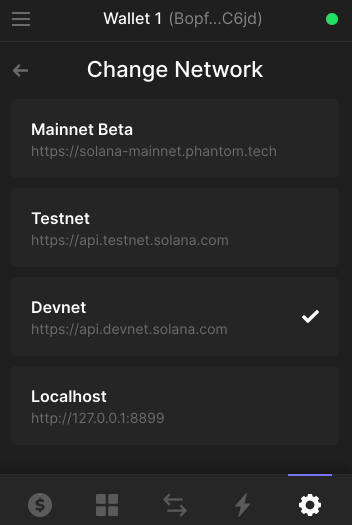
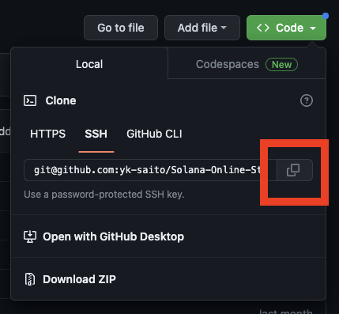

### 🛠 環境構築をはじめる

Section 1では、ウォレットでアプリに接続するという、web3で最も重要な機能の実装を主な目的としています。

ユーザーがSolanaウォレットでデータショップにログインできるようにしたいのですが、通常は認証の構築はかなり面倒です。

ユーザー名、パスワードなどのデータベースが必要になります。

しかし、ブロックチェーンを使えば、あなたが思っているよりもずっと簡単に認証を行うことが出来るのです!


### 🔌 Phantom Wallet をインストールする

このプロジェクトでは、[Phantom Wallet](https://phantom.app/)という、Solana専用のウォレットを使用します。

まずはブラウザに拡張機能をダウンロードしてPhantom Walletをセットアップしてください。

Phantom Walletは **Chrome**、 **Brave**、 **Firefox**、および **Edge** をサポートしています。

Chromeの方は[こちら](https://chrome.google.com/webstore/detail/phantom/bfnaelmomeimhlpmgjnjophhpkkoljpa)からPhantom Walletをインストールすることがきます。

インストールが完了したら、Phantom WalletのネットワークをDevnetに変更しておきましょう。

※ 今回はDevnetを使用するので、ウォレットもDevnetに変更する必要があります。

- 「設定」→「ネットワークの変更」→「Devnet」から変更できます。



※ 本プロジェクトではBraveとChromeでのみ動作が確認できます。


### 🤖 ローカル開発環境を設定する

※ GitHubアカウントの初期設定がお済みでない方は、アカウント設定を行ってからお進みください。

まだ`GitHub`のアカウントをお持ちでない方は、[こちら](https://qiita.com/okumurakengo/items/848f7177765cf25fcde0) の手順に沿ってアカウントを作成してください。

`GitHub`のアカウントをお持ちの方は、下記の手順に沿ってフロントエンドの基盤となるリポジトリをあなたのGitHubに[フォーク](https://denno-sekai.com/github-fork/)しましょう。

1\. [こちら](https://github.com/unchain-tech/Solana-Online-Store)からunchain-tech/Solana-Online-Storeリポジトリにアクセスをして、ページ右上の`Fork`ボタンをクリックします。


2\. Create a new forkページが開くので、「Copy the `main` branch only」という項目に**チェックが入っていることを確認します**。


3\. 設定が完了したら`Create fork`ボタンをクリックします。あなたのGitHubアカウントに`Solana-Online-Store`リポジトリのフォークが作成されたことを確認してください。

それでは、フォークしたリポジトリをローカル環境にクローンしましょう。

`Code`ボタンをクリックして`SSH`を選択し、Gitリンクをコピーしましょう。



ターミナルで任意の作業ディレクトリに移動し、先ほどコピーしたリンクを貼り付け、下記を実行してください。

```
git clone コピーした_github_リンク
```

無事に複製されたらローカル開発環境の準備は完了です。

### 🏁 Web アプリケーションを起動する

今回のWebアプリケーションは **Next.js** を使用しています。

これはフレームワーク **React.js** 上に構築されているものです。

すでにReact.jsに精通している場合はNext.jsを使いこなすのは比較的簡単です（React.jsが分からない場合でも適宜説明を加えますのでご安心ください）。

それでは早速、以下の手順でWebアプリケーションを起動してみましょう。

1\. ターミナルを開き、`cd`でプロジェクトのルートディレクトリまで移動します。

2\. `yarn install`を実行します。

3\. `yarn dev`を実行します。

これらを実行すると、ローカルサーバーでWebアプリケーションが立ち上がり、中心のあたりにかわいらしい女の子の画像が表示されるはずです。

※自動的にWebアプリケーションが立ち上がらない場合は、ブラウザに`http://localhost:3000`と入力してWebアプリケーションを確認しましょう!


### ✅ テストスクリプトについて

このプロジェクトには、コンポーネントのテストスクリプトが`__tests__/コンポーネント名.test.js`として格納されています。これらは、期待するMVPの機能が実装されているかをテストする内容となっており、テストフレームワークとして[Jest](https://jestjs.io/ja/)を、UIコンポーネントのテストを行うために[Testing Library](https://testing-library.com/)を導入しています。Solanaネットワークとやり取りを行う機能をモック（模擬）しているため、ブラウザ上で実際に動作確認を行うよりもより迅速に機能テストを行うことが可能です。対象コンポーネントの実装が完成したら、テストを実行してみましょう!

ただし、あくまでも模擬的なので、各コンポーネントの実装ができたら実際にSolanaネットワークを使用した動作確認をブラウザ上で行いましょう 🚀

### 🙋‍♂️ 質問する

ここまでの作業で何かわからないことがある場合は、Discordの`#solana`で質問をしてください。

ヘルプをするときのフローが円滑になるので、エラーレポートには下記の4点を記載してください ✨

```
1. 質問が関連しているセクション番号とレッスン番号
2. 何をしようとしていたか
3. エラー文をコピー&ペースト
4. エラー画面のスクリーンショット
```

---

次のレッスンに進んで、開発を進めていきましょう 🎉
