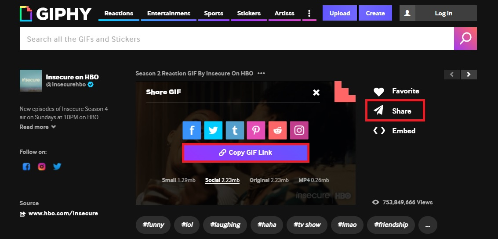
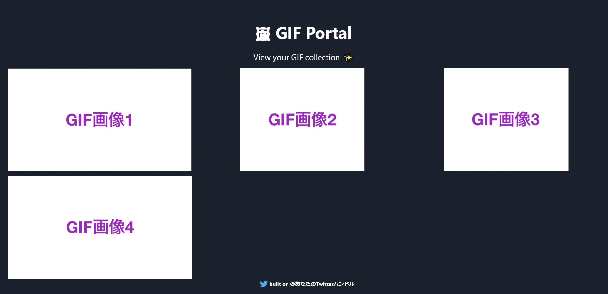

### 🧪 テストデータを表示する

最終的には、ユーザーがWebアプリケーションにPhantom Walletを接続している場合のみ、Solanaチェーン上に保存されたGIFデータを表示していきます。

ですが、今はSolanaプログラムと連携する前段階ということで、WebアプリケーションにGIFのテストデータを表示していきます。

テストデータは好きなものを使用していただいて構いません。

今回の例ではGIF画像のシェアサービス[GIPHY](https://giphy.com/)を利用していきます。

GIPHYで気に入った画像を選択したら、`Share`をクリックし、`Copy GIF Link`ボタンを押してリンクをコピーしておきます。



それでは、お気に入りのGIF画像へのリンクを`App.js`に反映させましょう。

`App.js`の定数を宣言している場所に下記を追加します。

```javascript
const TEST_GIFS = [
	'https://media.giphy.com/media/ZqlvCTNHpqrio/giphy.gif',
	'https://media.giphy.com/media/bC9czlgCMtw4cj8RgH/giphy.gif',
	'https://media.giphy.com/media/kC8N6DPOkbqWTxkNTe/giphy.gif',
	'https://media.giphy.com/media/26n6Gx9moCgs1pUuk/giphy.gif'
]
```

テストデータで使用するGIFは何枚でもOKです。

また、使用するGIFにあわせ、以下のようにWebサイトのタイトルと説明を変更しておきましょう。

```jsx
<p className="header">🖼 GIF Portal</p>
<p className="sub-text">
  View your GIF collection ✨
</p>
```

続いて、設定したGIFをWebアプリケーションに表示します。

アプローチとしては`renderNotConnectedContainer`関数と同じ方法をとります。

それでは`renderNotConnectedContainer`関数のすぐ下に、以下のとおり`renderConnectedContainer`関数を追加しましょう。

```jsx
const renderConnectedContainer = () => (
  <div className="connected-container">
    <div className="gif-grid">
      {TEST_GIFS.map(gif => (
        <div className="gif-item" key={gif}>
          
        </div>
      ))}
    </div>
  </div>
);
```

`renderConnectedContainer`関数には、すべてのGIFをレンダリングするコードが書かれています。

ただし、これだけではWebアプリケーションの表示は変わりません。

`renderConnectedContainer `関数も`renderNotConnectedContainer`関数と同じように、呼び出す必要があります。

`return`文の中身を以下のとおり変更します。

```jsx
return (
  <div className="App">
    <div className="container">
      <div className="header-container">
        <p className="header">🖼 GIF Portal</p>
        <p className="sub-text">
          View your GIF collection ✨
        </p>
        {!walletAddress && renderNotConnectedContainer()}
      </div>
      <main className="main">
        {/* ウォレットが接続されている場合にrenderConnectedContainer関数を実行します。 */}
        {walletAddress && renderConnectedContainer()}
      </main>
      <div className="footer-container">
        
        <a
          className="footer-text"
          href={TWITTER_LINK}
          target="_blank"
          rel="noreferrer"
        >{`built on @${TWITTER_HANDLE}`}</a>
      </div>
    </div>
  </div>
);
```

これらすべてを変更したうえでPhantom Walletを接続すると、設定したGIFが全て表示されているはずです。



Webアプリケーションのスタイルは`App.css`で設定済みですが、好みに合わせて変更してみてください。


### 🔤 GIF 入力ボックスを作成する

さて、それではこれからWebアプリケーションにお気に入りのGIFを追加し、Solanaチェーン上に保存するための機能を追加していきましょう。

そのための準備として、まずはGIFのリンクを入力するエリアと送信ボタンを作成していきます。

なお、入力ボックスはユーザーがウォレットをアプリに接続したときにのみ表示されるようにします。

`renderConnectedContainer`関数を以下のように修正しましょう。

```jsx
const renderConnectedContainer = () => (
  <div className="connected-container">
    <form
      onSubmit={(event) => {
        event.preventDefault();
      }}
    >
      <input type="text" placeholder="Enter gif link!" />
      <button type="submit" className="cta-button submit-gif-button">Submit</button>
    </form>
    <div className="gif-grid">
      {TEST_GIFS.map((gif) => (
        <div className="gif-item" key={gif}>
          
        </div>
      ))}
    </div>
  </div>
);
```

ブラウザを確認すると、入力ボックスと送信ボタンが追加されているはずです。

ただし、現段階では入力ボックスにGIFリンクを入力したり、Submitボタンを押したりしても何も起こりません。

これらの機能が正常に機能するよう、ロジックを記述していきましょう。

`const [walletAddress, setWalletAddress] = useState(null);`が記述されているすぐ下に以下のコードを追加します。

```javascript
const [inputValue, setInputValue] = useState('');
```

これは、入力ボックス内に入力されたGIFリンクの`state`を管理するためのものです。

GIFリンクは`inputValue`に設定され、管理されます。

続いて、`connectWallet`関数のすぐ下に以下のコードを追加します。

```javascript
const onInputChange = (event) => {
  const { value } = event.target;
  setInputValue(value);
};
```

この関数では、入力ボックスに入力された値を`inputValue`に設定するだけの関数で、`renderConnectedContainer`関数で使用します。

続いて、`renderConnectedContainer`関数の`input`タグの中身を以下のとおり変更しましょう。

```jsx
<input
  type="text"
  placeholder="Enter gif link!"
  value={inputValue}
  onChange={onInputChange}
/>
```

ここまででSolanaプログラムへGIFリンクを送信する準備が整いました。

最後に、SolanaプログラムへGIFリンクを送信する関数を記述していきます。

`onInputChange`関数の下に以下のコードを追加します。

```javascript
const sendGif = async () => {
  if (inputValue.length > 0) {
    console.log('Gif link:', inputValue);
  } else {
    console.log('Empty input. Try again.');
  }
};
```

この関数は、あとでSolanaプログラムと接続するときに処理を追加します。

現段階では、入力ボックスへの値を判定し、値があればGIFリンクを、なければ入力を促すメッセージをコンソールに出力するだけの機能です。

なお、Solanaプログラムと接続するには[非同期処理](https://zenn.dev/hinoshin/articles/212ba4e993377c)が必要になります。

Solanaプログラムとの接続中にWebアプリケーション側で他の処理が走ってしまうと思わぬエラーが引き起こされる可能性があるためです。

それでは最後に、`sendGif`関数を機能させるため、`renderConnectedContainer`関数の`form`タグを以下のとおり変更しましょう。

```jsx
<form
  onSubmit={(event) => {
    event.preventDefault();
    sendGif();
  }}
>
```

それではブラウザ上でGIFリンクを入力してSubmitボタンを押してみましょう。

コンソールに入力したGIFリンクが表示されていればOKです。


### 🌈 GIF データの state を設定する

Solanaプログラムと接続する前に、もう1つ設定するものがあります。

それは、GIFリンクのフェッチです。

現状は`TEST_GIFS`で設定したGIFデータをレンダリングしていますが、このプロジェクトの処理フローは以下のようになります。

1\. Webアプリを開く。

2\. ウォレットを接続する。

3\. SolanaプログラムからGIFリストを取得する。

上記を実装するためには、`useState`を使用して`gifList`（GIFリンクの一覧）の状態を管理する必要があります。

それでは、他の`useState`宣言をしたすぐ下に`gifList`の状態を管理するコードを以下のように追加しましょう。

```javascript
const [walletAddress, setWalletAddress] = useState(null);
const [inputValue, setInputValue] = useState('');
const [gifList, setGifList] = useState([]);
```

次に、ユーザーがウォレットを接続した場合にのみGIFリストを取得できるよう、処理を追加します。

現段階では`TEST_GIFS`にテストデータが設定されているので、`TEST_GIFS`を使ってSolanaプログラムからのフェッチをシミュレートしてみましょう。

既存の`useEffect`のすぐ下に、フェッチ用のコードを追加します。

```javascript
useEffect(() => {
  const onLoad = async () => {
    await checkIfWalletIsConnected();
  };
  window.addEventListener('load', onLoad);
  return () => window.removeEventListener('load', onLoad);
}, []);

useEffect(() => {
  if (walletAddress) {
    console.log('Fetching GIF list...');

    // Solana プログラムからのフェッチ処理をここに記述します。

    // TEST_GIFSをgifListに設定します。
    setGifList(TEST_GIFS);
  }
}, [walletAddress]);
```

`walletAddress`が設定されている場合にのみフェッチ処理が実行され、GIFデータが設定されます。

今はテストデータを使用しているため、テストデータが`gifList`に設定されるだけの処理です。

それでは、設定された`gifList`を利用するために、`renderConnectedContainer`関数を以下のとおり修正しましょう。

```jsx
const renderConnectedContainer = () => (
    <div className="connected-container">
      <form
        onSubmit={(event) => {
          event.preventDefault();
          sendGif();
        }}
      >
        <input
          type="text"
          placeholder="Enter gif link!"
          value={inputValue}
          onChange={onInputChange}
        />
        <button type="submit" className="cta-button submit-gif-button">
          Submit
        </button>
      </form>
      <div className="gif-grid">
        {/* TEST_GIFSの代わりにgifListを使用します。 */}
        {gifList.map((gif) => (
          <div className="gif-item" key={gif}>
            
          </div>
        ))}
      </div>
    </div>
  );
  ```

仕上げとして、入力フォームを送信すると、GIFが`gifList`に追加され、テキストフィールドがクリアされるようにしましょう。

`sendGif`関数を以下のとおり修正します。

```javascript
const sendGif = async () => {
  if (inputValue.length > 0) {
    console.log('Gif link:', inputValue);
    setGifList([...gifList, inputValue]);
    setInputValue('');
  } else {
    console.log('Empty input. Try again.');
  }
};
```

ここまででSolanaプログラムと接続するための準備が整いました。


### 🙋‍♂️ 質問する

ここまでの作業で何かわからないことがある場合は、Discordの`#solana`で質問をしてください。

ヘルプをするときのフローが円滑になるので、エラーレポートには下記の4点を記載してください ✨

```
1. 質問が関連しているセクション番号とレッスン番号
2. 何をしようとしていたか
3. エラー文をコピー&ペースト
4. エラー画面のスクリーンショット
```

---

おめでとうございます!

セクション1は終了です!

ぜひ、あなたのお気に入りのGIF画像が表示されたフロントエンドのスクリーンショットを`#solana`に投稿してください 😊

あなたの成功をコミュニティで祝いましょう 🎉

次のレッスンでは、Solanaの開発環境を構築します!