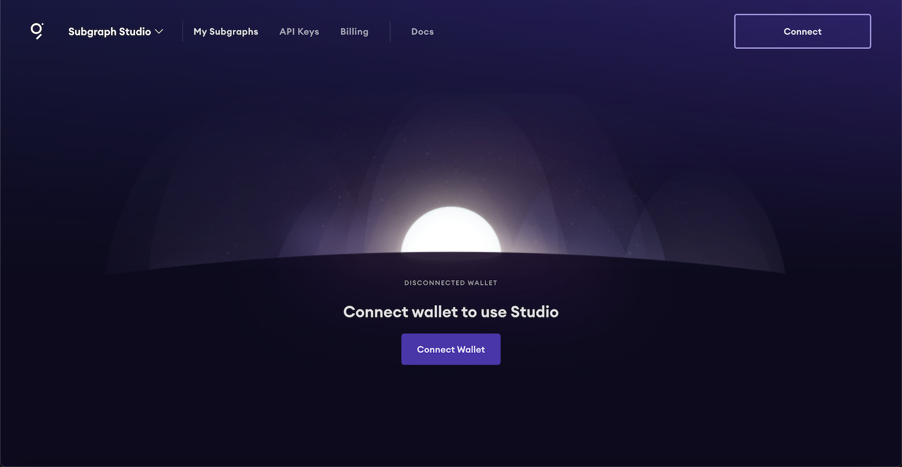
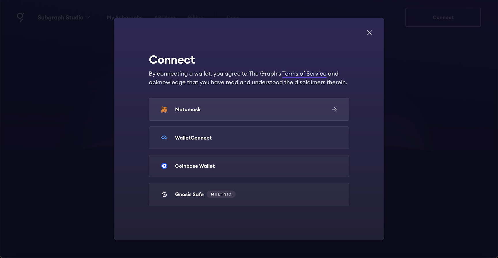
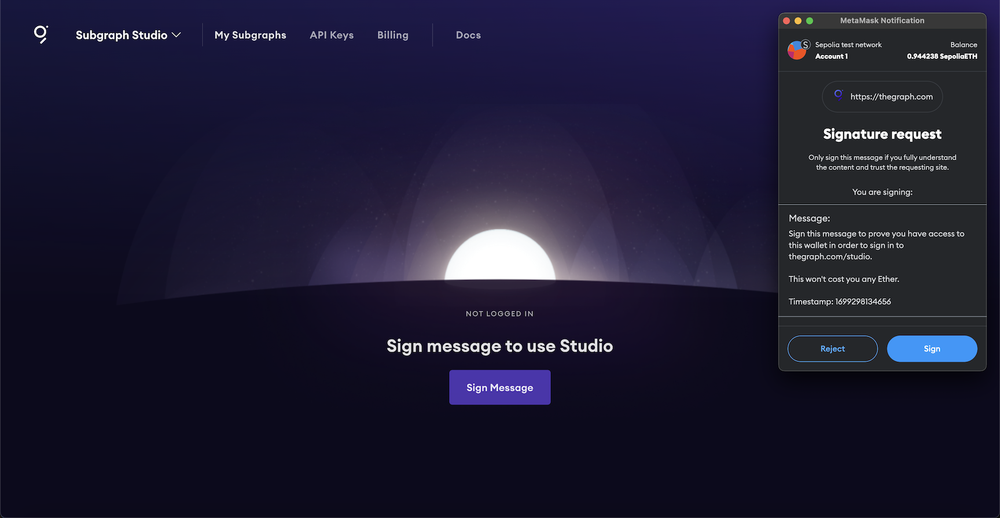
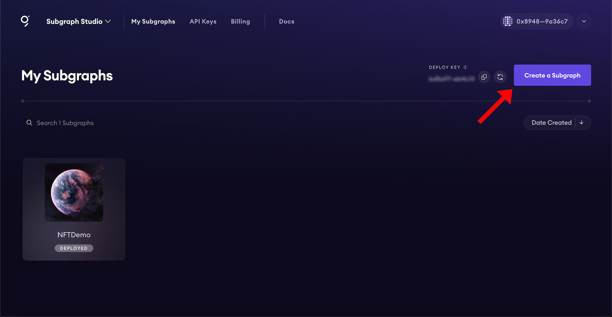
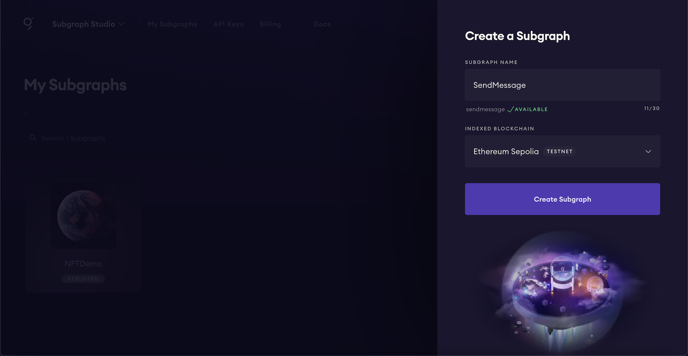

## Subgraph studio

### Studio へのサブグラフの移行

さて、スマートコントラクトが公開テストネットにあるので、サブグラフをStudioにプッシュする時が来ました。

#### ✅ https://thegraph.com/studio に移動する

#### ✅ ウォレットを接続する

接続したウォレットがあなたのものであることを確認するために、リクエストにサインする必要があるかもしれません。

#### ✅ Create a Subgraph をクリックする

#### ✅ サブグラフに名前をつける

