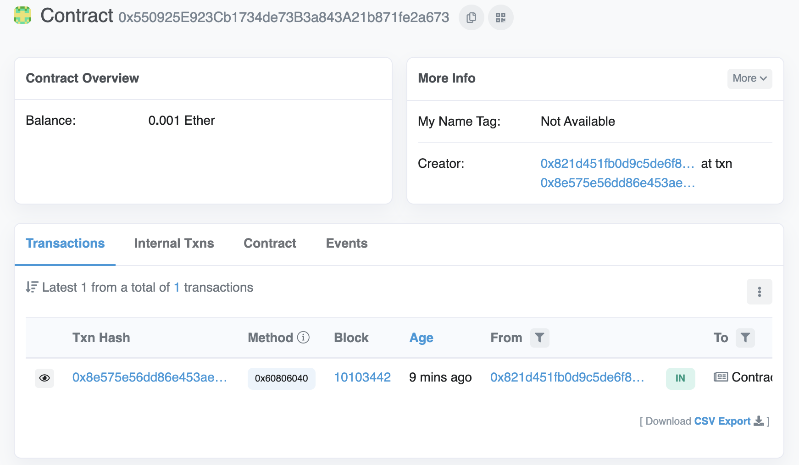
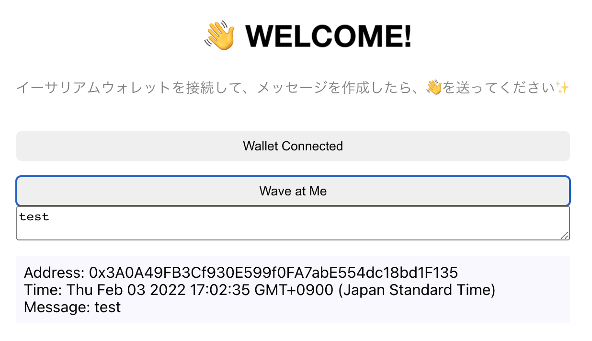

### 🎁 ユーザーに ETH を贈る

コントラクトの魅力の 1 つとして、コントラクトに関与したユーザーに報酬を支払える機能を実装できることが挙げらます。

よって、このレッスンでは、ETH をユーザーに送る機能をコントラクトに実装する方法を学びます。

まず、あなたの Web アプリケーションで「👋（wave）」を送ってくれた人に「0.0001ETH（≒$0.30）」を提供するスクリプトを作成していきます。

引き続き、Sepolia Test Network 上にコントラクトをデプロイするので、ユーザーに送るのは偽の ETH になります。

`WavePortal.sol`の`wave`関数を下記のように更新していきます。

```solidity
    function wave(string memory _message) public {
        _totalWaves += 1;
        console.log("%s waved w/ message %s", msg.sender, _message);

        /*
        * 「👋（wave）」とメッセージを配列に格納。
        */
        _waves.push(Wave(msg.sender, _message, block.timestamp));

        /*
        * コントラクト側でemitされたイベントに関する通知をフロントエンドで取得できるようにする。
        */
        emit NewWave(msg.sender, block.timestamp, _message);

        /*
        * 「👋（wave）」を送ってくれたユーザーに0.0001ETHを送る
        */
        uint256 prizeAmount = 0.0001 ether;
        require(
            prizeAmount <= address(this).balance,
            "Trying to withdraw more money than the contract has."
        );

        (bool success, ) = (msg.sender).call{value: prizeAmount}("");
        require(success, "Failed to withdraw money from contract.");
    }
```

コードを見ていきましょう。

> まず、下記で`prizeAmount`という変数を定義し、`0.0001` ETH を指定しています。
>
> ```solidity
> uint256 prizeAmount = 0.0001 ether;
> ```
>
> そして、下記では、ユーザーに送る ETH の額が**コントラクトが持つ残高**より下回っていることを確認しています。
>
> ```solidity
> require(
>     prizeAmount <= address(this).balance,
>     "Trying to withdraw more money than the contract has."
> );
> ```
>
> `address(this).balance`は**コントラクトが持つの資金の残高**を示しています。
>
> `require`は、何らかの条件が`true`もしくは`false`であることを確認する`if`文のような役割を果たします。
> もし`require`の結果が`false`の場合（＝コントラクトが持つ資金が足りない場合）は、トランザクションをキャンセルします。
>
> コントラクトに資金を提供する方法については、次のレッスンで説明します。
>
> 下記のコードはユーザーに送金を行うために実装されています。
>
> ```solidity
> (bool success, ) = (msg.sender).call{value：prizeAmount}("")
> ```
>
> 下記のコードは、トランザクション（＝送金）が成功したことを確認しています。
>
> ```solidity
> require(success, "Failed to withdraw money from contract.");
> ```
>
> 成功した場合は送金を行い、成功しなかった場合は、エラー文を出力しています。

次に、`WavePortal.sol`の`constructor`を下記のように変更します。

```solidity
constructor() payable {
    console.log("We have been constructed!");
}
```

`payable`を加えることで、コントラクトに送金機能を実装します。

### 🏦 コントラクトに資金を提供する

上記で、ユーザーに ETH を送金するためのコードを実装しました。
次に、その資金源となる ETH をコントラクトに付与する作業を行います。

テストを実施するために、 `run.js`を更新します。

- `run.js`はコントラクトのコア機能のテストを行うためのスクリプトです。

```javascript
const main = async () => {
  const waveContractFactory = await hre.ethers.getContractFactory("WavePortal");
  /*
   * 0.1ETHをコントラクトに提供してデプロイする
   */
  const waveContract = await waveContractFactory.deploy({
    value: hre.ethers.utils.parseEther("0.1"),
  });
  await waveContract.deployed();
  console.log("Contract deployed to:", waveContract.address);

  /*
   * コントラクトの残高を取得し、結果を出力（0.1ETHであることを確認）
   */
  let contractBalance = await hre.ethers.provider.getBalance(
    waveContract.address
  );
  console.log(
    "Contract balance:",
    hre.ethers.utils.formatEther(contractBalance)
  );

  /*
   * Waveし、トランザクションが完了するまで待機
   */
  let waveTxn = await waveContract.wave("A message!");
  await waveTxn.wait();

  /*
   * Waveした後のコントラクトの残高を取得し、結果を出力（0.0001ETH引かれていることを確認）
   */
  contractBalance = await hre.ethers.provider.getBalance(waveContract.address);
  console.log(
    "Contract balance:",
    hre.ethers.utils.formatEther(contractBalance)
  );

  let allWaves = await waveContract.getAllWaves();
  console.log(allWaves);
};

const runMain = async () => {
  try {
    await main();
    process.exit(0);
  } catch (error) {
    console.log(error);
    process.exit(1);
  }
};

runMain();
```

詳しく見ていきましょう。

**1 \. 0.1ETH をコントラクトに提供する**

```javascript
const waveContract = await waveContractFactory.deploy({
  value: hre.ethers.utils.parseEther("0.1"),
});
```

`hre.ethers.utils.parseEther("0.1")`によって、コントラクトがデプロイされた際に、コントラクトに 0.1 ETH の資金を提供することを宣言しています。

```javascript
let contractBalance = await hre.ethers.provider.getBalance(
  waveContract.address
);
```

ここでは、`ethers.js`が提供している`getBalance`関数を使って、コントラクトのアドレスに紐づいている残高を`contractBalance`に格納しています。

`ethers.js`の公式ドキュメントは [こちら（英語）](https://docs.ethers.io/v5/)です。

**2 \. コントラクトの資金を確認する**

```javascript
console.log("Contract balance:", hre.ethers.utils.formatEther(contractBalance));
```

ここでは、`hre.ethers.utils.formatEther(contractBalance)`を使用して wei 単位の残高を ETH 単位に変換したうえで出力し、コントラクトに 0.1ETH の残高があるか確認しています。

**3 \. `wave`したあとのコントラクトの残高を確認する**

```javascript
/*
 * Wave
 */
let waveTxn = await waveContract.wave("A message!");
await waveTxn.wait();
/*
 * Waveした後のコントラクトの残高を取得し、結果を出力（0.0001ETH引かれていることを確認）
 */
contractBalance = await hre.ethers.provider.getBalance(waveContract.address);
console.log("Contract balance:", hre.ethers.utils.formatEther(contractBalance));
```

ここでは、`wave`が呼ばれた後に`0.0001 ETH`がコントラクトの資金から差し引かれるか、確認しています。

### ⭐️ テストを実行する

それでは、ターミナル上で下記を実行し、テストを行いましょう。

```
yarn contract run:script
```

下記のような結果がターミナルで出力されているか確認してください。

```
WavePortal - Smart Contract!
Contract deployed to: 0x5FbDB2315678afecb367f032d93F642f64180aa3
Contract balance: 0.1
0xf39fd6e51aad88f6f4ce6ab8827279cfffb92266 waved w/ message A message!
Contract balance: 0.0999
[
  [
    '0xf39Fd6e51aad88F6F4ce6aB8827279cffFb92266',
    'A message!',
    BigNumber { value: "1643871888" },
    waver: '0xf39Fd6e51aad88F6F4ce6aB8827279cffFb92266',
    message: 'A message!',
    timestamp: BigNumber { value: "1643871888" }
  ]
]
```

`Contract balance: 0.1`が、`Contract balance: 0.0999`に下がっていれば、成功です 🎉

### 🛫 `deploy.js`を更新する

本番環境でコントラクトに資金を提供するため、下記のように`deploy.js`を更新します。

```javascript
const main = async () => {
  const [deployer] = await hre.ethers.getSigners();
  const accountBalance = await deployer.getBalance();

  console.log("Deploying contracts with account: ", deployer.address);
  console.log("Account balance: ", accountBalance.toString());

  const waveContractFactory = await hre.ethers.getContractFactory("WavePortal");
  /* コントラクトに資金を提供できるようにする */
  const waveContract = await waveContractFactory.deploy({
    value: hre.ethers.utils.parseEther("0.001"),
  });

  await waveContract.deployed();

  console.log("WavePortal address: ", waveContract.address);
};

const runMain = async () => {
  try {
    await main();
    process.exit(0);
  } catch (error) {
    console.error(error);
    process.exit(1);
  }
};

runMain();
```

更新したコードは下記です。

```javascript
const waveContract = await waveContractFactory.deploy({
  value: hre.ethers.utils.parseEther("0.001"),
});
```

`value: hre.ethers.utils.parseEther("0.001")`で、コントラクトに資金提供を行っています。

今回はテストですので、少額の 0.001ETH をコントラクトに付与しています。

また、`await waveContract.deployed()`を追加して、資金を追加するまでデプロイを待機するように設定しています。

※ この 1 行を追加すると、開発者はコントラクトがデプロイされたことを簡単に知ることができます。任意で排除しても、コードは走ります 😊

### 🛩 もう一度デプロイする

コントラクトを更新したので、下記を実行する必要があります。

1. 再度コントラクトをデプロイする

2. フロントエンドのコントラクトアドレスを更新する(更新するファイル: `App.js`)

3. フロントエンドの ABI ファイルを更新する(更新するファイル: `client/src/utils/WavePortal.json`)

**コントラクトを更新するたび、これらの 3 つのステップを実行する必要があります。**

復習もかねて、丁寧に実行していきましょう。

1 \. ターミナル上で下記を実行し、コントラクトを再度デプロイしましょう。

```
yarn contract deploy
```

ターミナルに下記のような出力結果が表示されていれば、デプロイは成功です。

```
Deploying contracts with account:  0x821d451FB0D9c5de6F818d700B801a29587C3dCa
Account balance:  321305319740326556
WavePortal address:  0x550925E923Cb1734de73B3a843A21b871fe2a673
```

[Etherscan](https://sepolia.etherscan.io/) にアクセスして、コントラクトアドレスを貼り付けてみましょう。

下記のように、`Balance`が`0.001 Ether`となっていることを確認してください。



これで、テストネットにコントラクトがデプロイされました 🎉

2 \. `App.js`の`contractAddress`を、ターミナルで取得した新しいコントラクトアドレスに変更します。

ターミナルに出力されたコントラクト(`WavePortal address`)のアドレス(`0x..`)をコピーしましょう。

- コピーしたアドレスを`App.js`の`const contractAddress = 'こちら'`に貼り付けましょう。

3 \. 以前と同じように`artifacts`から ABI ファイルを取得します。下記のステップを実行してください。

> 1\. ターミナル上で`contract`にいることを確認する（もしくは移動する）。
>
> 2\. ターミナル上で下記を実行する。
>
> ```
> code artifacts/contracts/WavePortal.sol/WavePortal.json
> ```
>
> 3\. VS Code で`WavePortal.json`ファイルが開かれるので、中身を全てコピーしましょう。※ VS Code のファインダーを使って、直接`WavePortal.json`を開くことも可能です。
>
> 4\. **コピーした`contract/artifacts/contracts/WavePortal.sol/WavePortal.json`の中身で`client/src/utils/WavePortal.json`の中身を上書きしてください。**

**繰り返しますが、コントラクトを更新するたびにこれを行う必要があります。**

`wave`を送ったユーザーに 0.0001ETH が送られているか確認してみましょう。

1\. 下記を実行する。

> ```
> yarn client start
> ```

2\. ローカル環境で Web アプリケーションを開き、`wave`を送る。

例)このような結果が Web アプリケーションに反映されていること確認してください。コントラクトを新しくしたので、既存の`wave`はリセットされています。

> 

3\. [Etherscan](https://sepolia.etherscan.io/) にアクセスして、コントラクトアドレスを貼り付ける。

> 下記のように、`Balance`が`0.0009 Ether`となっていることを確認してください。
>
> 
>
> WEB アプリで`wave`を送ったユーザーに 0.0001ETH を送ったので、残高が`0.001-0.0001=0.0009 ETH`になっています。

ターミナルを閉じるときは、以下のコマンドが使えます ✍️

- Mac: `ctrl + c`
- Windows: `ctrl + shift + w`

### 🙋‍♂️ 質問する

ここまでの作業で何かわからないことがある場合は、Discord の`#ethereum`で質問をしてください。

ヘルプをするときのフローが円滑になるので、エラーレポートには下記の 3 点を記載してください ✨

```
1. 質問が関連しているセクション番号とレッスン番号
2. 何をしようとしていたか
3. エラー文をコピー&ペースト
4. エラー画面のスクリーンショット
```

---

おめでとうございます!　セクション 3 が終了しました!
あなたの Etherscan のアドレスを`#ethereum`に投稿してあなたの成功をコミュニティで祝いましょう 😊
ユーザーに ETH を送れるコントラクトの実装が完了したら、次のレッスンに進みましょう 🎉
