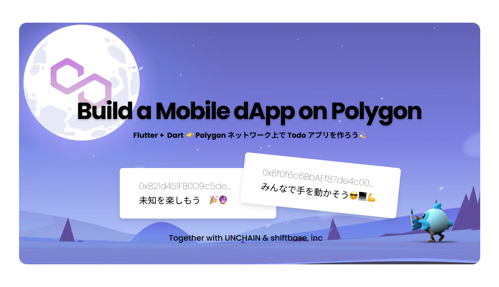

### 👋 ようこそ

このプロジェクトでは、Polygonネットワーク上にスマートコントラクトを実装して、スマートコントラクトとやりとりできる独自のMobileアプリケーションを構築します。

プロジェクトを進めるには以下の技術が必要です。

- [Terminal 操作](https://qiita.com/ryouzi/items/f9dee1540a04a0bfb9a3)
- [Dart](https://www.cresc.co.jp/tech/java/Google_Dart2/language/overview/overview.html)
- [Flutter](https://flutter.dev/)

※ 開発初心者の方は、まず`ETH-dApp`のプロジェクトから始めることをお勧めします ☺️

いますべてを理解している必要はありません。
わからないことがあったらインターネットで検索したり、コミュニティで質問しながらプロジェクトを進めていきましょう!

### ✨ Mobile dApp を作ろう

このプロジェクトでは、Polygonネットワーク上のFlutter dAppでCRUD（Create, Read, Update, Delete）操作を行う方法を、ToDoアプリを作成することで学びます。

プロジェクトは下記の3ステップに分かれています。

1. スマートコントラクトを作成する。
2. 作成したスマートコントラクトをブロックチェーンにデプロイする。
3. 簡単にCRUDできるToDoアプリを構築する。

ToDoは**オン・チェーン**にデプロイされます。

- オン・チェーンにデプロイされるとは、「作成したToDoのデータはすべてブロックチェーン上に記載される」という意味です。

### ⛓ ブロックチェーンとは何か？

ブロックチェーンとは、互いに通信するコンピュータ（ノード）のピアツーピア・ネットワークです。

参加者全員がネットワークの運営を分担する分散型ネットワークですので、各ネットワークの参加者は、ブロックチェーン上のコードとデータのコピーを維持します。

これらのデータはすべて、「ブロック」と呼ばれる記録の束に含まれており、それらが「連鎖」してブロックチェーンを構成しています。

ネットワーク上のすべてのノードは、コードとデータがいつでも変更可能な中央集権型のアプリケーションとは異なり、このデータが安全で変更不可能であることを保証しています。これがブロックチェーンを強力なものにしているのです ✨

ブロックチェーンはデータの保存を担っているため、根本的にはデータベースです。

そして、互いに会話するコンピュータのネットワークですから、ネットワークとなります。ネットワークとデータベースが一体化したものと考えればよいでしょう。

また、従来のWebアプリケーションとブロックチェーンアプリケーションの根本的な違いとして、アプリケーションは、ユーザーのデータを一切管理しません。ユーザーのデータは、ブロックチェーンによって管理されています。

### 🥫 スマートコントラクトとは何か？

スマートコントラクトとは、ブロックチェーン上でコントラクト（＝契約）を自動的に実行するしくみです。

よくたとえられるのは、自動販売機です。自動販売機には「100円が投下され、ボタンが押されたら、飲み物を落とす」というプログラムが搭載されており、「店員さんがお金を受け取って飲み物を渡す」というプロセスを必要としません。

人の介在を省き、自動的にプログラムが実行される点こそ、スマートコントラクトが、「スマート」と呼ばれる理由です。

実際には、スマートコントラクトのしくみは、イーサリアムネットワーク上のすべてのコンピュータに複製され、処理されるプログラムにより成り立っています。

イーサリアムの汎用性により、そのネットワーク上にアプリケーションを構築できます。

スマートコントラクトのコードはすべてイミュータブル（不変）、つまり**変更不可**能です。

つまり、スマートコントラクトをブロックチェーンにデプロイすると、コードを変更したり更新したりすることはできなくなるのです。

これは、コードの信頼性と安全性を確保するための設計上の特徴です。

私はよくスマートコントラクトをWeb上のマイクロサービスにたとえます。ブロックチェーンからデータを読み書きしたり、ビジネスロジックを実行したりするためのインタフェースとして機能するのです。これらはパブリックにアクセス可能で、ブロックチェーンにアクセスできる人なら誰でもそのインタフェースにアクセスできることを意味します。

### 📱 dApps とは何か？

dAppsは、**分散型アプリケーション（decentralized Application）** の略です。

dAppsは、ブロックチェーン上に構築されたスマートコントラクトと、フロントエンドであるユーザーインタフェース（Webサイトなど）を組み合わせたアプリケーションのことを指します。

dAppsは、イーサリアムのプログラミング言語であるSolidityを基盤に構築されています。

イーサリアムでは、スマートコントラクトはオープンAPIのように誰でもアクセスできます。よって、ほかの人が書いたスマートコントラクトも、あなたのWebアプリケーションから呼び出すことができます。逆も然りです。

### 🌍 プロジェクトをアップグレードする

[UNCHAIN](https://app.shiftbase.xyz) のプロジェクトは [UNCHAIN License](https://github.com/unchain-dev/UNCHAIN-projects/blob/main/LICENSE) により運用されています。

プロジェクトに参加していて、「こうすればもっと分かりやすいのに!」「これは間違っている!」と思ったら、ぜひ`pull request`を送ってください。

GitHubから直接コードを編集して直接`pull request`を送る方法は、[こちら](https://docs.github.com/ja/repositories/working-with-files/managing-files/editing-files#editing-files-in-another-users-repository)を参照してください。

どんなリクエストでも大歓迎です 🎉

**👋 `UNCHAIN-projects`に`pull request`を送られる方は、[UNCHAIN の GitHub](https://github.com/shiftbase-xyz/UNCHAIN-projects) にアクセスしてください!**

また、プロジェクトを自分のGitHubアカウントに`Fork`して、中身を編集してから`pull request`を送ることもできます。

- プロジェクトを`Fork`する方法は、[こちら](https://docs.github.com/ja/get-started/quickstart/fork-a-repo) を参照してください。
- `Fork`から`pull request`を作成する方法は、[こちら](https://docs.github.com/ja/pull-requests/collaborating-with-pull-requests/proposing-changes-to-your-work-with-pull-requests/creating-a-pull-request-from-a-fork) です。

### ⚡️ `Issue`を作成する

`pull request`送るほどでもないけど、提案を残したい!と思ったら、[こちら](https://github.com/shiftbase-xyz/UNCHAIN-projects/issues) に`Issue`を作成してみましょう。

`Issue`の作成方法に関しては、[こちら](https://docs.github.com/ja/issues/tracking-your-work-with-issues/creating-an-issue)を参照してください。

`pull request`や`issue`の作成は、実際にチームで開発を行う際に重要な作業になるので、ぜひトライしてみてください。

UNCHAINのプロジェクトをみんなでより良いものにしていきましょう ✨

### 🙋‍♂️ 質問する

ここまで何かわからないことがある場合は、Discordの`#polygon`で質問をしてください。

---

次のレッスンに進んで、Mobile dAppについて学びましょう 🚀

---

Documentation created by [RATDOTLweb3](https://github.com/RATDOTLweb3)（UNCHAIN discord ID: Kyotaro#3990）
