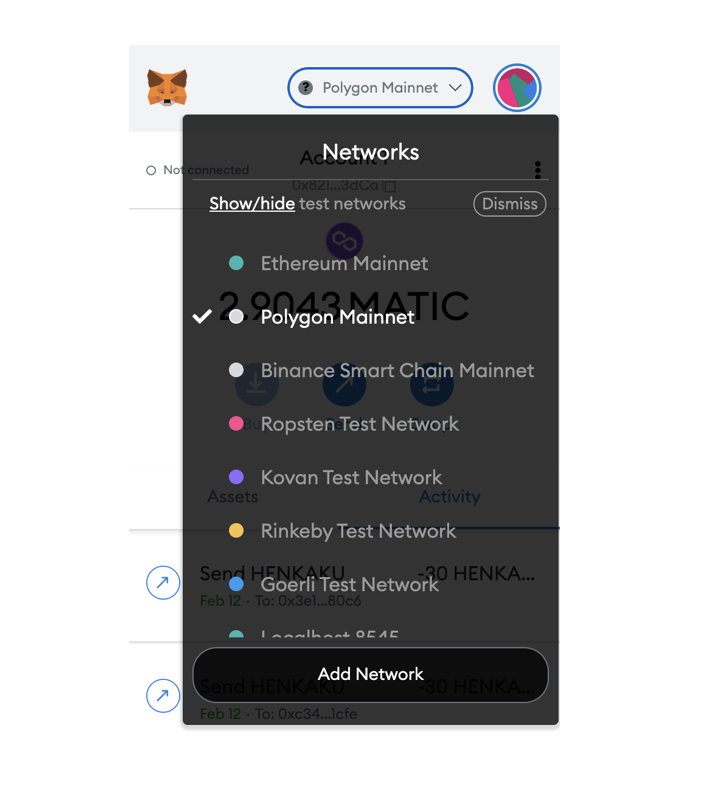
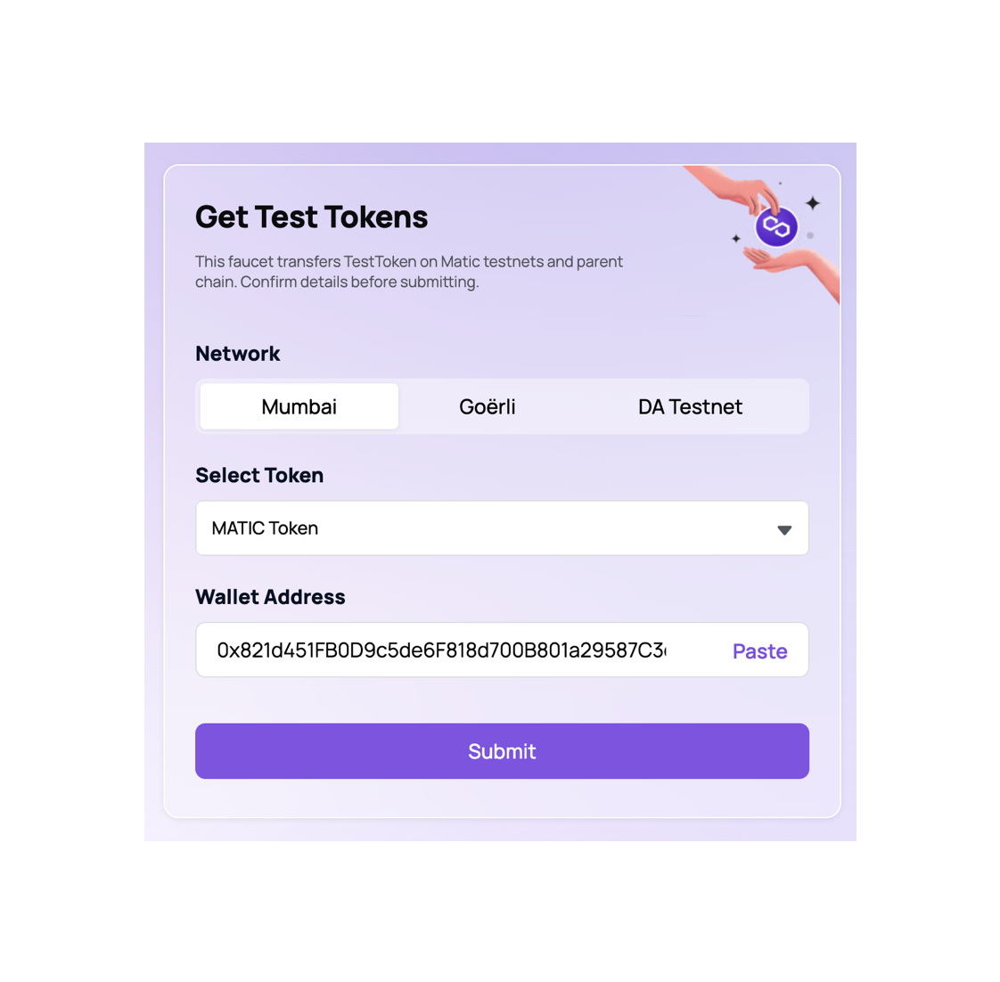

### 🐣 テストネットにデプロイする

前のセクションでスマートコントラクトが書けたので、次はそれをデプロイします。


### 🦊 MetaMask に Polygon Network を追加する

MetaMaskウォレットにMatic MainnetとPolygon Mumbai-Testnetを追加してみましょう。

**1 \. Matic Mainnet を MetaMask に接続する**

Matic MainnetをMetaMaskに追加するには、次の手順に従ってください。

まず、[Polygonscan](https://polygonscan.com/) に向かい、ページの一番下までスクロールして、`Add Polygon Network`ボタンをクリックします。


下記のようなポップアップが立ち上がったら、`Switch Network`をクリックしましょう。


`Matic Mainnet`があなたのMetaMaskにセットアップされました。



**2 \. Polygon Mumbai-Testnet を MetaMask に接続する**

Polygon Mumbai-TestnetをMetaMaskに追加するには、次の手順に従ってください。

まず、[mumbai.polygonscan.com](https://mumbai.polygonscan.com/) に向かい、ページの一番下までスクロールして、`Add Mumbai Network`ボタンをクリックします。

`Matic Mainnet`を設定した時と同じ要領で`Polygon Testnet`をあなたのMetaMaskに設定してください。

### 🚰 偽 MATIC を入手する

MetaMaskでPolygonネットワークの設定が完了したら、偽のMATICを取得していきましょう。

[こちら](https://faucet.polygon.technology/) にアクセスして、下記のように偽MATICをリクエストしてください。



Sepoliaとは異なり、これらのトークンの取得にそれほど問題はないはずです。

1回のリクエストで0.5 MATIC（偽）が手に入るので、2回リクエストして、1 MATIC入手しましょう。

**⚠️: Polygon のメインネットワークにコントラクトをデプロイする際の注意事項**

> Polygon のメインネットワークにコントラクトをデプロイする準備ができたら、本物の MATIC を入手する必要があります。
>
> これには 2 つの方法があります。
>
> 1. イーサリアムのメインネットで MATIC を購入し、Polygon のネットワークにブリッジする。
>
> 2. 仮想通貨の取引所（ WazirX や Coinbase など）で MATIC を購入し、それを直接 MetaMask に転送する。
>
> Polygon のようなサイドチェーンの場合、`2`の方が簡単で安く済みます。


### ✨ スマートコントラクトを Mumbai testnet に公開する

上記の`providerOrUrl: process.env.ALCHEMY_API_KEY,`の`process.env.ALCHEMY_API_KEY`の部分を、[alchemy.com](https://www.alchemy.com/)で作成したPolygon用のデプロイ先の`API key`に設定します。

手順は下記のとおりです。

まず、先ほどのリンクからログインして、`Create App`を選択し、下記のように設定してください。


下の画像で示す部分をクリックすると、`HTTP`を確認できます。


次に下記のコマンドを`todo-dApp-contract`フォルダ上でターミナルを開いて実行してください。

`Alchemy Polygon URL`の部分に、先ほど確認した`HTTP`を貼り付けてください。

次に、`.gitignore`ファイルを以下のように更新してください。

```
node_modules
.env
```

次に`hardhat-config.js`の既存の内容をすべて削除し、以下のコードに置き換えてください。

solidityのバージョンはあなたが使用しているものに合わせて変更してください。

```js
//hardhat-config.js
require('@nomicfoundation/hardhat-toolbox');
require('dotenv').config();

const { PRIVATE_KEY, STAGING_ALCHEMY_KEY } = process.env;

/** @type import('hardhat/config').HardhatUserConfig */
module.exports = {
  solidity: '0.8.17',
  networks: {
    mumbai: {
      url: STAGING_ALCHEMY_KEY || '',
      accounts: PRIVATE_KEY ? [PRIVATE_KEY] : ['0'.repeat(64)],
    },
  },
};
```

次に`.env`ファイルを`contract`ディレクトリに作成して次のように値を入れましょう。

`<YOUR_ALCHEMY_KEY>`にはAlchemyで作成したHTTP_KEYを、`<YOUR_PRIVATE_KEY>`にはmetamaskで作成したウォレットのプライベートキーを代入しましょう。

```
STAGING_ALCHEMY_KEY=<YOUR_ALCHEMY_KEY>
PRIVATE_KEY=<YOUR_PRIVATE_KEY>
```

では早速デプロイ作業に移りましょう。ターミナルで以下のコマンドを実行します。

```
yarn contract deploy
```

下のようになっていれば成功です！

```
$ yarn workspace contract deploy
warning package.json: No license field
$ npx hardhat run scripts/deploy.js --network mumbai
Deploying contracts with account:  0x04CD057E4bAD766361348F26E847B546cBBc7946
Account balance:  287212753772831574
TodoContract address:  0x14479CaB58EB7B2AF847FCb2DbFD5F7e1bB17A08
✨  Done in 21.27s.
```

次は、Flutterアプリケーションへ接続していきましょう。

### 🙋‍♂️ 質問する

ここまでの作業で何かわからないことがある場合は、Discordの`#polygon`で質問をしてください。

ヘルプをするときのフローが円滑になるので、エラーレポートには下記の3点を記載してください ✨

```
1. 質問が関連しているセクション番号とレッスン番号
2. 何をしようとしていたか
3. エラー文をコピー&ペースト
4. エラー画面のスクリーンショット
```

---
ターミナルの出力結果をDiscordの`#polygon`に投稿して、コミュニティにシェアしてください!

次のセクションに進んで、Flutterアプリケーションへの接続を開始しましょう 🎉
