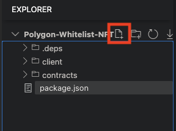
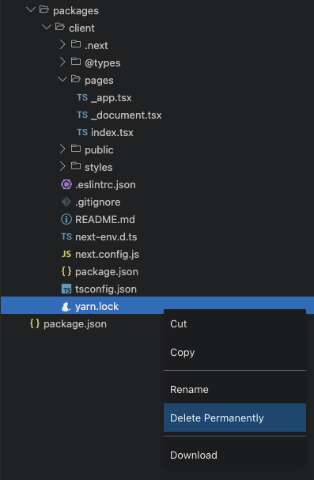
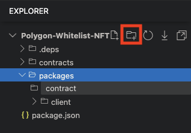
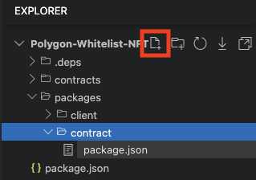

### 📦 Monorepo configration

Update your file structure to a monorepo structure. Monorepo is a way to manage all code for the contract and client（or other components）together in one repository.

Create a `package.json` in the root of your project.



Write the following in the package.json you created.

```json
{
  "name": "polygon-whitelist-nft",
  "version": "1.0.0",
  "license": "MIT",
  "private": true,
  "workspaces": {
    "packages": [
      "packages/*"
    ]
  },
  "scripts": {
    "contract": "yarn workspace contract",
    "client": "yarn workspace client",
    "test": "yarn contract test"
  }
}

```

Next, let's configure the `workspaces`. Create a `packages` folder in the root of your project.


#### client

Move the `client` folder into the `packages` folder.。


Delete the `yarn.lock` file in the client folder. If you use a monorepo configuration, the yarn.lock files in each workspace will no longer be needed, as they will be centrally managed in the project root.



#### contract

We would like to configure the `packages/contract` folder using [hardhat](https://hardhat.org/) to add automated tests for the contracts we have created.

Create a `contract` folder in your `packages` folder.



Create a `package.json` file in the contract folder.



In the package.json file you created, please include the following

```json
{
    "name": "contract",
    "version": "1.0.0",
    "private": true,
    "scripts": {
      "clean": "npx hardhat clean",
      "compile": "hardhat compile",
      "coverage": "hardhat coverage",
      "test": "hardhat test"
    }
}
```

Let's build a project using Hardhat. Execute the following command in the root of your project.

```
yarn workspace contract add --dev hardhat@^2.14.0
```

Verify that hardhat has been added to packages/contract/package.json. If the installation is successful but hardhat is not added, try reloading your browser.

Next, install the necessary tools. As before, run the following command in the root of the project.

```
yarn workspace contract add @openzeppelin/contracts@^5.0.0 && yarn workspace contract add --dev @nomicfoundation/hardhat-chai-matchers@^1.0.0 @nomicfoundation/hardhat-network-helpers@^1.0.8 @nomicfoundation/hardhat-toolbox@^2.0.1 @nomiclabs/hardhat-ethers@^2.0.0 @nomiclabs/hardhat-etherscan@^3.0.0 @typechain/ethers-v5@^10.1.0 @typechain/hardhat@^6.1.2 @types/chai@^4.2.0 @types/mocha@^9.1.0 chai@^4.3.7 hardhat-gas-reporter@^1.0.8 solidity-coverage@^0.8.1 ts-node@^8.0.0 typechain@^8.1.0 typescript@^4.5.0
```

At this point, packages/contract/package.json should look like the following.

```json
{
    "name": "contract",
    "version": "1.0.0",
    "private": true,
    "devDependencies": {
        "@nomicfoundation/hardhat-chai-matchers": "^1.0.0",
        "@nomicfoundation/hardhat-network-helpers": "^1.0.8",
        "@nomicfoundation/hardhat-toolbox": "^2.0.1",
        "@nomiclabs/hardhat-ethers": "^2.0.0",
        "@nomiclabs/hardhat-etherscan": "^3.0.0",
        "@typechain/ethers-v5": "^10.1.0",
        "@typechain/hardhat": "^6.1.2",
        "@types/chai": "^4.2.0",
        "@types/mocha": "^9.1.0",
        "chai": "^4.3.7",
        "hardhat": "^2.14.0",
        "hardhat-gas-reporter": "^1.0.8",
        "solidity-coverage": "^0.8.1",
        "ts-node": "^8.0.0",
        "typechain": "^8.1.0",
        "typescript": "^4.5.0"
    },
    "dependencies": {
        "@openzeppelin/contracts": "^4.8.2"
    }
}
```

Now let's generate a project using Hardhat, go under packages/contract/ and execute the following command。

```
npx hardhat init
```

Set up your project as follows.

```
✔ What do you want to do? · Create a TypeScript project
✔ Hardhat project root: · (Press Enter to set it up automatically)
✔ Do you want to add a .gitignore? (Y/n) · y
```

⚠️ It may not display well（e.g., choices do not appear, the display is stuck, etc.）. In such cases, we recommend that you work on Section 5 Lesson 3 first, upload it to GitHub, clone it to your local environment, and resume the remaining lessons again.

If you have successfully generated a project, make sure that it looks like this at this point.


Now let's update the files in the `packages/contract` folder.

First, let's move the contracts folder in the root of the project into the `packages/contract` folder. The following command should be executed in the root of the project.

```
rm -r ./packages/contract/contracts/ && mv ./contracts/ ./packages/contract/
```

Next, update `hardhat.config.ts` as follows

```typescript
import { HardhatUserConfig } from 'hardhat/config';
import '@nomicfoundation/hardhat-toolbox';

const config: HardhatUserConfig = {
  solidity: '0.8.20',
  paths: {
    artifacts: '../client/artifacts',
  },
};

export default config;

```

We have modified the compiler version of solidity and set the generated destination for the `artifacts` folder where the ABI will be stored.

Now let's check the operation. Run the following command in the root of your project.

```
yarn install
```

Once the package installation is complete, let's compile the contract.

```
yarn contract compile
```

Next, let's launch the frontend.

```
yarn client dev
```

If it runs without problems, the monorepo setup is complete!

### 🙋‍♂️ Asking Questions

If you have any uncertainties or issues with the work done so far, please ask in the `#polygon` channel on Discord.

To streamline the assistance process, kindly include the following 4 points in your error report ✨:

```
1. Section and lesson number related to the question
2. What you were trying to do
3. Copy & paste the error message
4. Screenshot of the error screen
```